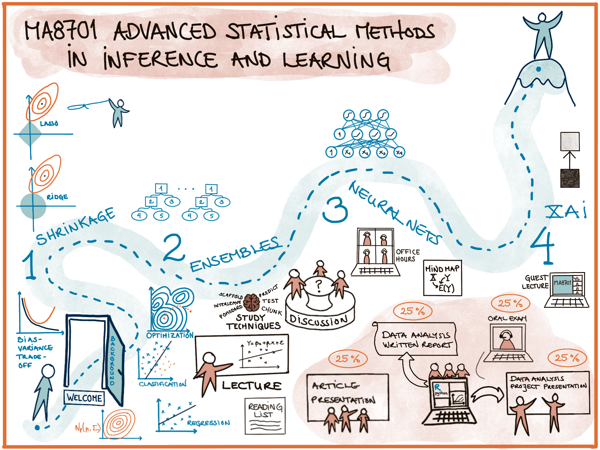
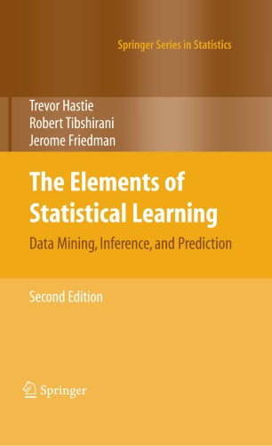
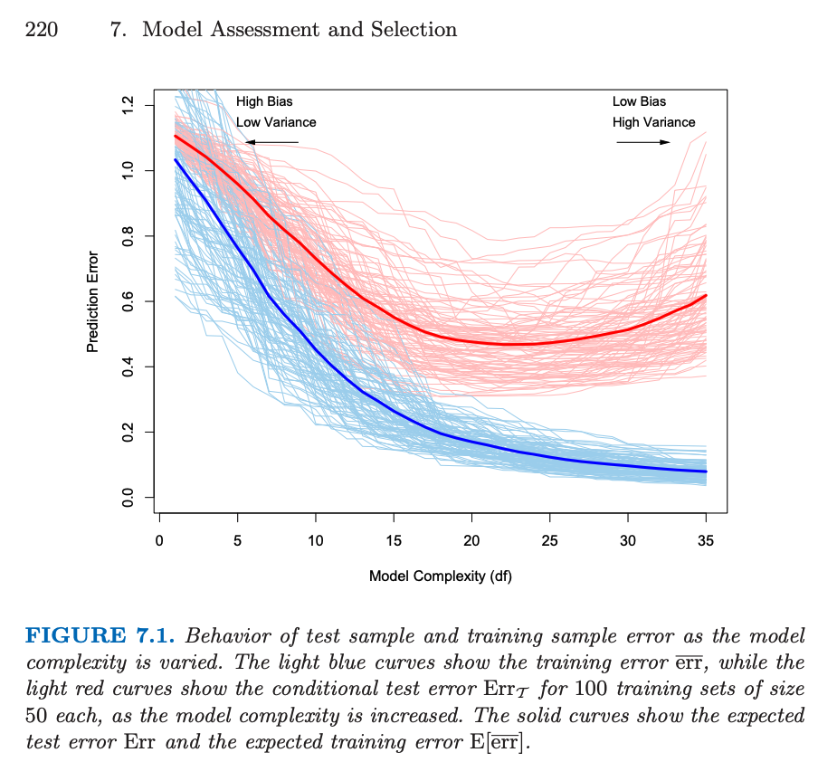

```{r setup, include=TRUE,echo=FALSE}
suppressPackageStartupMessages(library(knitr))
knitr::opts_chunk$set(echo = FALSE, message=FALSE,warning = FALSE, error = FALSE)
```


```{r}
#http://zevross.com/blog/2017/06/19/tips-and-tricks-for-working-with-images-and-figures-in-r-markdown-documents/
# options in r chunk settings
# out.width="100%"
# dpi=72


```

---

# Course topics

```{r,out.width= "20%", fig.align="left"}
#,fig.show="hold"}

```

The starting point is that we cover important parts of 

The Elements of Statistical Learning: Data Mining, Inference, and Prediction, Second Edition (Springer Series in Statistics, 2009) by Trevor Hastie, Robert Tibshirani, and Jerome Friedman.

but, since the book is from 2008 this means that for many topic we need (to be up to date) additional selected material in the form of book chapters and research articles.


---

## Introduction [this part, one week]

Sort out assumed background knowledge, and learn something new

* Notation
* Statistical decision theoretic framework (partly new) ELS 2.4
* Model selection and model assessment - including bias-variance trade-off (mostly new) ELS 7

---

## Part 1: Shrinkage [3 weeks]

or "Regularized linear and generalized linear models".

* ELS 3.2.3,3.4, 3.8, 4.4.4.
* Hastie, Tibshirani, Wainwright (HTW): "Statistical Learning with Sparsity: The Lasso and Generalizations". Selected chapters.
* Post-selective inference (articles)
* An introduction to analysing text

---

## Part 2: Ensembles [4 (5) weeks]

* trees, bagging and forests
* general ensembles (similar to super learner)
* boosting
* hyper-parameter tuning

Selected chapters in ELS (8.7, 8.8, 9.2, parts of 10, 15, 16) and several articles.

## Part 3: Neural nets [(2) 3 weeks]

* Goodfellow, Bengio, Courville: Deep learning (2016). MIT press. https://www.deeplearningbook.org/. Selected chapters.
* Evaluating uncertainty

---

## Part 4: XAI [2 weeks]

Lectured by Kjersti Aas <https://www.nr.no/~kjersti/>.

Articles on 

* LIME, 
* partial dependence plots, 
* Shapley values, 
* relative weights and 
* counterfactuals.

## Closing [1 week]

* w/oral presentations of second data project from Parts 2-4.

---

## Required previous knowledge

* TMA4267 Linear statistical methods
* TMA4268 Statistical learning
* TMA4295 Statistical inference
* TMA4300 Computer intensive statistical methods
* TMA4315 Generalized linear models
* Good understanding and experience with R, or with Python, for statistical data analysis.
* Knowledge of RMarkdown for writing reports and presentations
* Skills in group work - possibly using git

---

# Learning 

## Learning outcome

**1. Knowledge**

* Understand and explain the central theoretical aspects in statistical inference and learning. 
* Understand and explain how to use methods from statistical inference and learning to perform a sound data analysis. 
* Be able to evaluate strengths and weaknesses for the methods and choose between different methods in a given data analysis situation.

---

**2. Skills**

Be able to analyse a dataset using methods from statistical inference and learning in practice (using R or Python), and give a good presentation and discussion of the choices done and the results found.

**3. Competence**

* The students will be able to participate in scientific discussions, read research presented in statistical journals, and carry out research in statistics at high international level. 
* They will be able to participate in applied projects, and analyse data using methods from statistical inference and learning.


---

## Learning methods and activities

Herbert A. Simon (Cognitive science, Nobel Laureate):
_Learning results from what the student does and thinks
and only from what the student does and thinks. The
teacher can advance learning only by influencing what the
student does to learn._

---

* Lectures will be on 14 Mondays 9.15-12 in S21 (and zoom). We will not record the lectures because we will try to include student activities in groups (on tables or break-out rooms).

* Mette will have digital office hours on zoom (same link as for the lectures). Time will be decided in class with a poll.

* Exploring different study techniques (one or more each lecture).

* Problem sets to work on between lectures.

* Final individual oral exam (25% of pass/fail grade) in May.

---

* One practical compulsory group project in data analysis (application of course theory using R or Python) with short report. Topic: Part 1 on Shrinkage, chosen data set discussed with lecturer before start. Due mid February. First given comments by one other group, then evaluated by course responsible. (25% of pass/fail grade)

* One article group presentation, orally (15 minutes+questions). Material from Parts 2 and 3 preferred, and must be decided on with lecturer (might also be parts of your own master thesis if applicable). Due before Easter. (25% of pass/fail)

* Practical compulsory project in data analysis (application of course theory using R or Python) with oral presentation (15 minutes+questions). Topic: Part 2-4, data set and methods discussed with lecturer before start. Due after Part 4 is finished. (25% of pass/fail grade)

* For the two data analysis projects: one should be with a data set requiring regression and one with classification type analysis.

---

## Course wiki

<https://wiki.math.ntnu.no/ma8701/2021v/start>

**Questions?**

---

## Class activity

Aim: get to know each other - to improve on subsequent group work!

````{r,echo=TRUE,eval=FALSE}
while (at least one student not presented) 
   lecturer give two alternatives, you choose one. 
   lecturer choose a few students to present their view 
   together with giving their name and study programme 
   (and say if they are looking for group members)
   
```

---

* Dog person or cat person?
* When performing logistic regression - do you then say you do statistical learning or machine learning?
* I will show you the result of a descriptive analysis: summary or graphical display?
* Learning something new: read a book or watch a video?
* Analysing data: R or python?
* Analysing data: report p-values and or confidence intervals
* In class: taking notes or not?
* Use camel case or snake case for programming?
  
camel: writing compound words such that each word in the middle of the phrase begins with a capital letter, with no intervening spaces or punctuation. "camelCase" or "CamelCase".

snake: writing compound words where the elements are separated with one underscore character (_) and no spaces, with each element's initial letter usually lower cased within the compound and the first letter either upper- or lower case as in "foo_bar"

---

# Introduction

(finally - we start on the fun stuff!)

## Plan

* Notation
* Statistical decision theoretic framework (partly new)

Remind about assumed background knowledge (already known), 

* Regression (ELS ch 3, except 3.2.3, 3.2.4, 3.4, 3.7, 3.8)
* Classification (ELS ch 4.1-4.5, except 4.4.4)

and then cover new aspects for 

* Model selection and assessment (ELS Ch 7.1-7.6, 7.10-7.12), including statistical learning and the bias-variance trade-off (ELS ch 2)

---

## Notation

(mainly from ELS)

We will only consider supervised methods.

* Response $Y$ (or $G$): dependent variable, outcome, usually univariate (but may be multivariate)
   + quantitative $Y$: for regression
   + qualitative, categorical $G$: for classification, some times dummy variable coding used (named one-hot coding in machine learning)
* Covariates $X_1, X_2, \ldots, X_p$: "independent variables", predictors, features
   + continuous, discrete: used directly
   + categorical, discrete: often dummy variable coding used

We aim to construct a rule, function, learner: $f(X)$, to predict $Y$ (or $G$).

---

Random variables and (column) vectors are written as uppercase letters $X$, and $Y$, while observed values are written with lowercase $(x,y)$. (Dimensions specified if needed.)

Matrices are presented with bold face: ${\bf X}$, often $N \times (p+1)$. 

ELS uses boldface also for ${\bf x}_j$ being a vector of all $N$ observations of variable $j$, but the vector of observed variables for observation $i$ is just $x_i$.

---


Both the response _and covariates_ will be considered to be random, and drawn from some joint distribution
$P(X_1,X_2,\ldots, X_p,Y)=P(X,Y)$ or $P(X,G)$.

Conditional distribution: $P(X,Y)=P(Y \mid X)P(X)$ or $P(Y\mid X=x)P(X=x)$

and double expectation is often used

$$\text{E}[L(Y,f(X))]=\text{E}_{X,Y}[L(Y,f(X))]=\text{E}_{X}\text{E}_{Y \mid X}[L(Y,f(X))]$$
where $L$ is a loss function (to be defined next) and $f(X)$ some function to predict $Y$ (or $G$).

---

## Training set
(ELS 2.1)

A set of size $N$ of independent pairs $(x_i,y_i)$ is called the _training set_ and often denoted ${\cal T}$.

The training data is used to estimate the unknown function $f$.

### Test data

Test data is in general thought of as future data, and plays an important role in both 

* model selection (finding the best model among a candidate set) and also for 
* model assessment (assess the performance of the fitted model on future data).

We will consider theoretical results for future test data, and also look at different ways to split or resample available data.

---

## Group discussion

Two core regression methods
are multiple linear regression (MLR) and $k$-nearest neighbour (kNN).

For the two methods

* Set up the formal definition for $f$, and model assumptions made
* What top results do you remember? Write them down.
* What are challenges?
* What changes need to be done to each of the two methods for classification?

---

### Regression and MLR

**Resources**

(mostly what we learned in TMA4267, or ELS ch 3, except 3.2.3, 3.2.4, 3.4, 3.7, 3.8)

* From TMA4268: [Overview](https://www.math.ntnu.no/emner/TMA4268/2019v/TMA4268overview.html) and in particular [Module 3: Linear regression](https://www.math.ntnu.no/emner/TMA4268/2019v/3LinReg/3LinReg.html)
* From TMA4315: [Overview](https://www.math.ntnu.no/emner/TMA4315/2018h/TMA4315overviewH2018.html) and in particular [Module 2: MLR](https://www.math.ntnu.no/emner/TMA4315/2018h/2MLR.html)

For $k$NN see also Problem 1 of the [TMA4268 2018 exam](https://www.math.ntnu.no/emner/TMA4268/Exam/V2018e.pdf) with [solutions](https://www.math.ntnu.no/emner/TMA4268/Exam/e2018sol.pdf)

---

# Statistical decision theoretic framework
(ELS ch 2.4)

is a mathematical framework for developing models $f$ - and assessing optimality.

First, regression:

* $X \in \Re^p$
* $Y \in \Re$
* $P(X,Y)$ joint distribution of covariates and respons

Aim: find a function $f(X)$ for predicting $Y$ from some inputs $X$.

Ingredients: Loss function $L(Y,f(X))$ - for _penalizing errors in the prediction_.

Criterion for choosing $f$: Expected prediction error (EPE)

---

$$ \text{EPE}(f)=\text{E}_{X,Y}[L(Y,f(X))]=\int_{x,y}L(y,f(x))p(x,y)dxdy$$
Choose $f$ to minimize the $\text{EPE}(f)$.


---

## Squared error loss


$$ \text{EPE}(f)=\text{E}_{X,Y}[L(Y,f(X))]=\text{E}_{X}\text{E}_{Y \mid X}[(Y-f(X))^2\mid X]$$

We want to minimize EPE, and see that it is sufficient to minimize $\text{E}_{Y\mid X}[(Y-f(X))^2\mid X]$ for each $X=x$ (pointwise):

$$ f(x)=\text{argmin}_c \text{E}_{Y \mid X}[(Y-c)^2 \mid X=x]$$
This gives as result the conditional expectation - the best prediction at any point $X=x$:

$$ f(x)=\text{E}[Y \mid X=x]$$
Proof: by differentiating and setting equal 0, see for example page 8 of <https://getd.libs.uga.edu/pdfs/ma_james_c_201412_ms.pdf>

In practice: need to estimate $f$.

---

### Linear regression

Conditionally (known from before): if we assume that $(X,Y) \sim N_{p+1}(\mu,\Sigma)$ then we have seen that $\text{E}(Y\mid X)$ is linear in $X$ and $\text{Cov}(Y \mid X)$ is independent of $X$. Then we know we get 
$\hat{\beta}=(X^TX)^{-1}X^T Y$ (with matrices) using OLS or MLE.

---

But, also if we assume an approximate linear model: $f(x)\approx x^T \beta$

Marginally: $\text{argmin}_{\beta} \text{E}[(Y-X^T\beta)^2]$ gives $\beta=\text{E}[X X^T]^{-1}\text{E}[XY]$ (now random vectors).

We may replace expectations with averages in training data to estimate $\beta$.

This is not conditional on $X$, but we have assumed a linear relationship.

---

## Absolute loss

Regression with absolute (L1) loss: $L(Y,f(X))=\lvert Y-f(X) \rvert$ gives $\hat{f}(x)=\text{median}(Y\mid X=x)$.

Proof: for example pages 8-11 of <https://getd.libs.uga.edu/pdfs/ma_james_c_201412_ms.pdf>

---

## Classification loss

* $X \in \Re^p$
* $G \in {\cal G}=\{1,\ldots,K\}$
* $\hat{G}(X) \in {\cal G}=\{1,\ldots,K\}$
* $L(G,\hat{G}(X))$ is a $K\times K$ matrix where $K=\lvert G \rvert$, with elements $l_{jk}$ giving the price to pay to misclassify an observation with true class $g_j$ to class $g_k$. 
* Elements on the diagonal of $L$ is 0, and off-diagonal elements are often $1$.

We would like to find $\hat{G}$ to minimize the EPE:

$$\text{EPE}=\text{E}_{G,X}[L(G,\hat{G}(X))]=\text{E}_X \text{E}_{G\mid X}[L(G,\hat{G}(X))]$$
$$=\text{E}_X \{ \sum_{k=1}^K L(g_k,\hat{G}(X))P(G=g_k \mid X=x) \} $$

---

Also here it is sufficient to minimize the loss for each value of $x$ (pointwise)
$$ \hat{G}=\text{argmin}_{g \in {\cal G}}\sum_{k=1}^K L(g_k,\hat{G}(X))P(G=g_k \mid X=x) $$

In the special case of 0-1 loss (off-diagonal elements in $L$ equal to 1) then all $k$ except the correct class gives loss $1$ with probability $P(G=g_k \mid X=x)$, which is summed. This equals $1$ minus the conditional probability of the correct class $g$.

---

$$\hat{G}=\text{argmin}_{g \in {\cal G}} [1-P(G=g \mid X=x)]$$
$$=\text{argmax}_{g \in {\cal G}}P(G=g \mid X=x)$$

The _Bayes classifier_ classifies to the most probable class using the conditional distrbution $P(G \mid X)$. The class boundaries are class the _Bayes decision boundaries_ and the error rate is the _Bayes rate_.

Note: can also achieve the same result with dummy variable coding for classes and squared error.

---

## Group discussion

What are the most important results from the "Statistical decision theoretic framework"?

What do we know about classification? (TMA4268 and TMA4315 mainly, or ELS ch 4.1-4.5, except 4.4.4)

* Sampling vs diagnostic paradigm, parametric vs non-parametric methods
* $k$NN, LDA, logistic and multinomial regression

---

**Resources**

(mostly what we learned in TMA4267, or ELS ch 4.1-4.5, except 4.4.4)

* From TMA4268: [Overview](https://www.math.ntnu.no/emner/TMA4268/2019v/TMA4268overview.html) and in particular [Module 4: Classification](https://www.math.ntnu.no/emner/TMA4268/2019v/4Classif/4Classif.html) and [Module 2: Statistical learning](https://www.math.ntnu.no/emner/TMA4268/2019v/2StatLearn/2StatLearn.html#k-nearest_neighbour_classifier)
* From TMA4315: [Overview](https://www.math.ntnu.no/emner/TMA4315/2018h/TMA4315overviewH2018.html) and in particular [Module 3: Binary regression](https://www.math.ntnu.no/emner/TMA4315/2018h/3BinReg.html)
and [Module 6: Categorical regression](https://www.math.ntnu.no/emner/TMA4315/2018h/6Categorical.html).

---


# Model assessment and selection

(ELS Ch 7.1-7.6,7.10-7.12)

The generalization performance of $\hat{f}$ can be evaluated from the EPE (expected prediction error) on an independent test set. 

We use this for 

* Model assessment: evaluate the performance of a selected model
* Model selection: select the best model for a specific task - among a set of models

---

## Plan

1) Look at $\text{EPE}(x_0)$ (now called Err($x_0$)) and how model complexity can be broken down into irreducible error, squared bias and variance (should be known from before)
2) Study EPE (Err) unconditional and conditional on the training set
3) Study optimism of the training error rate, and how in-sample error may shed light
4) Cross-validation and .632 bootstrap estimates of EPE
5) How will we build on this in Parts 1-4?

---


## The bias-variance trade-off 

(ELS p26 and 7.3)

Assume:
$$ Y=f(X)+\varepsilon$$
where $\text{E}(\varepsilon)=0$ and $\text{Var}(\varepsilon)=\sigma_{\varepsilon}^2$.

For the bias-variance decomposition we only consider the squared loss. Why?

In Ch 7 we use the notation Err instead of EPE (expected prediction error) that we used in Ch 2.

Let $\text{Err}(x_0)$ be the expected prediction error of a regression fit $\hat{f}(X)$ at a (new) input value $X=x_0$. As in Ch 2 the expected value is over $(X,Y)$ for Err, and we may look at 
$$ \text{Err}=E_{x_0} \text{Err}(x_0)$$

---

$$ \text{Err}(x_0)=\text{E}[(Y-\hat{f}(x_0))^2 \mid X=x_0]=\sigma_{\varepsilon}^2 +  \text{Var}[\hat{f}(x_0)]+[\text{Bias}(\hat{f}(x_0))]^2$$

* First term: irreducible error, $\text{Var}(\varepsilon)=\sigma^2$ and is always present unless we have measurements without error. This term cannot be reduced regardless how well our statistical model fits the data. 
* Second term: variance of the prediction at $x_0$ or the expected deviation around the mean at $x_0$. If the variance is high, there is large uncertainty associated with the prediction. 
* Third term: squared bias. The bias gives an estimate of how much the prediction differs from the true mean. If the bias is low the model gives a prediction which is close to the true value.


---

### Derivation

If you need to refresh your memory of the bias-variance trade-off, you might also look at the exam Problem 2 [TMA4268 2018 exam](https://www.math.ntnu.no/emner/TMA4268/Exam/V2018e.pdf) with [solutions](https://www.math.ntnu.no/emner/TMA4268/Exam/e2018sol.pdf)

Also: [TMA4268](https://www.math.ntnu.no/emner/TMA4268/2019v/TMA4268overview.html) and in particular [Module 2](https://www.math.ntnu.no/emner/TMA4268/2019v/2StatLearn/2StatLearn.html)

---

The following is a derivation:

\small
\begin{align*} \text{Err}(x_0)&=\text{E}[(Y-\hat{f}(x_0))^2 \mid X=x_0]\\
&=\text{E}[Y^2 + \hat{f}(x_0)^2 - 2 Y \hat{f}(x_0)\mid X=x_0] \\
&= \text{E}[Y^2\mid X=x_0] + \text{E}[\hat{f}(x_0)^2\mid X=x_0] - \text{E}[2Y \hat{f}(x_0)\mid X=x_0]\\
&= \text{Var}[Y\mid X=x_0] + \text{E}[Y\mid X=x_0]^2 + \text{Var}[\hat{f}(x_0)\mid X=x_0] + \text{E}[\hat{f}(x_0)\mid X=x_0]^2 - 2 \text{E}[Y\mid X=x_0]\text{E}[\hat{f}(x_0)\mid X=x_0] \\
&= \text{Var}[Y\mid X=x_0]+f(x_0)^2+\text{Var}[\hat{f}(x_0)\mid X=x_0]+\text{E}[\hat{f}(x_0)\mid X=x_0]^2-2f(x_0)\text{E}[\hat{f}(x_0)\mid X=x_0]\\
&= \text{Var}[Y\mid X=x_0]+\text{Var}[\hat{f}(x_0)\mid X=x_0]+(f(x_0)-\text{E}[\hat{f}(x_0)\mid X=x_0])^2\\
&= \text{Var}(\varepsilon\mid X=x_0) +  \text{Var}[\hat{f}(x_0)\mid X=x_0]+[\text{Bias}(\hat{f}(x_0))\mid X=x_0]^2
\end{align*}
\normalsize

(For some applications also the training Xs are fixed.)
See the exercises below to study the results for $k$NN and OLS.

---

## Expected prediction error 

(ELS 7.2 and 7.4, and we are now back to a general loss function - but first have regression in mind)

If we now keep the training set fixed (we would do that in practice - since we usually only have one training set):

$$ \text{Err}_{\cal T}=\text{E}[L(Y,\hat{f}(X))\mid {\cal T}]$$

as before the expected value is with respect to $(X,Y)$, but the training set is fixed - so that this is the test set error is for this specific training set ${\cal T}$.

Getting back to the unconditional version, we take expected value over ALL that is random - including the training set 
$$ \text{Err}=\text{E}(\text{E}[L(Y,\hat{f}(X))\mid {\cal T}])=\text{E}_{\cal T} [\text{Err}_{\cal T}]$$

We want to estimate $\text{Err}_{\cal T}$, but we will soon see that it turns out that most methods estimate $\text{Err}$.

---

### Training error

(also referred to as apparent error)

For a regression problem: The training error is the average loss over the training sample:
$$\overline{\text{err}}=\frac{1}{N} \sum_{i=1}^N L(y_i,\hat{f}(x_i))$$

<!--Unfortuneately the training error is  not a good estimate of the test error. -->

---

## Group discussion

Look at Figure 7.1 (with figure caption) on 220 in the ELS book. 
The text reads that "100 simulated training sets of size 50" and that "lasso produced sequence of fits".

Explain what you see - in particular what are the red and blue lines and the bold lines. What can you conclude from the figure?

* Red lines
* Bold red line
* Blue lines
* Bold blue line

---

```{r}
#http://zevross.com/blog/2017/06/19/tips-and-tricks-for-working-with-images-and-figures-in-r-markdown-documents/
# options in r chunk settings
# out.width="100%"
# dpi=72


```

---

### Conclusion 
(from Figure 7.1)

The training error $\overline{\text{err}}$ is not a good estimate for the $\text{Err}_{\cal T}$ nor the $\text{Err}$.

If we are in a _data rich situation_ we "just" divide our data into three parts, and use 

* one for training
* one for validation (model selection)
* one for testing (model assessment)

A typical split might be 50-60% training and 20-25% validation and test, but this depends on the complexity of the model to be fitted and the signal-to-noise ratio in the data.

The focus in Ch 7 of ELS is to present methods to be used in the situations where we _do not have enough data_ to rely on the training-validation-testing split.


---

### Loss function and training error for classification

* $X \in \Re^p$
* $G \in {\cal G}=\{1,\ldots,K\}$
* $\hat{G}(X) \in {\cal G}=\{1,\ldots,K\}$

0-1 loss with $\hat{G}(X)=\text{argmax}_k \hat{p}_k(X)$
$$L(G,\hat{G}(X))=I(G\neq \hat{G}(X))$$ 
$-2$-loglikelihood loss (why $-2$?):
$$ L(G,\hat{p}(X))=-2 \text{log} \hat{p}_G(X)$$

---

Test error (only replace $\hat{f}$ with $\hat{G}$):
$$ \text{Err}_{\cal T}=\text{E}[L(Y,\hat{G}(X))\mid {\cal T}]$$
$$ \text{Err}=\text{E}[\text{E}[L(Y,\hat{G}(X))\mid {\cal T}]]=\text{E} [\text{Err}_{\cal T}]$$

Training error (for 0-1 loss)
$$\overline{\text{err}}=\frac{1}{N}\sum_{i=1}^N I(g_i\neq \hat{g}(x_i))$$
Training error (for $-2$loglikelihood loss)
$$\overline{\text{err}}=-\frac{2}{N}\sum_{i=1}^N \text{log}\hat{p}_{g_i}(x_i)$$

---

## Optimism of the training error rate

(again - focus is on regression)

First, nothing new, but new notation $(X^0,Y^0)$ to specify that a new test observation is drawn from the joint distribution $F$ (both over new $X$ and new $Y$):

$$\text{Err}_{\cal T}=\text{E}_{X^0,Y^0}[L(Y^0,\hat{f}(X^0))\mid {\cal T}]$$

and then the averaging over the training set (both $X$s and $Y$s in the training set):
$$\text{Err}=\text{E}_{\cal T} \text{E}_{X^0,Y^0}[L(Y^0,\hat{f}(X^0))\mid {\cal T}]$$

This is also called _extra-sample error_ (in contrast to what we now will define to be in-sample).

---

We saw before - from the ELS Figure 7.1, the training error $\overline{\text{err}}$ is (in general) less than (or equal to) the true test error, so not a good estimator for the test error.

$$\overline{\text{err}}=\frac{1}{N} \sum_{i=1}^N L(y_i,\hat{f}(x_i))$$

[In Exercise 2.9 we prove that the expected training error is smaller or equal the expected error of a testset - for MLR. Important to work on this exercise!]

Part of this is due to where the $X$ values are "placed". The test input vectors need not be "in the same positions" as in the training $X$ values (when the mean is taken over the full distribution of $X$). 

To eliminate this "confusing fact", calculations can be made be assuming the $X$-values in the training data are kept fixed - and this is called the _in-sample error_. (We did the same in TMA4267 using the Fahrmeir et al book, Chapter 3.4.)

---

### In-sample error

$$\text{Err}_{\text{in}}=\frac{1}{N}\sum_{i=1}^N \text{E}_{Y^0}[L(Y_i^0,\hat{f}(x_i))\mid {\cal T}]$$

Observe that we now take the expected value over distribution of the response - but that the (new) responses are found at the original training points. The training predictor positions $x_i$, $i=1,\ldots, N$ are fixed. In addition the responses in the training data are also kept fixed, so the only random quantity here is the new responses at the fixed predictors.

---

### Optimism 

Optimism is defined as the difference between the in-sample error and the training error:

$$ \text{op}=\text{Err}_{\text{in}}-\overline{\text{err}}$$

### Average optimism

is defined as the expected value of the optimism, where the expectation is taken over the distribution of the training responses - denoted ${\bf y}$ (training predictors still kept fixed):

$$ \omega=\text{E}_{\bf y}(op)=\text{E}_{\bf y}(\text{Err}_{\text{in}})-\text{E}_{\bf y}(\overline{\text{err}})$$

Observe that if we write ${\cal T}$ then the expectation is taken over the distribution of both the predictors and responses in the training set, and we here write ${\bf y}$ for taking the distribution only over the reponses in the training set (not the predictors in the training set). 

So: we will focus on "modelling" $\omega$, "instead of" $\text{Err}$.

---

### Covariance result

For squared error (see ELS exercise 7.4), 0-1 loss, and "other loss functions" it can be shown

$$ \omega=\frac{2}{N} \sum_{i=1}^N \text{Cov}(\hat{y}_i,y_i)$$
Interpretation: 

* how much the training error _underestimates_ the true error depends on how strongly the observed response $y_i$ affects its own prediction $\hat{y}_i$.
* the _harder_ we fit the data the greater the covariance - which increases the expected (averaged) optimism.

---

### Expected in-sample prediction error

$$ \text{E}_{\bf y}(\text{Err}_{\text{in}})=\text{E}_{\bf y}(\overline{\text{err}})+\frac{2}{N} \sum_{i=1}^N \text{Cov}(\hat{y}_i,y_i)$$
This is the starting point for several methods to "penalize" fitting complex models!

---

### Result for $\omega$

Additive error model and squared loss: $Y=f(X)+\varepsilon$, with $\hat{y}_i$ obtained by a linear fit with $d$ inputs (or basis functions)
$$\omega=2 \frac{d}{N}\sigma_{\varepsilon}^2$$

Proof? We look at a generalization in ELS exercise 7.5.

Observe that the optimism increases with $d$ and decreases with $N$.

Comment: versions of the formula hold approximately for other error models than linear with squared loss (ELS mention binary data and entropy loss), but not in general for 0-1 loss (page 231, bottom, with reference to Efron 1986 - consult the ELS book).

---

### Three ways to perform model selection

* Estimate of expected in-sample prediction error (ELS Ch 7.5-7.6): We may develop the average optimism for a class of models that are linear in the parameters (Mallows Cp, AIC, BIC, ...) - and compare models of different complexity using $\text{E}_{\bf y}(\text{Err}_{\text{in}})$. Remark: in-sample error is not of interest, but used to choose between models effectively.

* Estimate $\text{Err}$ (ELS Ch 7.10-7.11): We may instead use resampling methods (cross-validation and bootstrapping) to estimate $\text{Err}$ directly (and use that for model selection and assessment).

* In the data rich approach: we have so much data that we use a separate validation set for model selection (and a separate test set for model assessment). That is not the focus of ELS Ch 7.

---

## Estimates of (expected) in-sample prediction error

We have the following result:

$$ \text{E}_{\bf y}(\text{Err}_{\text{in}})=\text{E}_{\bf y}(\overline{\text{err}})+\frac{2}{N} \sum_{i=1}^N \text{Cov}(\hat{y}_i,y_i)$$
where now
$$ \omega=\frac{2}{N} \sum_{i=1}^N \text{Cov}(\hat{y}_i,y_i)$$
We now want to get an estimate of the average optimism, to get an estimate of the in-sample prediction error:

$$ \widehat{\text{Err}_{\text{in}}}=\overline{\text{err}}+\hat{\omega}$$

Comment: observe that $\overline{\text{err}}$ is now an estimate of $\text{E}_{\bf y}(\overline{\text{err}})$ and even though we write $\widehat{\text{Err}_{\text{in}}}$ we are aiming to estimate $\text{E}_{\bf y}(\text{Err}_{\text{in}})$. Focus now is on $\hat{\omega}$!

---

### $C_p$ statistics

for squared error loss (follows directly from the $\omega$-result for additive error model)

$$C_p=\overline{\text{err}}+2\frac{d}{N}\hat{\sigma}_{\varepsilon}^2$$
where $\hat{\sigma}_{\varepsilon}^2$ is estimated from a "low-bias model" (in MLR we use a "full model").

(This method is presented both in TMA4267 and TMA4268, see also exam question [Problem 3 in TMA4267 in 2015](https://www.math.ntnu.no/emner/TMA4267/2017v/Exam/eV2015.pdf) and [solutions](https://www.math.ntnu.no/emner/TMA4267/2017v/Exam/lV2015.pdf).)

---

### Akaike information criterion (AIC)

Based on different asymptotic ($N \rightarrow \infty$) relationship for log-likelihood loss functions

$$ -2 \text{E}[\log P_{\hat{\theta}}(Y)]\approx - \frac{2}{N} \text{E}[\text{loglik}]+2 \frac{d}{N} $$

* $P_{\hat{\theta}}(Y)$: family of density for $Y$ where the true density is included
* $\hat{\theta}$: MLE of $\theta$
* $\text{loglik}$: maximized log-likelihood $\sum_{i=1}^N \log P_{\hat{\theta}}(y_i)$

**Logistic regression with binomial loglikelihood**

$$ \text{AIC}=- \frac{2}{N} \text{loglik}+2 \frac{d}{N}$$
**Multiple linear regression** if variance $\sigma_{\varepsilon}^2=\hat{\sigma}_{\varepsilon}^2$ assumed known then AIC is equivalent to $C_p$.

For nonlinear or similar models then $d$ is replaced by some measure of model complexity.

---

**AIC as function of tuning parameter**
(back to squared error loss)

We have a set of models $f_{\alpha}(x)$ indexed by some tuning parameter $\alpha$.

$$\text{AIC}(\alpha)=\overline{\text{err}}(\alpha)+2 \frac{d(\alpha)}{N}\hat{\sigma}_{\varepsilon}^2$$

* $\overline{\text{err}}(\alpha)$: training error
* $d(\alpha)$ number of parameters
* $\hat{\sigma}_{\varepsilon}^2$ estimated variance of large model

The model complexity $\alpha$ is chosen to minimize $\text{AIC}(\alpha)$.

This is not true if the models are chosen adaptively (for example basis functions) this formula underestimates the optimism - and we may regard this as the _effective number of parameters_ is larger than $d$.

---

### The effective number of parameters
(ELS 7.6)

The number of parameters $d$ can be generalized into an _effective number of parameters_. We will look at linear fitting method:

$$ \hat{\bf y}={\bf Sy}$$
where ${\bf S}$ as a $n \times n$ matrix depending on covariates $x_i$ but not responses $y_i$.

* MLR ${\bf H}={\bf X}({\bf X}^T{\bf X})^{-1}{\bf X}^T$
* cubic smoothing splines
* ridge regression

The effective number of parameters is

$$\text{df}({\bf S})=\text{trace}({\bf S})$$
Remember that the trace of a square matrix is the sum of the diagonal elements, and trace is often denoted tr.

What is the trace (tr) for MLR? 

$\text{tr}({\bf H})=\text{tr}({\bf X}({\bf X}^T{\bf X})^{-1}{\bf X}^T)=\text{tr}(({\bf X}^T{\bf X})^{-1}{\bf X}^T{\bf X})=\text{tr}({\bf I})_{p+1}=(p+1)$ if intercept model with $p$ covariates.

---

**Additive error model and squared loss:** $Y=f(X)+\varepsilon$ with $\text{Var}(\varepsilon)=\sigma_{\varepsilon}^2$ then 
$$ \sum_{i=1}^N \text{Cov}(\hat{y}_i,y_i)=\text{trace}({\bf S})\sigma_{\varepsilon}^2$$
leading to a generalization
$$\text{df}(\hat{{\bf y}})=\frac{\sum_{i=1}^N \text{Cov}(\hat{y}_i,y_i)}{\sigma_{\varepsilon}^2}$$
See exercise 7.5 to prove this.

We return to this formula when we look at neural networks with quadratic penalization (weigth decay, ridge regularization) in Part 3. 

---

## Cross-validation (CV)
(ELS Ch 7.10, 7.12 - most should be known from TMA4268)

The aim is to estimate $\text{Err}_{\cal T}$, but from simulation analyses (ELS Ch 7.12) it turns out that cross-validation estimates $\text{Err}$ "the best".

The starting point for the method is that we only have one training set - and try to use that for either model selection or model assessment (not both). 

What to do when both is needed, is not covered in this chapter. Nested cross-validations aka two-layers of cross-validation is one possibility. Another is to set aside data for a test set for model assessment, but use the training set in cross-validation for model selection. 

---

### Formal set-up for model assessment

* The allocation of observation $\{1,\ldots,N\}$ to folds $\{1,\ldots,K\}$ is done using an indexing function $\kappa: \{1,\ldots,N\} \rightarrow \{1,\ldots,K\}$, that for each observation allocate the observation to one of $K$ folds.

* Further, $\hat{f}^{-k}(x)$ is the fitted function, computed on the observations except the $k$th fold (the observations from the $k$th fold is removed).

* The CV estimate of the expected prediction error $\text{Err}=\text{Err}=\text{E}_{\cal T} \text{E}_{X^0,Y^0}[L(Y^0,\hat{f}(X^0))\mid {\cal T}]$ is then 
$$ \text{CV}(\hat{f})=\frac{1}{N}\sum_{i=1}^N L(y_i,\hat{f}^{-k(i)}(x_i))$$

---

### Formal set-up for model selection

* The indexing function $\kappa$ is unchanged, and for the fitting function we add a tuning parameter $\alpha$: $f(x,\alpha)$ such that $\hat{f}^{-k}(x,\alpha)$ is the fitted function using tuning parameter $\alpha$, with the $k$th fold removed from the model fitting.

* The expected prediction error is estimated by 

$$ \text{CV}(\hat{f},\alpha)=\frac{1}{N}\sum_{i=1}^N L(y_i,\hat{f}^{-k(i)}(x_i,\alpha))$$

* We find the best tuning parameter $\hat{\alpha}$ that minimize the $\text{CV}(\hat{f},\alpha)$. 
Alternatively the _one-standard error rule_ can be used: choose the most parsimonious ("smallest") model whose error is no more than one standard error above the error of the best model.

* This best chosen model is then fit to all the data. (ELS page 242).

---

### Choice of $K$

* Popular choices are 5 and 10 based on observations in simulation studies- and arguments similar to a bias-variance trace off.
* $K=N$ is called _leave-one-out_ cross-validation LOOCV, and gives the lowest bias for estimating the $\text{Err}$.

---

### Generalized cross-validation (GCV)

For LOOCV with squared loss and linear fitting. Remember 
$$ \hat{\bf y}={\bf Sy}$$
For many fitting methods (including MLR) 

$$ \frac{1}{N}\sum_{i=1}^N [y_i-\hat{f}^{-i}(x_i)]^2=\frac{1}{N}\sum_{i=1}^N [\frac{y_i-\hat{f}(x_i)}{1-S_{ii}}]^2$$
where $S_{ii}$ is the $i$th diagonal element of ${\bf S}$. This leads to the GCV approximation:

$$ \text{GCV}(\hat{f})=\frac{1}{N}\sum_{i=1}^N [\frac{y_i-\hat{f}(x_i)}{1-\text{tr}({\bf S})/N}]^2$$
where we recognise the effective number of parameters $\text{trace}({\bf S})$. In some settings the $\text{trace}({\bf S})$ is computed more easily than the individual elements $S_{ii}$.

---

### The wrong and the right way to do cross-validation

In short: make sure that all part of the model fit process is "inside" the CV.

See learning material from TMA4268: [Module 5: Resampling](https://www.math.ntnu.no/emner/TMA4268/2019v/5Resample/5Resample.html#the_right_and_the_wrong_way_to_do_cross-validation), and I also recommend to work on [Problem 3](https://www.math.ntnu.no/emner/TMA4268/2019v/5Resample/5Resample.html#problem_3:_selection_bias_and_the_%E2%80%9Cwrong_way_to_do_cv%E2%80%9D) with [solutions]()

---

## Bootstrap methods
(ELS Ch 7.11 - bootstrapping is known from TMA4268 and TMA4300, but not the special case of estimating $\text{Err}$). [Bootstrap in TMA4268: Module 5](https://www.math.ntnu.no/emner/TMA4268/2019v/5Resample/5Resample.html#the_bootstrap)

**Notation:** ${\bf Z}=(z_1,\ldots,z_N)$ is the training set with $z_i=(x_i,y_i)$.

**Aim:** Of interest is some quantity calculated from the data ${\bf Z}$, denoted $S({\bf Z})$. We will have focus on the expected prediction error. 

**Resampling:** We draw with replacement from ${\bf Z}$ a total of $N$ observastions into ${\bf Z}^{*b}$. We repeat this $B$ times.

**Estimator for expected predicted error $\text{Err}$:**

$$\widehat{\text{Err}}_{\text{boot}}=\frac{1}{B}\frac{1}{N}\sum_{b=1}^B \sum_{i=1}^N L(y_i,\hat{f}^{*b}(x_i))$$

---

However - $\widehat{\text{Err}}_{\text{boot}}$ is not a good estimator: bootstrap datasets are acting as training data and the original data as a test sample - and the two samples have observations in common.

This overlap can make predictions too good. Remeber, in CV we have no overlap.

**Q:** What is the probability that observation $i$ is included in bootstrap sample $b$?

---

The problem is given in TMA4268 Module 5 as [Problem 1](https://www.math.ntnu.no/emner/TMA4268/2019v/5Resample/5Resample.html#recexboot)
with (handwritten) [solutions](https://www.math.ntnu.no/emner/TMA4268/2019v/5Resample/5Resample-sol.pdf).


The answer is $1-(1-\frac{1}{N})^N\approx 1-e^{-1}=0.632$.

Why is this relevant?

What if we try to change the bootstrap $\text{Err}$ estimator - so that we for each observation $i$ only keep predictions from bootstrap samples this observation is not present? Then we would mimick the CV-estimator.

---

The _leave-one-out_ bootstrap estimate:

$$\widehat{\text{Err}}^{(1)}=\frac{1}{N} \sum_{i=1}^N \frac{1}{\lvert C^{-i} \rvert} \sum_{b \in C^{-i}} L(y_i,\hat{f}^{*b}(x_i))$$
where $C^{-i}$ are the indices in the bootstrap sample $b$ that do not contain observation $i$, and $\lvert C^{-i} \rvert$ is the number of samples. ($B$ must be large enough that we do not get any $C^{-i}$s that are empty, or leave out these zero sets in the formula.)

Comment: this is also called out-of-bootstrap, and is closely connected to the popular out-of-bag estimate for random forests.

---

There is an addition fix to make the estimate even better.

Since the average number of distinct observations in each bootstrap sample is approximately $0.632 N$ - and the bootstrap sample behaves like a training set - this gives a socalled training-set-size bias (similar to C with $K=2$), meaning that the leave-one-out bootstrap estimator will be _biased upwards_. This can be fixed by weighing together the leave-one-out boostrap estimator with the training error.

The ".632" estimator:

$$\widehat{\text{Err}}^{(.632)}=0.368 \overline{\text{err}}+0.632 \widehat{\text{Err}}^{(1)}$$

---

According to ELS (page 251): the derivation of the .632 estimator is complex, and the estimator is expected to work well in situation where the data is not overfitted, but may break down in overfit situations. 

According to CASI (page 323) the .632 rule is less variable than the leave-one-out CV. 

Example of this on page 251-252: two equal size classes where predictors independent of class, classification with $1$NN gives $\overline{\text{err}}=0$, $\widehat{\text{Err}}^{(1)}=0.5$ and thus 
$\widehat{\text{Err}}^{(.632)}=0.632\cdot 0.5=0.316$, where here the true error rate is $0.5$.

---

There is an improved version of the estimator - taking into account the amount of overfitting, leading to an adjustment to the weight $w=0.632$ (and $1-w=0.368$) dependent on a socalled _no-information error rate_=$\gamma$=the error rate of the prediction rule when predictors and class labels are independent.

$$\hat{\gamma}=\frac{1}{N^2}\sum_{i=1}^{N}\sum_{i´=1}^N L(y_i,\hat{f}(x_{i´}))$$
Further the _relative overfitting rate_ is defined to be

$$ \hat{R}=\frac{\widehat{\text{Err}}^{(1)}-\overline{\text{err}}}{\hat{\gamma}-\overline{\text{err}}}$$

---

Finally, the ".632+"-estimator is

$$\widehat{\text{Err}}^{(.632+)}=(1-\hat{w}) \overline{\text{err}}+ \hat{w} \widehat{\text{Err}}^{(1)}$$
where $\hat{w}=\frac{0.632}{1-0.368 \hat{R}}$.

For details on this approach consult ELS page 252-253.

---

# Conclusions: Model selection and assessment

**Group discussion:** Construct a "mind map"/"overview sheet"/"concept map" for the Model assessement and selection topic.

---

* in a perfect world we would be rich on data and can divide available data into sets for training, validation and testing
* cool covariance-result on expected optimism for training error related to in-sample prediction error (the covariance) - that is used for finding model selection criteria (but not for model assessment)
* estimating expected prediction (test) error for a particular training set is not easy in general (if we only have this one training set), but cross-validation and bootstrapping may provide reasonable estimates of the expected test error $\text{Err}$.

# Exercises

The exercises are from the ELS book, Chapters 2 and 7. Solutions to the exercises will be posted, see also under References for solutions posted by different authors.

## Curse of dimensionality

Read pages 22-23 and then answer Exercise 2.3 - which is to "Derive equation (2.24)."

Important take home messages:

* All sample points are close to an edge of the sample.
* If data are uniformly distributed in an hypercube in $p$ dimensions, we need to cover $r^{1/p}$ of the the range of each input variable to capture a fraction $r$ of the observations.

## Expected training and test MSE for linear regression

Exercise 2.9.

Important take home message: We have proven (for MLR) that the expected test MSE is always at least as large as the expected training MSE.

---

## Look into the derivation for the bias and variance
(no solutions posted)

for $k$NN in Equation 7.10 and OLS in Equation 7.11 on pages 222-223.

## Establish the average optimism in the training error

Exercise 7.4

## Relate the covariance to the trace of a linear smoother

Exercise 7.5

Need to know about covariance and variance of linear combinations. The reading list in TMA4267 included Härdle and Simar (2015): Applied Multivariate Statistical Analysis (fourth edition) - [ebook from Springer available at NTNU](https://www.springer.com/gp/book/9783662451717). Alternatively [classnotes from TMA4267 (page 58-59)]
(https://www.math.ntnu.no/emner/TMA4267/2017v/TMA4267V2017Part1.pdf)

## Perform best subset linear regression and compute different error rates

Exercise 7.9

You may use R or python for the analyses.

# Solutions to exercises

Please try yourself first, or take a small peek - and try some more - before fully reading the solutions. Report errors or improvements to <Mette.Langaas@ntnu.no>. (The solutions given here are very similar to the UiO STK-IN4300 solutions, see link under References.)

All except solution to 7.9 available.

* [2.3](https://github.com/mettelang/MA8701V2021/blob/main/ELSe23.pdf)
* [2.9](https://github.com/mettelang/MA8701V2021/blob/main/ELSe29.pdf) 
* [7.4](https://github.com/mettelang/MA8701V2021/blob/main/ELSe74.pdf) 
* [7.5](https://github.com/mettelang/MA8701V2021/blob/main/ELSe75.pdf) 
* [7.9](https://github.com/mettelang/MA8701V2021/blob/main/ELSe79.html)

# References 

* [ELS official errata:](https://web.stanford.edu/~hastie/ElemStatLearn/errata2.html)

* [ELS solutions to exercises](https://waxworksmath.com/Authors/G_M/Hastie/hastie.html)
* [ELS solutions from UiO](https://www.uio.no/studier/emner/matnat/math/STK-IN4300/h20/exercises.html)

* [Camel_case](https://en.wikipedia.org/wiki/Camel_case)
* [Snake_case](https://en.wikipedia.org/wiki/Snake_case)

* [CASI Computer Age Statistical Inference, Efron and Hastie (2017). Chapter 12: Cross-Validation and $C_p$ Estimates of Prediction Error](https://web.stanford.edu/~hastie/CASI_files/PDF/casi.pdf)
* [Burnham and Andersen (2002): Model Selection and Multimodel Inference: A Practical Information-Theoretic Approach. Springer.  Chapter 7: Statistical Theory and Numerical Results](https://link.springer.com/chapter/10.1007/978-0-387-22456-5_7)

* [R Markdown Cookbook:](https://bookdown.org/yihui/rmarkdown-cookbook/)
* [R Markdown cheat sheet:](https://rstudio.com/wp-content/uploads/2015/03/rmarkdown-reference.pdf)


