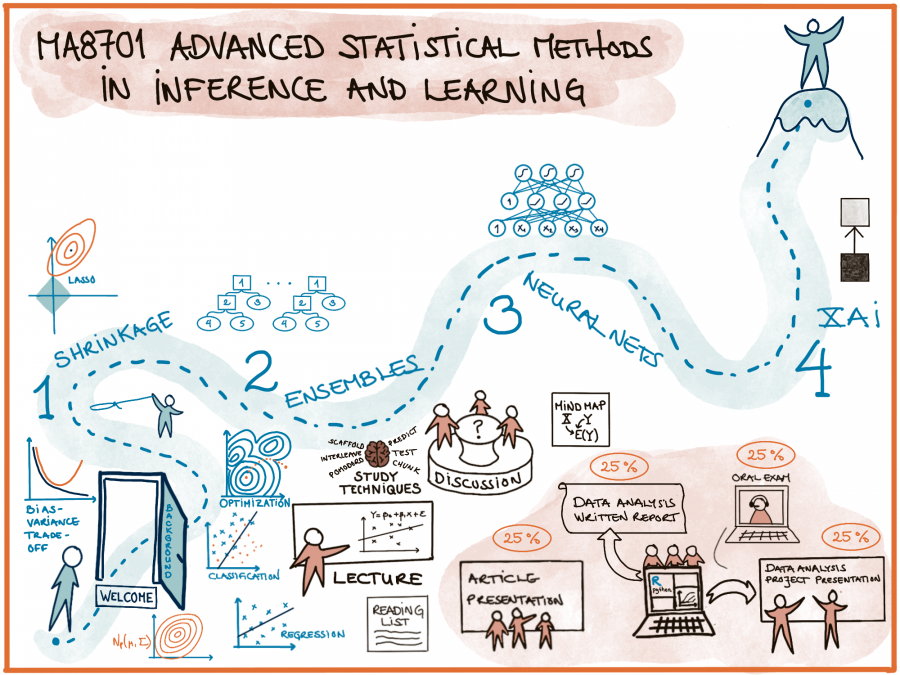

```{r setup, include=TRUE,echo=FALSE}
suppressPackageStartupMessages(library(knitr))
knitr::opts_chunk$set(echo = FALSE, message=FALSE,warning = FALSE, error = FALSE)
suppressPackageStartupMessages(library(ggplot2))
suppressPackageStartupMessages(library(reticulate))
#reticulate::use_python("/usr/bin/python3",required=TRUE)
suppressPackageStartupMessages(library(ggpubr))
suppressPackageStartupMessages(library(cowplot))
suppressPackageStartupMessages(library(magick))
suppressPackageStartupMessages(library(pheatmap))
suppressPackageStartupMessages(library(amap))
```


```{r}
#http://zevross.com/blog/2017/06/19/tips-and-tricks-for-working-with-images-and-figures-in-r-markdown-documents/
# options in r chunk settings
# out.width="100%"
# dpi=72


```

---

# Course topics

```{r,out.width= "20%", fig.align="left"}
#,fig.show="hold"}
include_graphics("ELSbookcover.jpeg")
```

The starting point is that we cover important parts of 

The Elements of Statistical Learning: Data Mining, Inference, and Prediction, Second Edition (Springer Series in Statistics, 2009) by Trevor Hastie, Robert Tibshirani, and Jerome Friedman.

but, since the book is from 2008 this means that for many topic we need (to be up to date) additional selected material in the form of book chapters and research articles.


---

## Introduction [this part, one week]

Sort out assumed background knowledge, and learn something new

* Notation
* Statistical decision theoretic framework (partly new)
* Regression (what do we know)
* Classification (ditto)
* Model selection and model assessment - including bias-variance trade-off (mostly new)

---

## Part 1: Shrinkage [3 weeks]

or "Regularized linear and generalized linear models".

* ELS 3.2.3,3.4, 3.8, 4.4.4.
* Hastie, Tibshirani, Wainwright (HTW): "Statistical Learning with Sparsity: The Lasso and Generalizations". Selected chapters.
* Post-selective inference (articles)
* An introduction to analysing text

Includes one data analysis project with short report.

---

## Part 2: Ensembles [4 (5) weeks]

* trees, bagging and forests
* general ensembles (similar to super learner)
* boosting
* hyper-parameter tuning

Selected chapters in ELS (8.7, 8.8, 9.2, parts of 10, 15, 16) and several articles.

## Part 3: Neural nets [(2) 3 weeks]

* Goodfellow, Bengio, Courville: Deep learning (2016). MIT press. https://www.deeplearningbook.org/. Selected chapters.
* Evaluating uncertainty

---

## Part 4: XAI [2 weeks]

Lectured by Kjersti Aas.

Articles on 

* LIME, 
* partial dependence plots, 
* Shapley values, 
* relative weights and 
* counterfactuals.

## Closing [1 week]

* w/oral presentations of second data project from Parts 2-4.

---

# Useful/required previous knowledge

* TMA4267 Linear Statistical Methods
* TMA4268 Statistical learning
* TMA4295 Statistical inference
* TMA4300 Computer intensive statistical methods
* TMA4315 Generalized linear models
* Good understanding and experience with R, or with Python, for statistical data analysis.
* Knowledge of RMarkdown for writing reports and presentations
* Skills in group work - possibly using git

---

# Learning outcome

**1. Knowledge**

* Understand and explain the central theoretical aspects in statistical inference and learning. 
* Understand and explain how to use methods from statistical inference and learning to perform a sound data analysis. 
* Be able to evaluate strengths and weaknesses for the methods and choose between different methods in a given data analysis situation.

---

**2. Skills**

Be able to analyse a dataset using methods from statistical inference and learning in practice (using R or Python), and give a good presentation and discussion of the choices done and the results found.

**3. Competence**

* The students will be able to participate in scientific discussions, read research presented in statistical journals, and carry out research in statistics at high international level. 
* They will be able to participate in applied projects, and analyse data using methods from statistical inference and learning.


---

# Learning methods and activities

Herbert A. Simon (Cognitive science, Nobel Laureate):
_Learning results from what the student does and thinks
and only from what the student does and thinks. The
teacher can advance learning only by influencing what the
student does to learn._

* Lectures will be on 14 Mondays 9.15-12 in S21 (and zoom). We will not record the lectures because we will try to include student activities in groups (on tables or break-out rooms).

* Exploring different study techniques (one or more each lecture).

* Problem sets to work on between lectures.

* Final individual oral exam (25% of pass/fail grade) in May.

---

* One practical compulsory group project in data analysis (application of course theory using R or Python) with short report. Topic: Part 1 on Shrinkage, chosen data set discussed with lecturer before start. Due mid February. First given comments by one other group, then evaluated by course responsible. (25% of pass/fail grade)

* One article group presentation, orally (15 minutes+questions). Material from Parts 2 and 3 preferred, and must be decided on with lecturer (might also be parts of your own master thesis if applicable). Due before Easter. (25% of pass/fail)

* Practical compulsory project in data analysis (application of course theory using R or Python) with oral presentation (15 minutes+questions). Topic: Part 2-4, data set and methods discussed with lecturer before start. Due after Part 4 is finished. (25% of pass/fail grade)

* For the two data analysis projects: one should be with a data set requiring regression and one with classification type analysis.

---

# Course wiki

<https://wiki.math.ntnu.no/ma8701/2021v/start>

**Questions?**

---

# Class activity

Aim: get to know each other - to improve on subsequent group work!

````{r,echo=TRUE,eval=FALSE}
while (at least one student not presented) 
   lecturer give two alternatives, you choose one. 
   lecturer choose a few students to present their view 
   together with giving their name and study programme 
   (and say if they are looking for group members)
   
```

---

* Dog person or cat person?
* When performing logistic regression - do you then say you do statistical learning or machine learning?
* I will show you the result of a descriptive analysis: summary or graphical display?
* Learning something new: read a book or watch a video?
* Analysing data: R or python?
* Analysing data: report p-values and or confidence intervals
* In class: taking notes or not?
* Use camel case or snake case for programming?
  
camel: writing compound words such that each word in the middle of the phrase begins with a capital letter, with no intervening spaces or punctuation. "camelCase" or "CamelCase".

snake: writing compound words where the elements are separated with one underscore character (_) and no spaces, with each element's initial letter usually lower cased within the compound and the first letter either upper- or lower case as in "foo_bar"

---

# Introduction: Plan

(finally - we start on the fun stuff!)

* Notation
* Statistical decision theoretic framework (partly new)

Remind about assumed background knowledge (already known), 

* Regression (ELS ch 3, except 3.2.3, 3.2.4, 3.4, 3.7, 3.8)
* Classification (ELS ch 4.1-4.5, except 4.4.4)

and then cover new aspects for 

* Model selection and assessment (ELS Ch 7.1-7.6, 7.10-7.12), including statistical learning and the bias-variance trade-off (ELS ch 2)

---

# Notation

(mainly from ELS)

We will only consider supervised methods.

* Response $Y$ (or $G$): dependent variable, outcome, usually univariate (but may be multivariate)
   + quantitative $Y$: for regression
   + qualitative, categorical $G$: for classification, some times dummy variable coding used (named one-hot coding in machine learning)
* Covariates $X_1, X_2, \ldots, X_p$: "independent variables", predictors, features
   + continuous, discrete: used directly
   + categorical, discrete: often dummy variable coding used

We aim to construct a rule, function, learner: $f(X)$, to predict $Y$ (or $G$).

---

Random variables and (column) vectors are written as uppercase letters $X$, and $Y$, while observed values are written with lowercase $(x,y)$. (Dimensions specified if needed.)

Matrices are presented with bold face: ${\bf X}$, often $N \times (p+1)$. 

ELS uses boldface also for ${\bf x}_j$ being a vector of all $N$ observations of variable $j$, but the vector of observed variables for observation $i$ is just $x_i$.

---


Both the response _and covariates_ will be considered to be random, and drawn from some joint distribution
$P(X_1,X_2,\ldots, X_p,Y)=P(X,Y)$ or $P(X,G)$.

Conditional distribution: $P(X,Y)=P(Y \mid X)P(X)$ or $P(Y\mid X=x)P(X=x)$

and double expectation is often used

$$\text{E}[L(Y,f(X))]=\text{E}_{X,Y}[L(Y,f(X))]=\text{E}_{X}\text{E}_{Y \mid X}[L(Y,f(X))]$$
where $L$ is a loss function (to be defined next) and $f(X)$ some function to predict $Y$ (or $G$).

---

## Training set
(ELS 2.1)

A set of size $N$ of independent pairs $(x_i,y_i)$ is called the _training set_ and often denoted ${\cal T}$.

The training data is used to estimate the unknown function $f$.

Test data is in general thought of as future data, and plays an important role in both 

* model selection (finding the best model among a candidate set) and also for 
* model assessment (assess the performance of the fitted model on future data).

We will consider theoretical results for future test data, and also look at different ways to split or resample available data.

---

## Two core regression methods

are multiple linear regression (MLR) and $k$-nearest neighbour (kNN).

**Group discussion:** 

For the two methods

* Set up the formal definition for $f$, and model assumptions made
* What top results do you remember? Write them down.
* What are challenges?
* What changes need to be done to each of the two methods for classification?

---

### Regression and MLR

**Resources**

(mostly what we learned in TMA4267, or ELS ch 3, except 3.2.3, 3.2.4, 3.4, 3.7, 3.8)

* From TMA4268: <https://www.math.ntnu.no/emner/TMA4268/2019v/TMA4268overview.html> and in particular <https://www.math.ntnu.no/emner/TMA4268/2019v/3LinReg/3LinReg.html>
* From TMA4315: <https://www.math.ntnu.no/emner/TMA4315/2018h/TMA4315overviewH2018.html> and in particular <https://www.math.ntnu.no/emner/TMA4315/2018h/2MLR.html>

---

# Statistical decision theoretic framework
(ELS ch 2.4)

is a mathematical framework for developing models $f$ - and assessing optimality.

First, regression:

* $X \in \Re^p$
* $Y \in \Re$
* $P(X,Y)$ joint distribution of covariates and respons

Aim: find a function $f(X)$ for predicting $Y$ from some inputs $X$.

Ingredients: Loss function $L(Y,f(X))$ - for _penalizing errors in the prediction_.

Criterion for choosing $f$: Expected prediction error (EPE)
$$ \text{EPE}(f)=\text{E}_{X,Y}[L(Y,f(X))]=\int_{x,y}L(y,f(x))p(x,y)dxdy$$
Choose $f$ to minimize the $\text{EPE}(f)$.


---

## Squared error loss

$$ \text{EPE}(f)=\text{E}_{X,Y}[L(Y,f(X))]=\text{E}_{X}\text{E}_{Y \mid X}[(Y-f(X))^2\mid X]$$

We want to minimize EPE, and see that it is sufficient to minimize $\text{E}_{Y\mid X}[(Y-f(X))^2\mid X]$ for each $X=x$ (pointwise):

$$ f(x)=\text{argmin}_c \text{E}_{Y \mid X}[(Y-c)^2 \mid X=x]$$
This gives as result the conditional expectation - the best prediction at any point $X=x$:

$$ f(x)=\text{E}[Y \mid X=x]$$
Proof: by differentiating and setting equal 0, see for example page 8 of <https://getd.libs.uga.edu/pdfs/ma_james_c_201412_ms.pdf>

In practice: need to estimate $f$.

---

### Linear regression

Conditionally (known from before): if we assume that $(X,Y) \sim N_{p+1}(\mu,\Sigma)$ then we have seen that $\text{E}(Y\mid X)$ is linear in $X$ and $\text{Cov}(Y \mid X)$ is independent of $X$. Then we know we get 
$\hat{beta}=(X^TX)^{-1}X^T Y$ (with matrices) using OLS or MLE.

But, also if we assume an approximate linear model: $f(x)\approx x^T \beta$

Marginally: $\text{argmin}_{\beta} \text{E}[(Y-X^T\beta)^2]$ gives $\beta=\text{E}[X X^T]^{-1}\text{E}[XY]$ (now random vectors).

We may replace expectations with averages in training data to estimate $\beta$.

This is not conditional on $X$, but we have assumed a linear relationship.

---

## Absolute loss

Regression with absolute (L1) loss: $L(Y,f(X))=\lvert Y-f(X) \rvert$ gives $\hat{f}(x)=\text{median}(Y\mid X=x)$.

Proof: for example pages 8-11 of <https://getd.libs.uga.edu/pdfs/ma_james_c_201412_ms.pdf>

---

## Classification loss

* $X \in \Re^p$
* $G \in {\cal G}=\{1,\ldots,K\}$
* $\hat{G}(X) \in {\cal G}=\{1,\ldots,K\}$
* $L(G,\hat{G}(X))$ is a $K\times K$ matrix where $K=\lvert G \rvert$, with elements $l_{jk}$ giving the price to pay to misclassify an observation with true class $g_j$ to class $g_k$. 
* Elements on the diagonal of $L$ is 0, and off-diagonal elements are often $1$.

We would like to find $\hat{G}$ to minimize the EPE:

$$\text{EPE}=\text{E}_{G,X}[L(G,\hat{G}(X))]=\text{E}_X \text{E}_{G\mid X}[L(G,\hat{G}(X))]$$
$$=\text{E}_X \{ \sum_{k=1}^K L(g_k,\hat{G}(X))P(G=g_k \mid X=x) \} $$

---

Also here it is sufficient to minimize the loss for each value of $x$ (pointwise)
$$ \hat{G}=\text{argmin}_{g \in {\cal G}}\sum_{k=1}^K L(g_k,\hat{G}(X))P(G=g_k \mid X=x) $$

In the special case of 0-1 loss (off-diagonal elements in $L$ equal to 1):

$$ \hat{G}=\text{argmin}_{g \in {\cal G}}\sum_{k=1}^K L(g_k,\hat{G}(X))P(G=g_k \mid X=x)$$
All $k$ except the correct class gives loss $1$ with probability $P(G=g_k \mid X=x)$, which is summed. This equals $1$ minus the conditional probability of the correct class $g$.

---

$$\hat{G}=\text{argmin}_{g \in {\cal G}} [1-P(G=g \mid X=x)]$$
$$=\text{argmax}_{g \in {\cal G}}P(G=g \mid X=x)$$

The _Bayes classifier_ classifies to the most probable class using the conditional distrbution $P(G \mid X)$. The class boundaries are class the _Bayes decision boundaries_ and the error rate is the _Bayes rate_.

---

## Classification (recap)

What do we know about classification? (TMA4268 and TMA4315 mainly, or ELS ch 4.1-4.5, except 4.4.4)

* Sampling vs diagnostic paradigm, parametric vs non-parametric methods
* $k$NN, LDA, logistic and multinomial regression

**Resources**

(mostly what we learned in TMA4267, or ELS ch 4.1-4.5, except 4.4.4)

* From TMA4268: <https://www.math.ntnu.no/emner/TMA4268/2019v/TMA4268overview.html> and in particular <https://www.math.ntnu.no/emner/TMA4268/2019v/4Classif/4Classif.html> and <https://www.math.ntnu.no/emner/TMA4268/2019v/2StatLearn/2StatLearn.html#k-nearest_neighbour_classifier>
* From TMA4315: <https://www.math.ntnu.no/emner/TMA4315/2018h/TMA4315overviewH2018.html> and in particular <https://www.math.ntnu.no/emner/TMA4315/2018h/3BinReg.html>
and <https://www.math.ntnu.no/emner/TMA4315/2018h/6Categorical.html>.

---

# Model assessment and selection

(ELS Ch 7.1-7.6,7.10-7.12)

The generalization performance of $\hat{f}$ can be evaluated from the EPE (expected prediction error) on an independent test set. 

We use this for 

* Model assessment: evaluate the performance of a selected model
* Model selection: select the best model for a specific task - among a set of models

---

## Plan

1) Look at $\text{EPE}(x_0)$ (now called Err($x_0$)) and how model complexity can be broken down into irreducible error, squared bias and variance (should be known from before)
2) Study EPE (Err) unconditional and conditional on the training set
3) Study optimism of the training error rate, and how in-sample error may shed light
4) Cross-validation and .632 bootstrap estimates of EPE
5) How will we build on this in Parts 1-4?

---


## The bias-variance trade-off 

(ELS p26 and 7.3)

Assume:
$$ Y=f(X)+\varepsilon$$
where $\text{E}(\varepsilon)=0$ and $\text{Var}(\varepsilon)=\sigma_{\varepsilon}^2$.

For the bias-variance decomposition we only consider the squared loss. Why?

In Ch 7 we use the notation Err instead of EPE (expected prediction error) that we used in Ch 2.

Let $\text{Err}(x_0)$ be the expected prediction error of a regression fit $\hat{f}(X)$ at a (new) input value $X=x_0$. As in Ch 2 the expected value is over $(X,Y)$ for Err, and we may look at 
$$ \text{Err}=E_{x_0} \text{Err}(x_0)$$

---

$$ \text{Err}(x_0)=\text{E}[(Y-\hat{f}(x_0))^2 \mid X=x_0]=\sigma_{\varepsilon}^2 +  \text{Var}[\hat{f}(x_0)]+[\text{Bias}(\hat{f}(x_0))]^2$$

* First term: irreducible error, $\text{Var}(\varepsilon)=\sigma^2$ and is always present unless we have measurements without error. This term cannot be reduced regardless how well our statistical model fits the data. 
* Second term: variance of the prediction at $x_0$ or the expected deviation around the mean at $x_0$. If the variance is high, there is large uncertainty associated with the prediction. 
* Third term: squared bias. The bias gives an estimate of how much the prediction differs from the true mean. If the bias is low the model gives a prediction which is close to the true value.


---

### Derivation

From TMA4268: <https://www.math.ntnu.no/emner/TMA4268/2019v/TMA4268overview.html> and in particular <https://www.math.ntnu.no/emner/TMA4268/2019v/2StatLearn/2StatLearn.html>

\small
\begin{align*} \text{Err}(x_0)&=\text{E}[(Y-\hat{f}(x_0))^2 \mid X=x_0]\\
&=\text{E}[Y^2 + \hat{f}(x_0)^2 - 2 Y \hat{f}(x_0)\mid X=x_0] \\
&= \text{E}[Y^2\mid X=x_0] + \text{E}[\hat{f}(x_0)^2\mid X=x_0] - \text{E}[2Y \hat{f}(x_0)\mid X=x_0]\\
&= \text{Var}[Y\mid X=x_0] + \text{E}[Y\mid X=x_0]^2 + \text{Var}[\hat{f}(x_0)\mid X=x_0] + \text{E}[\hat{f}(x_0)\mid X=x_0]^2 - 2 \text{E}[Y\mid X=x_0]\text{E}[\hat{f}(x_0)\mid X=x_0] \\
&= \text{Var}[Y\mid X=x_0]+f(x_0)^2+\text{Var}[\hat{f}(x_0)\mid X=x_0]+\text{E}[\hat{f}(x_0)\mid X=x_0]^2-2f(x_0)\text{E}[\hat{f}(x_0)\mid X=x_0]\\
&= \text{Var}[Y\mid X=x_0]+\text{Var}[\hat{f}(x_0)\mid X=x_0]+(f(x_0)-\text{E}[\hat{f}(x_0)\mid X=x_0])^2\\
&= \text{Var}(\varepsilon\mid X=x_0) +  \text{Var}[\hat{f}(x_0)\mid X=x_0]+[\text{Bias}(\hat{f}(x_0))\mid X=x_0]^2
\end{align*}
\normalsize

---

(For some applications also the training Xs are fixed.)

See the exercises below to study the results for $k$NN and OLS.

---

## Studying $\text{Err}$ and the new $\text{Err}_{\cal T}$

(ELS 7.2 and 7.4, and we are now back to a general loss function - but first have regression in mind)

If we now keep the training set fixed (we would do that in practice - since we usually only have one training set):

$$ \text{Err}_{\cal T}=\text{E}[L(Y,\hat{f}(X))^2\mid {\cal T}]$$

as before the expected value is with respect to $(X,Y)$, but the training set is fixed - so that this is the test set error is for this specific training set ${\cal T}$.

Getting back to the unconditional version, we use 
$$ \text{Err}=\text{E}[L(Y,\hat{f}(X))^2\mid {\cal T}]=\text{E} [\text{Err}_{\cal T}]$$

We want to estimate $\text{Err}_{\cal T}$, but we will soon see that it turns out that most methods estimate $\text{Err}$.

---

## Training error

(also referred to as apparent error)

For a regression problem: The training error is the average loss over the training sample:
$$\overline{\text{err}}=\frac{1}{N} \sum_{i=1}^N L(y_i,\hat{f}(x_i))$$

<!--Unfortuneately the training error is  not a good estimate of the test error. -->

The following is Figure 7.1 from the ELS book. 
The text (page 220) also reads that "100 simulated training sets of size 50" and that "lasso produced sequence of fits".

Explain what you see - in particular what is the red and blue lines and the bold lines. What can you conclude from the figure?

---

```{r}
#http://zevross.com/blog/2017/06/19/tips-and-tricks-for-working-with-images-and-figures-in-r-markdown-documents/
# options in r chunk settings
# out.width="100%"
# dpi=72

include_graphics("ELSfig71.png")
```

---

### Conclusion 
(from Figure 7.1)

The training error $\overline{\text{err}}$ is not a good estimate for the $\text{Err}_{\cal T}$ nor the $\text{Err}$.

If we are in a _data rich situation_ we "just" divide our data into three parts, and use 

* one for training
* one for validation (model selection)
* one for testing (model assessment)

A typical split might be 50-60% training and 20-25% validation and test, but this depends on the complexity of the model to be fitted and the signal-to-noise ratio in the data.

The focus in Ch 7 of ELS is to present methods to be used in the situations where we _don´t have enough data_ to rely on the training-validation-testing split.

---

## Loss function and traning error for classification

* $X \in \Re^p$
* $G \in {\cal G}=\{1,\ldots,K\}$
* $\hat{G}(X) \in {\cal G}=\{1,\ldots,K\}$

0-1 loss with $\hat{G}(X)=\text{argmax}_k \hat{p}_k(X)$
$$L(G,\hat{G}(X))=I(G\neq \hat{G}(X))$$ 
$-2$-loglikelihood loss (why $-2$?):
$$ L(G,\hat{p}(X))=-2 \text{log} \hat{p}_G(X)$$
---

Test error (only replace $\hat{f}$ with $\hat{G}$):
$$ \text{Err}_{\cal T}=\text{E}[L(Y,\hat{G}(X))^2\mid {\cal T}]$$
$$ \text{Err}=\text{E}[L(Y,\hat{G}(X))^2\mid {\cal T}]=\text{E} [\text{Err}_{\cal T}]$$

Training error (for $-2$loglikelihood loss)
$$\overline{\text{err}}=-\frac{2}{N}\sum_{i=1}^N \text{log}\hat{p}_{g_i}(x_i)$$

---

## Optimism of the training error rate

(again - focus is on regression)

First, nothing new, but new notation $(X^0,Y^0)$ to specify a new test observation drawn from the joint distribution $F$:


# Exercises

The exercises are from the ELS book, Chapters 2 and 7. Solutions to the exercises will be posted, see also under References for solutions posted by different authors.

## Curse of dimensionality

Read pages 22-23 and then answer Exercise 2.3 - which is to "Derive equation (2.24)."

Important take home messages:

* All sample points are close to an edge of the sample.
* If data are uniformly distributed in an hypercube in $p$ dimensions, we need to cover $r^{1/p}$ of the the range of each input variable to capture a fraction $r$ of the observations.

## Expected training and test MSE for linear regression

Exercise 2.9.

Important take home message: We have proven (for MLR) that the expected test MSE is always at least as large as the expected training MSE.

---

## Look into the derivation for the bias and variance

for $k$NN in Equation 7.10 and OLS in Equation 7.11 on pages 222-223.

## Establish the average optimism in the training error

Exercise 7.4

## Relate the covariance to the trace of a linear smoother

Exercise 7.5

## Perform best subset linear regression and compute different error rates

Exercise 7.9

# References

* ELS solutions to exercises: <https://waxworksmath.com/Authors/G_M/Hastie/hastie.html>
* ELS official errata: <https://web.stanford.edu/~hastie/ElemStatLearn/errata2.html>
* Andrew Ng Lecture notes on Learning theory <https://sgfin.github.io/files/notes/CS229_Lecture_Notes.pdf>
* R Markdown Cookbook: <https://bookdown.org/yihui/rmarkdown-cookbook/>
* R Markdown cheat sheet: >https://rstudio.com/wp-content/uploads/2015/03/rmarkdown-reference.pdf>

* <https://en.wikipedia.org/wiki/Camel_case>
* <https://en.wikipedia.org/wiki/Snake_case>


When relevant? <https://www.math.ntnu.no/emner/TMA4315/2017h/qq.html>
* <https://machinelearningmastery.com/mcnemars-test-for-machine-learning/>

