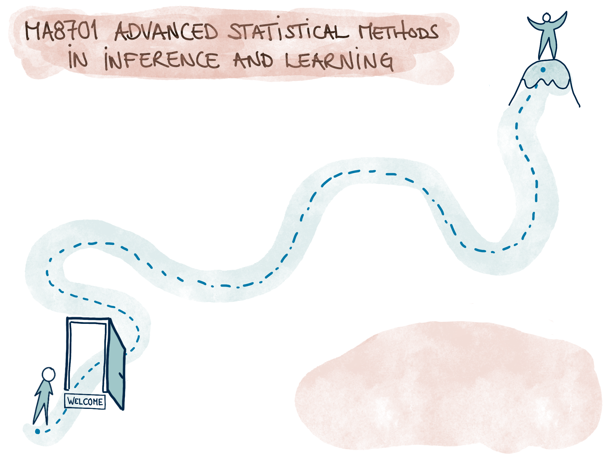
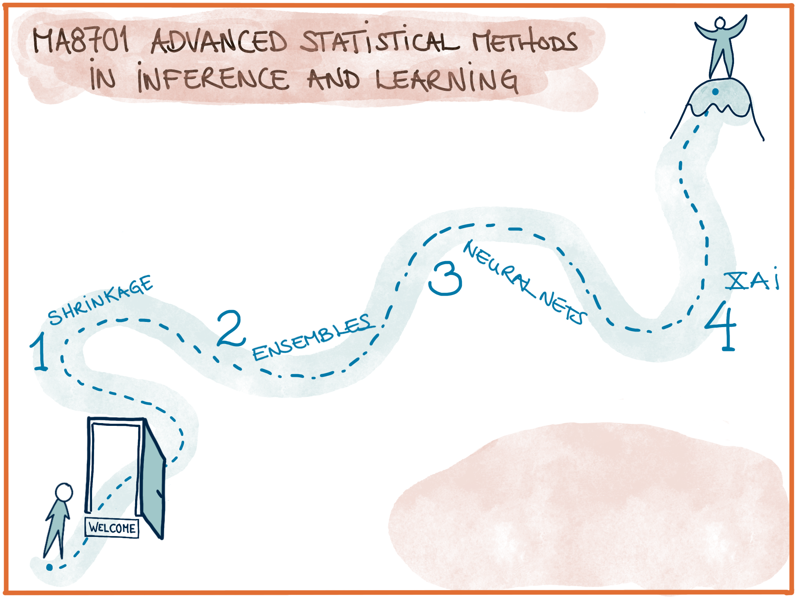
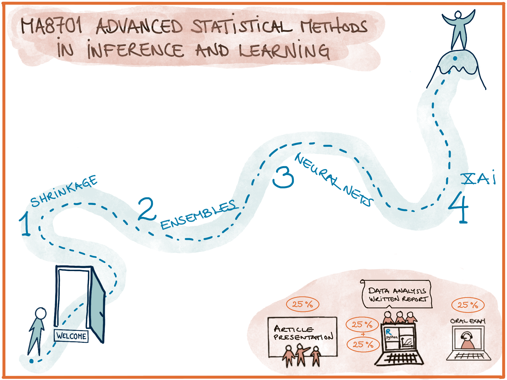
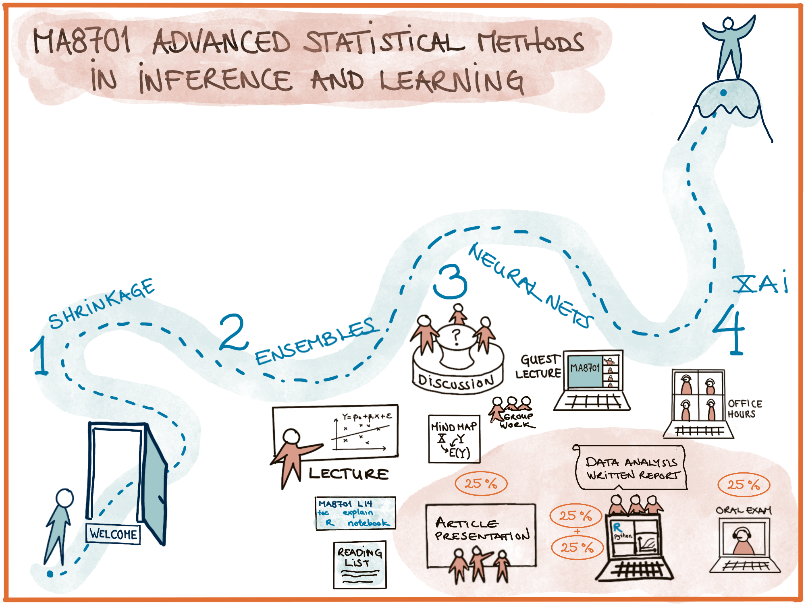
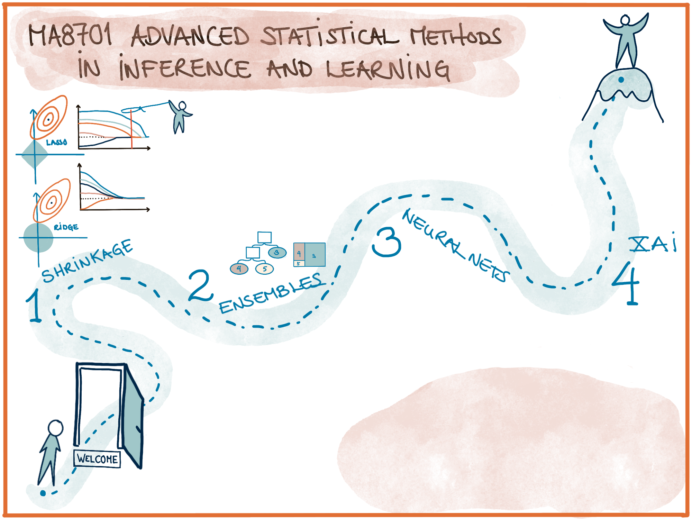
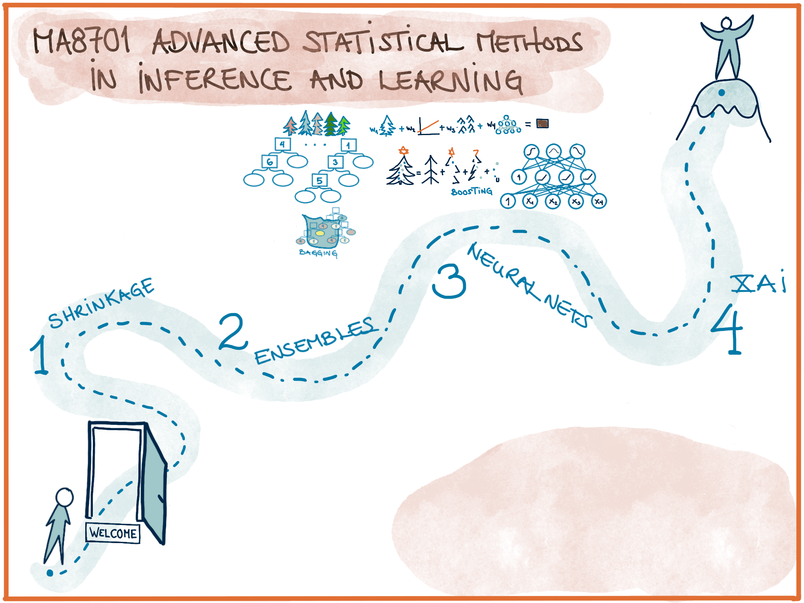
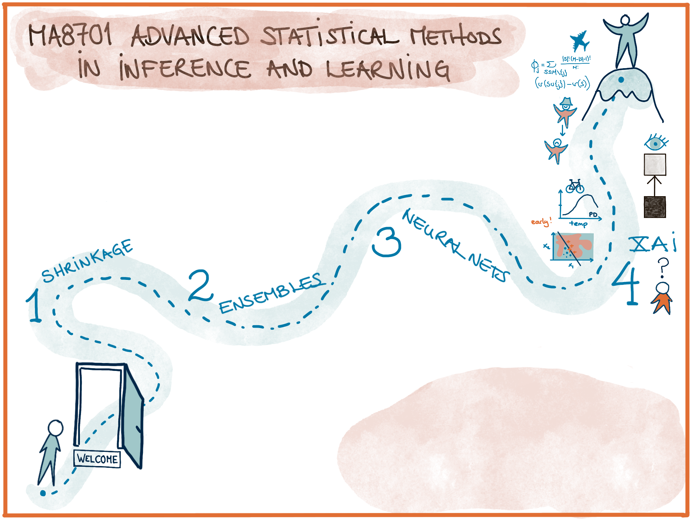
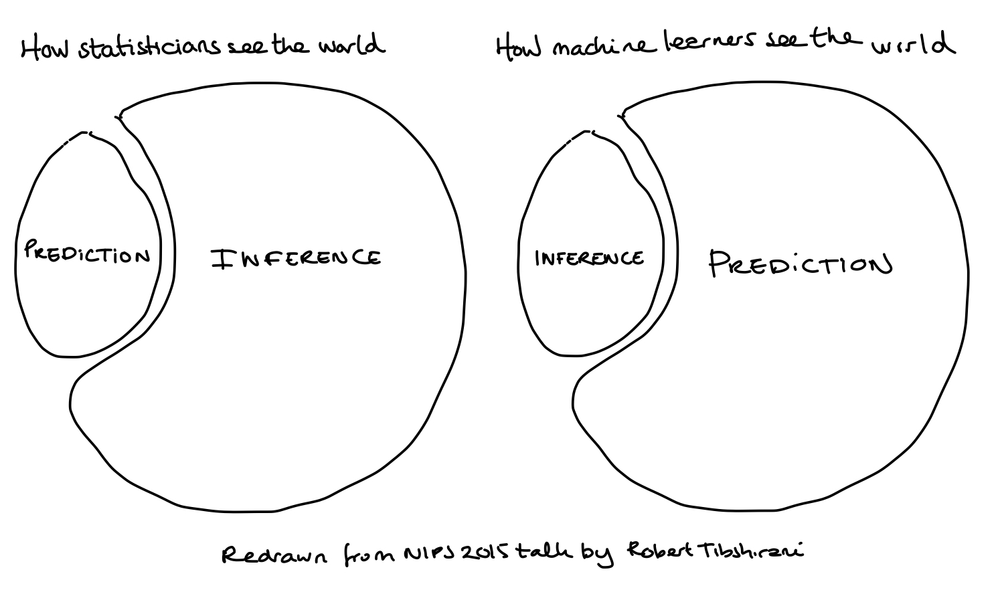
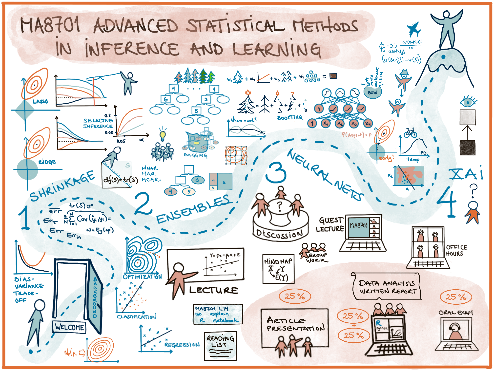

```{r,echo=FALSE}
library(knitr)
```

# Outline

* Learning outcomes
* Grading elements: portfolio and oral exam
* Final reading list

$~$

* Overview: parts and topics through data analysis 
* Discussion: central aspects!

$~$

* What are difficult concepts? Clarify level
* Additional resources in L14.html

$~$

* Closing

---

```{r,out.width="100%",echo=FALSE}
#http://zevross.com/blog/2017/06/19/tips-and-tricks-for-working-with-images-and-figures-in-r-markdown-documents/
# options in r chunk settings
# out.width="100%"
# dpi=72


```

---

```{r,out.width="100%",echo=FALSE}
#http://zevross.com/blog/2017/06/19/tips-and-tricks-for-working-with-images-and-figures-in-r-markdown-documents/
# options in r chunk settings
# out.width="100%"
# dpi=72


```

---

```{r,out.width="100%",echo=FALSE}
#http://zevross.com/blog/2017/06/19/tips-and-tricks-for-working-with-images-and-figures-in-r-markdown-documents/
# options in r chunk settings
# out.width="100%"
# dpi=72


```

---

```{r,out.width="100%",echo=FALSE}
#http://zevross.com/blog/2017/06/19/tips-and-tricks-for-working-with-images-and-figures-in-r-markdown-documents/
# options in r chunk settings
# out.width="100%"
# dpi=72


```

---

#  Learning outcome 

**1. Knowledge**

>- Understand and explain the central theoretical aspects in statistical inference and learning. 
>- Understand and explain how to use methods from statistical inference and learning to perform a sound data analysis. 
>- Be able to evaluate strengths and weaknesses for the methods and choose between different methods in a given data analysis situation.

---

**2. Skills**

Be able to analyse a dataset using methods from statistical inference and learning in practice (using R or Python), and give a good presentation and discussion of the choices done and the results found.

$~$

---

**3. Competence**

>- The students will be able to participate in scientific discussions, read research presented in statistical journals, and carry out research in statistics at high international level. 

>- They will be able to participate in applied projects, and analyse data using methods from statistical inference and learning.


---

**Comments?**

---

# Two grading elements

## 75% Portfolio (Pass/Fail at 70/100)

$~$

* Written report from data analysis project 1 (Part 1) 
* Oral article presentation and discussion 
* Written report from data analysis project 2 (Parts 2-4) . Hand in by May 3. 

$~$

Grading deadline: May 14

---

<!-- Information on Pass/Fail will be given at May 14 at the latest, together with some comment on the report from the data analysis project 2. Feedback on the first to items given before Easter 2021 as a score and with comments. -->


## 25% Oral exam (Pass/Fail at 70/100)

May 25-28, 2021

$~$

* One week before the exam (May 18) a list of five possible topics (questions) will be available by email and at <https://wiki.math.ntnu.no/ma8701/2021v/exam>.

$~$

* If you want you may prepare a 5-10 minutes presentation of one of the topics (bring notes, but no slides, talk and write by hand) to be held in the start of the oral exam.

$~$

* The rest of the exam is general questions from the reading list (no notes)

$~$

*  Important: understanding - the big lines - explain formula not memorize formula!

$~$

Total duration < 30 minutes. 

---

## Questions?

---

# Final reading list

List with links at <https://wiki.math.ntnu.no/ma8701/2021v/curriculum>

## Book chapters

>- Hastie, Tibshirani and Friedman (2009), "The Elements of Statistical Learning": Ch 2.4, 3.2.3, 3.4.1-3.4.2, 4.4.1-4.4.4, 7.1-7.6, 7.10-7.12, 8.7, 9.2, 9.6, 10.10-10.12, 16.1. 
>- Hastie, Tibshirani, Wainwright (2015): "Statistical Learning with Sparsity: The Lasso and Generalizations". Ch 1, 2.1-2.5, 3.1-3.2, 3.7,4 (4.1-4.3, 4.5-4.6 only on an overview level), 6.0, 6.1 (overview), 6.2, 6.5.
>- Goodfellow, Bengio and Courville (2016). "Deep learning": Ch 6.0, 6.2-6.4, 7.0-7.1, 7.8, 7.11, 7.12.
>- Molnar (2019), "Interpretable Machine Learning. Ch 2, 5 (not 5.8), 6.1.


---

## Other
<https://wiki.math.ntnu.no/ma8701/2021v/curriculum>

>- Taylor and Tibshirani (2015). "Statistical learning and selective inference", p 7629-7634  (skip sequential stopping rule and PCR) [L4]
>- Dezeure, Bühlmann and Meinshausen (2015). "High-Dimensional Inference: Confidence Intervals, p-Values and R-Software hdi". Ch2.1.1, 2.2 [L4]
>-  Chen, T., & Guestrin, C. (2016). "XGBoost: A Scalable Tree Boosting System". (pp. 785–794). The mathematical notation is not in focus [L6]
>- Erin Le Dell (2015): "Scalable Ensemble Learning and Computationally Efficient Variance Estimation". Ch 2.2 [L7]
>- Frazier (2018): "A tutorial on Bayesian optimization", Ch 1,2,3,4.1, 5: only the section "Noisy evaluations", 6, 7 [L8]
>- Slide deck from Jeremy Barnes and Samia Toulieb from [L10].
>- Phd thesis of Gundersen (2020): Ch 2.1-2.3, 3 (3.3. only "concept", not 3.1.1), 4.0-4.1 (only concepts not maths). [L11] 

<!-- ca 15 min max hit-->

---

## Questions?

---

# Outline

* Learning outcomes
* Grading elements: portfolio and oral exam
* Final reading list

$~$

* Overview: parts and topics through data analysis 
* Discussion: central aspects!

$~$

* What are difficult concepts? Clarify level
* Additional resources in L14.html

$~$

* Closing

---

# Overview of topics 

## Problem types

Main focus: 

* regression and classification

But, very briefly 

* time series: turned into regression or classification, or recurrent neural nets
* text: basic processing and then regression, classification or recurrent neural nets
* (images: convolutional neural networks)

---

## Methods

>- Interpretable methods
>- Non-interpretable methods
>- Methods to explain

$~$

>- Model, method, algorithm, prediction.

---

## Interpretable methods 
(Model, method, algorithm, prediction.)

>- LM, GLM, CART
>- Ridge, lasso for LM and GLM

```{r,out.width="80%",echo=FALSE}
#http://zevross.com/blog/2017/06/19/tips-and-tricks-for-working-with-images-and-figures-in-r-markdown-documents/
# options in r chunk settings
# out.width="100%"
# dpi=72


```


---

## Non-interpretable methods
(Model, method, algorithm, prediction.)

>- Bagging (random forest), boosting (xgboost), super learner

>- Feed forward neural network, (recurrent nn), (convolutional nn), (Bayesian nn)

```{r,out.width="80%",echo=FALSE}
#http://zevross.com/blog/2017/06/19/tips-and-tricks-for-working-with-images-and-figures-in-r-markdown-documents/
# options in r chunk settings
# out.width="100%"
# dpi=72


```

---

## Methods to explain
(Not so relevant here: Model, method, algorithm, prediction.)

>- ICE/PD/ALE plots, feature importance, LMG/Shapley regression

>- LIME, counterfactuals, Shapley


```{r,out.width="80%",echo=FALSE}
#http://zevross.com/blog/2017/06/19/tips-and-tricks-for-working-with-images-and-figures-in-r-markdown-documents/
# options in r chunk settings
# out.width="100%"
# dpi=72


```

---

## Statistical learning - and inference

>- (Supervised) learning has focus on prediction: 
    + predict a continuous response or predict the correct class 
    + (and interpret with XAI - due to law and ethical AI)

>- Inference: 
    + model assumptions, 
    + sampling distribution
    + estimate effects with uncertainty (CI), 
    + test hypotheses ($p$-values), 
    + interpret
    + Bayesian methods for "increased understanding" 
$~$

>- Take home message: we need inference to provide uncertainty estimates!

---

```{r,out.width="80%",echo=FALSE}
#http://zevross.com/blog/2017/06/19/tips-and-tricks-for-working-with-images-and-figures-in-r-markdown-documents/
# options in r chunk settings
# out.width="100%"
# dpi=72


```

>- Aim in MA8701: move from the right figure towards the left figures. 

>- Have we succeeded?

---

# Outline

* Learning outcomes
* Grading elements: portfolio and oral exam
* Final reading list

$~$

* Overview: parts and topics through data analysis 
* Discussion: central aspects!

$~$

* What are difficult concepts? Clarify level
* Additional resources in L14.html

$~$

* Closing

---

# Data analysis

## First step in data analysis

* Descriptive statistics
* How to handle missing data (complete case, single imputation, multiple imputation, method-specific solutions)
* Defining covariates (feature design, non-linearities, interactions) and response 
* Covariates: center and scale (standardize) or not?
* Response: center? transform?
* At the same time: 
   + need training and test data or do CV for model assessment, 
   + need validation data or CV for model selection and hyperparameter tuning

---

## Looking at the course elements as "Performing data analysis"

$~$
$~$
$~$

---

```{r,out.width="100%",echo=FALSE}
#http://zevross.com/blog/2017/06/19/tips-and-tricks-for-working-with-images-and-figures-in-r-markdown-documents/
# options in r chunk settings
# out.width="100%"
# dpi=72


```

---

## Break-out session

**Learning goal (knowledge): Understand and explain the central theoretical aspects in statistical inference and learning. **

* What are core take home messages from the "Performing data analysis" drawing?
* What are central theoretical aspects that we have learned?
* Do the two sets of answers overlap?

<!-- --- -->

<!-- ## Some possible answers -->

<!-- * The statistical decision theoretic framework is built on using the expected prediction error as a criterion for choosing a prediction model. -->
<!-- * The bias-variance trade-off explains the possibly conflicting roles of the bias and the variance when needing to choose between methods of different complexity. -->
<!-- * Loss functions are motivated by maximum likelihood theory, with assumptions on the distribution of a response. -->
<!-- * Model selection and model assessment need to be performed on other data than used for model fit (the training data). Enter validation and test data. -->
<!-- * Wisedom of the crowd -->
<!-- * The many flavours of regularization -->
<!-- * ethical AI -->
<!-- * the data poor situation is way more difficult that if we can afford training set- validation set - test set  -->

---

# Difficult concepts

## The 13 lectures

* L1: Model selection and assessment
* L2: Lasso and ridge for linear model
* L3: Lasso and ridge for GLM, variants of lasso
* L4: Statistical inference (after selection)
* L5: Trees and bagging
* L6: xgboost
* L7: Random forest and super learner
* L8: Hyperparameter tuning, Bayesian optimization, comparisons inference
* L9: Feed-forward neural networks
* L10: Text analysis and recurrent networks
* L11: Uncertainty in neural networks
* L12: XAI global and LIME
* L13: Counterfactuals and Shapley


---

Answers from 13 students.

```{r,echo=FALSE}
# responses
#Bayesian statistics=xx
difficult=list(
  c(8),
  c(1,11,13),
  c(2,3,4,9,10,11),
  c(1,8),
  c(4,6,9,10,11),
  c(6,11),
  c(6,8),
  c(11),
  c(1,2,3),
  c(1,8,12),
  c(6,7,8,9,10,11),
  c(4),
  c(1,7,8,11))
res=(table(unlist(difficult)))
names(res)=paste("L",names(res),sep="")
barplot(res)
```

---

## The role of Bayesian statistics in this course

$~$

$~$

$~$


<!-- Some students mentioned little familiarity with Bayesian methods. -->

<!-- Bayesian methods are covered in TMA4300 Computational statistics (and some students take MA8702 and are Bayesian experts), which was listed on our wiki-page prerequisites for taking the course. Students that do not know basic Bayesian theory will have problems understanding the Bayesian lasso in L4 and all the uncertainty quantification for deep learning in L11 (the part that is not about dropout). The Bayesian optimization (L8) can be understood by only using knowledge about conditional multivariate normal distributions (which should be known from TMA4267 Linear statistics models). -->

<!-- I have made a short story below about what we have learned in L4 with the Bayesian lasso (and ridge), and what are the core ideas for the uncertainty quantification in L11. Understanding this will be sufficient at the oral exam, and will hopefully be of interest in general.  -->


---

### Uncertainty in neural networks

#### Drop-out

**During training (at each training step):**

* remove randomly (Bernoulli probability $p$) input or hidden nodes (internal nodes) from the model.

$~$

---


**During test phase (for prediction): **

>- use the same drop-out mechanism to get a prediction, 
>- repeat this many times to provide an estimate of the predictive distribution. 
>- Or, just estimate the mean and variance of the sampled distribution, or construct an interval from the samples. 

$~$

>- Then you have a prediction with an uncertainty estimate.

>- But, is this a smart thing to do?

---

#### Bayesian neural network

>- A Bayesian neural network is a stochastic artificial neural network where weights are estimated using Bayesian inference. 

>- Weights thus have distributions - both prior (before we have data) and posterior (conditional on the data we have observed).

>- During training (at each training step): update the posterior distribution of the weights.

>- The method called variational inference can be used to approximate this posterior distribution (a competitor to Integrated nested Laplace approximations).

>- We get a measure of uncertainty by using the posterior distribution of the weights.

>- During test phase (for prediction): use the posterior to calculate the predictive distribution.

---

>- This is a costly procedure, and we look for cheap approximate solutions. 

>- It turns out that under some restrictions drop-out can produce the predictive distribution for a prediction (during test phase). 

>- Drop out is much less costly than this variational inference approach and we can do that instead. 

>- This provides a good explanation to why using dropouts is a smart thing to do!

---

## Questions?

# Other resources in L14.html

## The role of mathematical results (pr topic)
## Concepts/questions pr lecture
## From students: possible oral exam questions
## From students: Core take home message
## Closing: All topics in short

# Closing

*  Please give feedback on course elements and suggestions for changes to the reference group. 

*  Last meeting is April 29. See contact detail to members at <https://wiki.math.ntnu.no/ma8701/2021v/start>

*  Deadline May 3 for Project 2

*  Activities before the oral exam? 

---

```{r,out.width="100%",echo=FALSE}
#http://zevross.com/blog/2017/06/19/tips-and-tricks-for-working-with-images-and-figures-in-r-markdown-documents/
# options in r chunk settings
# out.width="100%"
# dpi=72


```

