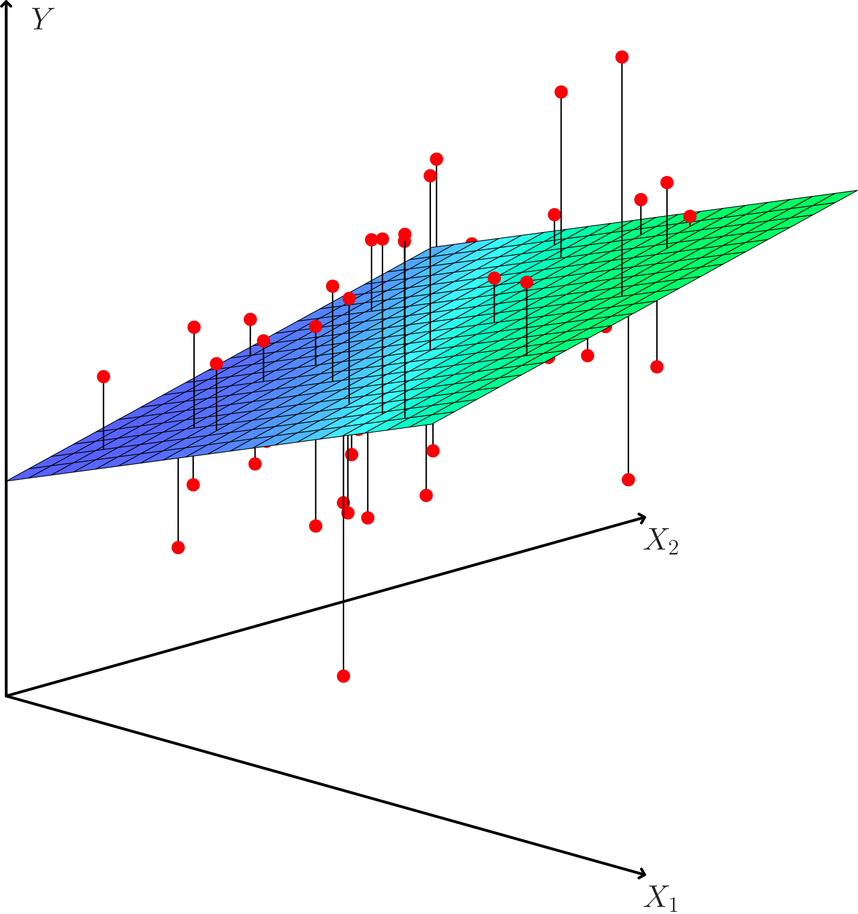
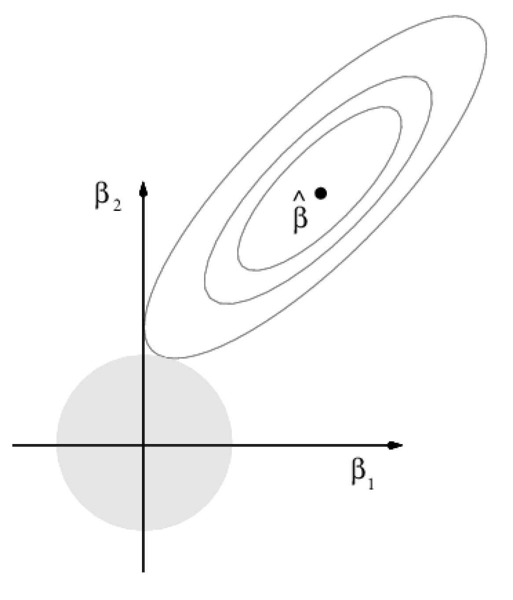
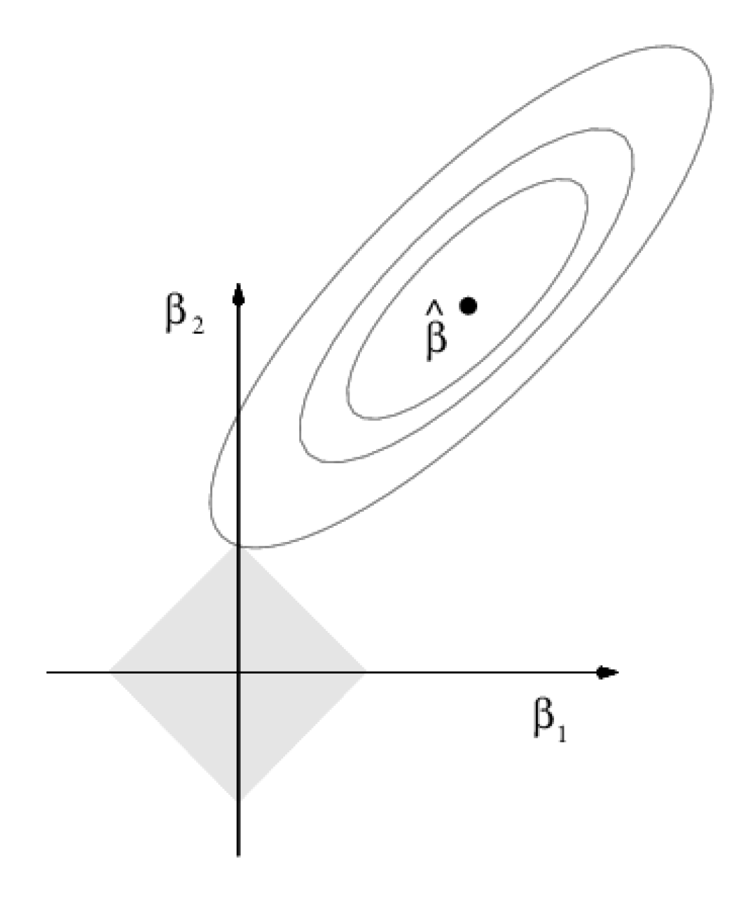
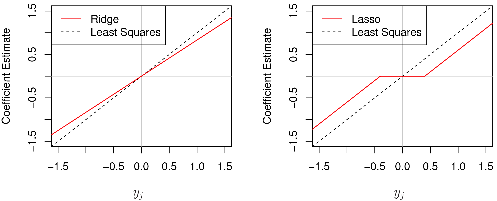

```{r setup, include=TRUE,echo=FALSE}
suppressPackageStartupMessages(library(knitr))
knitr::opts_chunk$set(echo = FALSE, message=FALSE,warning = FALSE, error = FALSE)
suppressPackageStartupMessages(library(ggplot2))
suppressPackageStartupMessages(library(reticulate))
#reticulate::use_python("/usr/bin/python3",required=TRUE)
suppressPackageStartupMessages(library(ggpubr))
suppressPackageStartupMessages(library(cowplot))
suppressPackageStartupMessages(library(magick))
suppressPackageStartupMessages(library(pheatmap))
suppressPackageStartupMessages(library(GGally))
suppressPackageStartupMessages(library(bestglm))
suppressPackageStartupMessages(library(glmnet))
suppressPackageStartupMessages(library(nortest))
```


```{r}
#http://zevross.com/blog/2017/06/19/tips-and-tricks-for-working-with-images-and-figures-in-r-markdown-documents/
# options in r chunk settings
# out.width="100%"
# dpi=72

# ny figur? office hours + mer om shrinkage + optimism Cov(yhat_i,y_i)
include_graphics("../overviewv2.png")
```

# Shrinkage

## Literature lecture 2 (L2)

* [ELS] The Elements of Statistical Learning: Data Mining, Inference, and Prediction, Second Edition (Springer Series in Statistics, 2009) by Trevor Hastie, Robert Tibshirani, and Jerome Friedman. [Ebook](https://web.stanford.edu/~hastie/Papers/ESLII.pdf). Chapter 3.2 and 3.4.1-3.4.3.

* [HTW] Hastie, Tibshirani, Wainwrigh: "Statistical Learning with Sparsity: The Lasso and Generalizations". CRC press. [Ebook](https://trevorhastie.github.io/). Chapter 1, 2.1-2.3,2.5.

and for the interested student

* [Wessel N. van Wieringen: Lecture notes on ridge regression](https://arxiv.org/pdf/1509.09169.pdf) (We will refer to this note as WNvW below.)

Some figures are taken from An Introduction to Statistical Learning, with applications in R (Springer, 2013) with permission from the authors: G. James, D. Witten, T. Hastie and R. Tibshirani.

---

## What is in a name?

This part of the course could have been called:

* "Regularized linear and generalized linear models"
* "Penalized maximum likelihood estimation"
* and also "Sparse models",

but it is called "Shrinkage". 

Focus is on generalized linear models, but we will also consider shrinkage in the next parts of this course (then for "more complex" method).

**Question:** in linear models (linear regression, generalized linear regression) we mainly work with methods where parameter estimates are unbiased - but might have high variance and not give very good prediction performance overall. Can we use penalization (shrinkage) to produce parameter estimates with some bias but less variance, so that the prediction performance is improved?

---

We will look at different ways of penalization (which produces shrunken estimators) - mainly what is called ridge and lasso methods.

Ridge is not a sparse method, but lasso is. In sparse statistical models a _small number of covariates_ play an important role. 

HTW (page 2): _Bet on sparsity principle:
Use a procedure that does well in sparse problems, since no procedure
does well in dense problems._

Shrinkage (penalization, regularization) methods are especially suitable in situations where we have multi-collinearity and/or more covariates than observations $N<<p$. Two examples are 

* in medicine with genetic data, where the number of patient samples is less than the number of genetic markers studied,
* in analysis of text (more to come in L3)

---

# Linear models
(ELS 3.2, HTW Ch 2.1)

We will only consider linear models in L2, and move to generalized linear models in L3.

## Set-up

Random response $Y$ and $p$-dimensional (random) covariates $X$.

Training data: $N$ (independent) observations: $(y_i,x_i)$, where $x_i$ is a column vector with $p$ covariates (features).

---

## Linear regression model
(ELS 3.2)

Additive noise model
$$ Y=f(X)+\varepsilon$$
with $\text{E}(\varepsilon)=0$ and $\text{Var}(\varepsilon)=\sigma^2$.

With squared loss, we remember that the optimal $f(X)=\text{E}(Y \mid X)$.

Linear regression model - we assumes that
$$f(X)=\beta_0+\sum_{j=1}^p X_{j}\beta_j $$
is linear in $X$, or that is a good approximation.

The unknown parameters are the regression coefficients $\beta_0,\ldots,\beta_p$ and the error variance $\sigma^2_{\varepsilon}$.

From TMA4267 we know that if $(X,Y)$ is jointly multivariate normal, then the conditional distribution of $Y\mid X$ has mean that is linear in $X$ and variance that is independent of $X$. Brush-up: See classnotes [page 8](https://www.math.ntnu.no/emner/TMA4267/2017v/TMA4267V2017Part2.pdf).

---

```{r,fig.cap="Figure from An Introduction to Statistical Learning, with applications in R (Springer, 2013) with permission from the authors: G. James, D. Witten, T. Hastie and R. Tibshirani.",out.width="50%"}
#http://zevross.com/blog/2017/06/19/tips-and-tricks-for-working-with-images-and-figures-in-r-markdown-documents/
# options in r chunk settings
# out.width="100%"
# dpi=72

# ny figur? office hours + mer om shrinkage + optimism Cov(yhat_i,y_i)

```
---

## Covariates

The covariates $X$ can be both quantitative or qualitative, be made of basis expansions or interactions - and more. For qualitative covariates often a dummy variable coding is used.
Brush-up: See [TMA4315 GLM Module 2](https://www.math.ntnu.no/emner/TMA4315/2018h/2MLR.html#categorical_covariates_-_dummy_and_effect_coding).

For now we don´t say so much more, but later we want the covariates to be standardized and the reponse to be centered.

---

## The classical linear model and least squares estimation

### First version

For the classical linear model we assume 

$$ Y_i=\beta_0+\sum_{j=1}^p X_{j}\beta_j+\varepsilon_i$$
with $\text{E}(\varepsilon_i)=0$ and $\text{Var}(\varepsilon_)=\sigma^2_{\varepsilon}$, and independence of errors $\varepsilon_j,\varepsilon_i$.

Regression parameters $\beta=(\beta_0,\beta_1,\ldots,\beta_p)\in \Re^{(p+1)}$.

We will use the word _linear predictor_ $\eta(x_i)=\beta_0+\sum_{j=1}^p x_{ij}\beta_j$, for the linear combination in the parameters $\beta$. 

The least squares estimator for the parameters $\beta$ is found by minimizing the squared-error loss:

$$ \text{minimize}_{\beta} \{ \sum_{i=1}^N (y_i-\beta_0+\sum_{j=1}^p x_{ij}\beta_j)^2\}$$

---

### Second version

This can also be written with vectors and matrices for the $i=1,\ldots,N$ observations.

$${\bf Y=X \boldsymbol{\beta}}+{\bf\varepsilon}$$
where ${\bf Y}$ is a $N \times 1$ random column vector, ${\bf X}$ a $N \times (p+1)$ design matrix with row for observations and columns for covariates, and ${\bf{\varepsilon}}$ $N \times 1$ random column vector

The assumptions for the classical linear model is:

1. $\text{E}(\bf{\varepsilon})=\bf{0}$.

2. $\text{Cov}(\varepsilon)=\text{E}(\varepsilon \varepsilon^T)=\sigma^2\bf{I}$.

3. The design matrix has full rank, $\text{rank}({\bf X})=(p+1)$.

---

The classical _normal_ linear regression model is obtained if additionally

4. $\varepsilon\sim N_n(\bf{0},\sigma^2\bf{I})$ holds. 

For random covariates these assumptions are to be understood conditionally on $\bf{X}$.


For derivation of the least squares estimator $\hat{\beta}$ see [TMA4268 Module 3](https://www.math.ntnu.no/emner/TMA4268/2019v/3LinReg/3LinReg.html#parameter_estimation) and links therein.

The same results are found using likelihood theory, if we assume that $Y\sim N$. See [TMA4315 GLM Module 2](https://www.math.ntnu.no/emner/TMA4315/2018h/2MLR.html#likelihood_theory_(from_b4)). Both methods are written out in [these class notes from TMA4267/8](https://www.math.ntnu.no/emner/TMA4268/2018v/notes/LeastSquaresMLR.pdf).

---

The squared error loss to be minimized can be written
$$({\bf Y}-{\bf X}{{\beta}})^T({\bf Y}-{\bf X}{{\beta}})$$
Differensiation  with respect to the unknown parameter vector, and equating to zero leads to the _normal equations_.

$$ {\bf X}^T{\bf X}{\beta}= {\bf X}^T {\bf Y}$$
To give
$$ \hat{\beta}_{\text LS}=({\bf X}^T{\bf X})^{-1} {\bf X}^T {\bf Y}$$

---

## Properties of estimators

If we only assume a classical linear model, the mean and covariance of $\hat{\beta}$ is 
$\text{E}(\hat{\beta}_{\text LS})=\beta$ and $\text{Cov}(\hat{\beta}_{\text LS})=\sigma^2({\bf X}^T{\bf X})^{-1}$.

For the classical normal linear model:

* Least squares and maximum likelihood estimator for ${\bf \beta}$:
\[ \hat{\beta}_{\text LS}=({\bf X}^T{\bf X})^{-1} {\bf X}^T {\bf Y}\]
with $\hat{\beta}_{\text LS}\sim N_{p}(\beta,\sigma^2({\bf X}^T{\bf X})^{-1})$.

* Restricted maximum likelihood estimator for ${\bf \sigma}^2$:
\[ \hat{\sigma}^2=\frac{1}{n-p}({\bf Y}-{\bf X}\hat{\beta}_{\text LS})^T({\bf Y}-{\bf X}\hat{\beta}_{\text LS})=\frac{\text{SSE}}{n-p}\]
with $\frac{(n-p)\hat{\sigma}^2}{\sigma^2} \sim \chi^2_{n-p}$.

* Statistic for inference about $\beta_j$, $c_{jj}$ is diagonal element $j$ of $({\bf X}^T{\bf X})^{-1}$.
\[ T_j=\frac{\hat{\beta}_{\text LS,j}-\beta_j}{\sqrt{c_{jj}}\hat{\sigma}}\sim t_{n-p-1}\]

---

## The Gauss-Markov theorem
(ELS 3.2.2)

The Gauss-Markov theorem is the famous result stating: _the least squares estimators for the regression parameters $\beta$ have the smallest variance among all linear unbiased estimators_.

For simplicity, we look at a linear combination of the parameters, $\theta=a^T \beta$, with estimator
$\hat{\theta}=a^T \hat{\beta}=a^T ({\bf X}^T{\bf X})^{-1} {\bf X}^T {\bf Y}$. Observe that the estimator is linear in the response ${\bf Y}$.

Q: why is a linear combination of interest? What about a prediction of the response at covariate $x_0$? It would be $f(x_0)=x_0^T \beta$, a linear combination of the $\beta$ elements.

---

If we assume that the linear model is correct, then $\hat{\theta}$ is an unbiased estimator of 
$\theta$, because $\text{E}(a^T \hat{\beta})=a^T \text{E}(\hat{\beta})=a^T\beta=\theta$.

According to the Gauss-Markov theorem: if we have another estimator $\tilde{\theta}=c^T{\bf Y}$ that is unbiased for $\theta$ then it must have a larger variance than the LS-estimator:

$$\text{Var}(\hat{\theta})=\text{Var}(a^T \hat{\beta})\le \text{Var}(c^T{\bf Y})=\text{Var}(\tilde{\theta})$$

---

In Exercise ELS 3.3a we prove the Gauss-Markov theorem based on this set-up (least squares estimator of a linear combination $a^T\beta$). 

Proof for the full parameter vector $\beta$ (not only the scalar linear combination), requires a bit more work (it is ELS exercise 3.3b if you want to try). 

---

## Comparing variances of estimators

It is not hard to check that an estimator (for example $p\times 1$ column vector) is unbiased (in each element). 

But, what does it mean to compare the variance (covariance matrix) of two estimators of dimension $p \times 1$? 

---

In statistics a "common" strategy is to consider all possible linear combinations of the elements of the parameter vector, and check that the variance of estimator $\hat{\beta}$ is smaller (or equal to) the variance of another estimator $\tilde{\beta}$. 

---

This is achieved by looking at the difference between the covariance matrices $\text{Cov}(\tilde{\beta})-\text{Cov}(\hat{\beta})$. If the difference is a positive semi-definite matrix, then every linear combination of $\hat{\beta}$ will have a variance that is smaller or equal to the variance of the corresponding linear combination for $\tilde{\beta}$.

---

### Why is this correct? 

Assume we want to see if $\text{Var}(c^T\tilde{\beta})\ge \text{Var}(c^T\hat{\beta})$ for any (nonzero) vector $c$. 

We know that $\text{Var}(c^T\hat{\beta})=c^T \text{Cov}(\hat{\beta})c$ and 
$\text{Var}(c^T\tilde{\beta})=c^T \text{Cov}(\tilde{\beta})c$. 

We then consider
$$\text{Var}(c^T\tilde{\beta})- \text{Var}(c^T\hat{\beta})=c^T(\text{Cov}(\tilde{\beta})-\text{Cov}(\hat{\beta}))c$$

---

If $\text{Cov}(\tilde{\beta})-\text{Cov}(\hat{\beta})$ is positive semi-definite then the variance difference will be equal or greater than 0 - by the definition of a positive semi-definite matrix.

This is also referred to as: The variance of $\tilde{\beta}$ exceeds _in a positive definite ordering sense_ that of $\hat{\beta}$, and written $\text{Var}(\tilde{\beta}) \succeq \text{Var}(\hat{\beta})$. (Remark: here both $\text{Var}$ and $\text{Cov}$ is used as notation for the variance-covariance matrix.)

---

## Mean squared error

We want to study the mean squared error for the (scalar) estimator $\tilde{\theta}$.

From the previous section we know that  $\tilde{\theta}$ could for example be the prediction at at covariate $x_0$? It would be $\tilde{\theta}=f(x_0)=x_0^T \beta$, and then 
$\text{MSE}(\tilde{\theta})$ would be an interesting quantity.
 
$$\text{MSE}(\tilde{\theta})= \text{E}[(\tilde{\theta}-\theta)^2]=\text{Var}(\tilde{\theta})+[\text{E}(\tilde{\theta})-\theta]^2$$

The last transition: add and subtract $\text{E}(\tilde{\theta})$.

The first term is the variance, and the second the squared bias. (There is no irredusible error since we are not considering a new observation, but we may of cause do that and add the irreducible error.)

---

We know that for unbiased estimators (bias equal to $0$), the MSE will be the smallest for the LS-estimator. This means that if we want to try to get a lower MSE we can´t do that with an unbiased estimator! 

This is a bit unusual to many of us, since we from our first course in statistics have been told about the glory of unbiased estimators!

---

But, if we shrink some of the regression coefficients towards 0, or set them equal to 0, then we get a _biased estimate_ for the regression parameters. Biased estimates are the core of this part of the course. We may want to pay the price of a biased estimate with the gain of decreased variance, so that the MSE for might get lower than for the LS-estimate.  

---

<!-- ## Multiple regression from orthogonalized covariates -->
<!-- (ELS 3.2.3) -->

<!-- <https://cran.r-project.org/web/packages/matlib/vignettes/gramreg.html> -->

<!-- <https://mertricks.com/2016/08/07/the-magic-behind-the-linear-methods-for-regression-part-1/> -->

## Preparing for shrinkage

### Standarization of covariates

For shrinkage methods it is common to _standardize_ the covariates, where standardize means that 

* the covariates are first centered, that is $\frac{1}{N}\sum_{i=1}^N x_{ij}=0$ for all $j=1,\ldots, p$, 
* and then scaled to unit variance, that is $\frac{1}{N}\sum_{i=1}^N x^2_{ij}=1$. 

This is done in practice by first subtracting the mean and then dividing by the standard deviation. The standarization is only needed if the covariates are of different units or scales, because for shrinkage we will (for some of the method) penalize the optimization with the same penalty for all covariates.

---

### Centering covariates and response

The intercept term $\beta_0$ will not be the aim for shrinkage in shrinkage methods.

To make the presentation of the shrinkage methods easier to explain and write down, HTW use the common trick to center all covariates _and_ the response. 

By centering the covariates and the response we may imagine moving the centroide of the data to the origin, where we do not need an intercept to capture the best linear regression hyperplane.

When both covariates and responses are centred the LS estimate for the intercept $\beta_0$ will be $\hat{\beta}_0=0$.

If interpretation is to be done for uncentred data we may calculate the estimated $\beta_0$ for uncentered data from the estimated regression coefficients and the mean of the original covariates and respons.

When covariates and responses are centred HTW remove $\beta_0$ from the regression model for the shrinkage methods. We will also do that.

---

**Group discussion:** 

1) Why is the LS estimate $\hat{\beta}_0=0$ for centred covariates and centred response in the multiple linear regression model?

2) Explain what is done in the analysis of the Gasoline data directly below.

Choose yourself if you want to focus 1 or 2.
---

## Gasoline data

Consider the multiple linear regression model, with response vector
$\bf{Y}$ of dimension $(N \times 1)$ and $p$ covariates and intercept in $\bf{X}$ $(N \times p+1)$.

\begin{align}
 \bf{Y} = \bf{X}\bf{\beta} + \bf{\varepsilon}
\end{align}
where $\bf{\varepsilon}\sim N(\bf{0},\sigma^2\bf{I})$.

When gasoline is pumped into the tank of a car, vapors are vented into the atmosphere. An experiment was conducted to determine whether $Y$, the amount of vapor, can be predicted using the following four variables based on initial conditions of the tank and the dispensed gasoline:

* `TankTemp`  	tank temperature (F) 
* `GasTemp` 		gasoline temperature (F) 
* `TankPres` 	vapor pressure in tank (psi)
* `GasPres`		vapor pressure of gasoline (psi)

The data set is called `sniffer.dat`.

We start by standardizing the
covariates (make the mean 0 and the variance 1), we also center the response. From the scatter plots of the response and the covariates - would you think an MLR is suitable?

---

```{r,echo=TRUE}
ds <- read.table("./sniffer.dat",header=TRUE)
x <- apply(ds[,-5],2,scale)
y <- ds[,5]-mean(ds[,5])
print(dim(x))
dss=data.frame(y,x)
ggpairs(dss)
```

Calculate the estimated covariance matrix of the standardized
covariates. Do you see a potential problem here?

```{r,echo=TRUE}
cov(dss)
```

---

We have fitted a MLR with all four covariates. Explain what you see.

```{r,echo=TRUE}
full <- lm(y~.,dss)
summary(full)
confint(full)
ggplot(full, aes(.fitted, .stdresid)) + geom_point(pch = 21) + geom_hline(yintercept = 0, 
    linetype = "dashed") + geom_smooth(se = FALSE, col = "red", size = 0.5, 
    method = "loess") + labs(x = "Fitted values", y = "Standardized residuals", 
    title = "Fitted values vs standardized residuals", subtitle = deparse(full$call))
ggplot(full, aes(sample = .stdresid)) + stat_qq(pch = 19) + geom_abline(intercept = 0, 
    slope = 1, linetype = "dotted") + labs(x = "Theoretical quantiles", 
    y = "Standardized residuals", title = "Normal Q-Q", subtitle = deparse(full$call))
ad.test(rstudent(full))
```

---

Perform best subset selection using Mallows $C_p$ (equivalent to AIC) to
choose the best model. 

```{r,echo=TRUE}
bests <- regsubsets(x,y)
sumbests <- summary(bests)
print(sumbests)
which.min(sumbests$cp) 
```
---

Model after best subset selection.

```{r,echo=TRUE}
red <- lm(y~GasTemp+TankPres+GasPres,data=dss)
summary(red)
confint(red)
```

---

# Ridge regression
(ELS 3.4.1)

Ridge regression is also called "Tikhonov regularization".

We consider the classical linear model set-up, as for the LS estimation, but now we look at shrinking the coefficients towards 0 to construct biased estimators - and then "hope" that this also has made the variances decrease.

We will not shrink the intercept $\beta_0$, because then the this will depend on the origin of the response. 

The ridge solution is dependent on the scaling of the covariates, and usually we work with standardized covariates and also with centered response.

---

## Minimization problem

### Budget version

We want to constrain the size of the estimated regression parameters, so we give the sum of squared regression coefficients a budget $t$.

Minimize the squared error loss

$$ \sum_{i=1}^N (y_i-\beta_0-\sum_{j=1}^p x_{ij}\beta_j )^2 $$
subject to $\sum_{j=1}^p \beta_j^2 \le t$. 
The solution is called $\hat{\beta}_{\text{ridge}}$. 

---

```{r,fig.cap="Figure from An Introduction to Statistical Learning, with applications in R (Springer, 2013) with permission from the authors: G. James, D. Witten, T. Hastie and R. Tibshirani.",out.width="40%"}
#http://zevross.com/blog/2017/06/19/tips-and-tricks-for-working-with-images-and-figures-in-r-markdown-documents/
# options in r chunk settings
# out.width="100%"
# dpi=72

# ny figur? office hours + mer om shrinkage + optimism Cov(yhat_i,y_i)

```

---

### Penalty version
<!-- $\frac{1}{2N}$ or not? -->

$$ \hat{\beta}_{\text{ridge}}= \text{argmin}_{\beta}[\sum_{i=1}^N (y_i-\beta_0-\sum_{j=1}^p x_{ij}\beta_j )^2 + \lambda \sum_{j=1}^p \beta_j^2]$$
where $\lambda \le 0$ is a complexity (regularization, penalty) parameter controlling the amount of shrinkage.

* The larger $\lambda$ the greater the amount of shrinkage
* The shrinkage is towards 0

This version of the problem is also called the Lagrangian form.

The budget and penalty minimization problems are equivalent ways to write the ridge regression and there is a one-to-one correspondence between the budget $t$ and the penalty $\lambda$.

<!-- (Where to read about Lagrangian duality?) -->
<!-- (Exercise 3.5: reparameterize covariates using centering) -->

---

## Parameter estimation

As explained, centred covariates and responses are used - and the intercept term is removed from the model. Then NOW ${\bf X}$ does not include a column with 1s and has dimension $N \times p$.

Penalty criterion to minimize

$$ ({\bf y}-{\bf X}\beta)^T ({\bf y}-{\bf X}\beta)+ \lambda \beta^T \beta $$
This can be rewritten as 

$$ {\bf y}^T{\bf y}-2{\bf y}^T{\bf X}\beta+\beta^T({\bf X}^T{\bf X}+\lambda {\bf I})\beta$$

---

Proceeding along the lines as done with the LS estimation, we get the (new) normal equations

$$ ({\bf X}^T{\bf X}+\lambda {\bf I})\beta= {\bf X}^T {\bf Y}$$

and the estimator:

$$ \hat{\beta}_{\text{ridge}}=({\bf X}^T{\bf X}+\lambda {\bf I})^{-1} {\bf X}^T {\bf Y}$$

---

Observe that the solution adds a positive constant $\lambda$ to the diagonal of ${\bf X}^T{\bf X}$, so that even if ${\bf X}^T{\bf X}$ does not have full rank then the problem is non-singular and we can invert $({\bf X}^T{\bf X}+\lambda {\bf I})$.

When ridge regression was introduced in statistics in the 1970s this (avoiding non-singuarlity) was the motivation.

When $N<p$ then the design matrix will have rank less than the number of covariates, and the LS estimate does not exist. 

The case when two or more covariates are perfectly linearly dependent is called _super-collinearity_ (accoring to WNvN).

---

<!-- ### Orthogonal covariates -->

<!-- We study the special case with orthogonal covariates for LS and ridge. -->


<!-- In the special case that the columns of the design matrix are orthogonal the ridge estimates are  -->

<!-- $$ \hat{\beta}_{\text{ridge}}=\frac{1}{1+\lambda} \hat{\beta}$$ -->

<!-- that is, a scaled version of the LS estimates. -->

---

### Gasoline continued

```{r,echo=TRUE}
start=glmnet(x=x,y=y,alpha=0)
autolambda=start$lambda # automatic choice of lambda had smallest lambda 0.96 - but I added more small values to also be able to see that LS-solution is for lambda=0
newlambda=c(autolambda,0.5,0.3,0.2,0.1)
fit.ridge=glmnet(x,y,alpha=0,lambda=newlambda)
plot(fit.ridge,xvar="lambda",label=TRUE)
#plot(fit.ridge,xvar="norm",label=TRUE)
```

---

## Model selection

To choose the optimal penalty parameter $\lambda$ cross-validation is the default method in use. ELS recommends to either 

* choose the $\lambda$ corresponding to the smallest CV error
* or first find the $\lambda$ with the smallest CV-error, and then record the estimated standard error of the CV-error at this value, and then choose the largest $\lambda$ such that the CV error is still within one standard error of the minimum. We choose the largest because we want the less flexible model.

The R package `glmnet` (by Hastie et al) has default $K=10$ fold cross-validation with the function `cv.glmnet` where `alpha=0` gives the ridge penalty.

---

### Gasoline continued

Explain what you see!

```{r,echo=TRUE}
cv.ridge=cv.glmnet(x,y,alpha=0,lambda=newlambda)
print(paste("The lamda giving the smallest CV error",cv.ridge$lambda.min))
print(paste("The 1sd err method lambda",cv.ridge$lambda.1se))

plot(cv.ridge)

# use 1sd error rule default
plot(fit.ridge,xvar="lambda",label=TRUE);
abline(v=log(cv.ridge$lambda.1se));

coef(cv.ridge)
full$coeff
red$coeff
```

---

## Properties of the ridge estimator

### Mean

Derive the mean of the ridge estimator.


What happens if:

* $\lambda \rightarrow 0$
* $\lambda \rightarrow \infty$ 

[Exam problem 12 (TMA4268, 2019)](https://www.math.ntnu.no/emner/TMA4268/Exam/V2019e.pdf)
with [solutions](https://www.math.ntnu.no/emner/TMA4268/Exam/e2019sol.html)
Alternatively: [Wessel N. van Wieringen: Lecture notes on ridge regression, section 1.4](https://arxiv.org/pdf/1509.09169.pdf) 


---

### Covariance

Derive the covariance of the ridge estimator.


What happens if:

* $\lambda \rightarrow 0$
* $\lambda \rightarrow \infty$

(in our centered model without intercept)

Same resources as above.

---

### Distribution

For the normal linear model 

$$\hat{\beta}(\lambda)_{\text{ridge}} \sim N \{ (\mathbf{X}^T \mathbf{X} + \lambda \mathbf{I}_{p})^{-1} \mathbf{X}^T \mathbf{X} \, \beta,$$
$$\sigma^2 ( \mathbf{X}^T \mathbf{X} + \lambda \mathbf{I}_{p} )^{-1}  \mathbf{X}^T \mathbf{X} ( \mathbf{X}^T \mathbf{X} + \lambda \mathbf{I}_{p} )^{-1}  \}.
$$

---

## Is ridge "better than" LS?

* We may prove that the variance of the ridge estimator is smaller or equal the variance of the LS estimator. See exercise "Variance of ridge compared to LS", where we need to look at differences of covariance matrices and check for positive semi-definite matrix.

* In addition it is possible to prove that given a suitable choice for $\lambda$ the ridge regression estimator may outperform the LS estimator in terms of the MSE. See WNvW Section 1.4.3 for the full derivation.

* The optimal choice of $\lambda$ depends both the true regression parameters and the error variance. This means that the penalty parameter should be chosen in a _data-driven_ fashion.

---

## Insight based on SVD

### Singular value decomposition (SVD)

Let ${\bf X}$ be a $N \times p$ matrix.

SVD is a decomposition of a matrix ${\bf X}$ into a product of three matrices
$${\bf X}={\bf U}{\bf D}{\bf V}^T.$$
${\bf D}$ is an $(N \times p)$-dimensional block matrix. Its upper left block is a $(\mbox{rank}(\mathbf{X})  \times \mbox{rank}(\mathbf{X}))$-dimensional digonal matrix with the singular values on the diagonal. The remaining blocks, zero if $p=N$. The singular values  are equal $\sqrt{\mathrm{eigenvalues}({\bf X}{\bf X}^T})=\sqrt{\mathrm{eigenvalues}({\bf X}^T{\bf X})}$.

$\mathbf{U}$ is an $(n \times n)$-dimensional matrix with columns containing the left singular vectors (denoted $\mathbf{u}_i$), that is, the eigenvectors of ${\bf X}{\bf X}^T$ 


$\mathbf{V}$ is a $(p \times p)$-dimensional matrix with columns containing the right singular vectors (denoted $\mathbf{v}_i$), that is, the eigenvectors of ${\bf X}^T{\bf X}$. 

The columns of $\mathbf{U}$ and $\mathbf{V}$ are orthogonal: $\mathbf{U}^{\top} \mathbf{U} = \mathbf{I}_{N} = \mathbf{U}\mathbf{U}^T$ and $\mathbf{V}^T \mathbf{V}= \mathbf{I}_{p} = \mathbf{V}\mathbf{V}^T$. 

---

Following the derivation of WNvW page 11-12:

* If $n>p$ and the rank of ${\bf X}$ is $p$, then the LS estimator $\hat{\beta}_{\text{LS}}$ can be written

$$\hat{\beta}_{\text{LS}}= \mathbf{V}(\mathbf{D}^T \mathbf{D})^{-1} \mathbf{D}^T \mathbf{U}^T \mathbf{Y}$$

* The ridge estimator $\hat{\beta}_{\text{ridge}}$

$$ \hat{\beta}_{\text{ridge}}=\mathbf{V} (\mathbf{D}^T \mathbf{D} + \lambda \mathbf{I})^{-1}  \mathbf{D}^T \mathbf{U}^T \mathbf{Y}$$

* The principal component regression based on the first $k$ principal components

$$ \hat{\beta}_{\text{PCR}} = \mathbf{V}_{k} (\mathbf{I}_{kp} \mathbf{D}^T \mathbf{D}\mathbf{I}_{pk})^{-1} \mathbf{I}_{kp} \mathbf{D}^T \mathbf{U}^T \mathbf{Y}$$

here $\mathbf{V}_{k}$ contains the first $k$ right singular vectors as columns, and ${\bf I}_{kp}$ is obtained by ${\bf I}_p$ by removing the last $p-k$ columns.


---

Connection to principal component analysis: The estimated covariance matrix for centred covariates is $\frac{1}{N}{\bf X}^T{\bf X}$. The eigenvalues of ${\bf X}^T{\bf X}$ are the squared singular values, $d^2_j$. The small singular values $d_j$ correspond to directions in the column space of ${\bf X}$ with small variance, which will be the direction for the last principal components. 

The ridge penalties shrinks the direction with the small singular values the most.
Principal components thresholds coefficients in the direction with singular values of ${\bf X}$, while ridge regression shrinks the coefficients in these directions.

---

Alternatively, it is possible to consider the prediction 

$$\hat{y}_{\text{LS}}={\bf X}\hat{\beta}_{\text LS}= \cdots = {\bf U}{\bf U}^T {\bf y}$$

$$\hat{y}_{\text{ridge}}={\bf X}\hat{\beta}_{\text ridge}= \cdots =
{\bf U}{\bf D}^2({\bf D}^2+\lambda {\bf I}_p)^{-1}{\bf U}^T {\bf y}=
\sum_{j=1}^p {\bf u}_j \frac{d_j^2}{d_j^2+\lambda}{\bf u}_j^T {\bf y}$$

**Group discussion:** What can we conclude from this about what the $\lambda$ does with each covariate direction? 


<!-- The eigenvalues of ${\bf X}^T{\bf X}$ and ${\bf X}{\bf X}^T$ are identical, since -->
<!-- \begin{align*} -->
<!--         {\bf X}^T{\bf X} \mathbf{e} &= \lambda \mathbf{e} \\ -->
<!--         {\bf X}{\bf X}^T{\bf X} \mathbf{e} &= \lambda {\bf X}\mathbf{e}\\ -->
<!--         {\bf X}{\bf X}^T\mathbf{e}^* &= \lambda \mathbf{e}^*. -->
<!-- \end{align*} -->

<!-- The eigenvectors of ${\bf X}{\bf X}^T$ equals ${\bf X} \mathbf{e}$ where $\mathbf{e}$ are the eigenvectors of ${\bf X}^T{\bf X}$. -->

<!-- For a column centred matrix ${\bf X}$, we estimate the covariance matrix by -->
<!-- $(N-1)\mathbf{S}={\bf X}^T{\bf X}$.  -->

<!-- --- -->

---

### The effective degrees of freedom

In  ELS Ch 7.6 we defined the effective number of parameters (here now referred to as the _effective degrees of freedom_) for a linear smoother $\hat{\bf y}={\bf Sy}$ as

$$\text{df}({\bf S})=\text{trace}({\bf S})$$

For ridge regression our linear smoother is 
$${\bf H}_{\lambda}={\bf X}({\bf X}^T{\bf X}+ \lambda {\bf I})^{-1}{\bf X}^T$$

---

$\text{df}(\lambda)=\text{tr}({\bf H}_{\lambda})=\text{tr}({\bf X}({\bf X}^T{\bf X}+ \lambda {\bf I})^{-1}{\bf X}^T)=\cdots=\sum_{j=1}^p \frac{d_j^2}{d_j^2+\lambda}$ 


* $\lambda=0$ gives $\text{df}(\lambda)=p$
* $\lambda \rightarrow \infty$ gives $\text{df}(\lambda)\rightarrow 0$

The $\text{df}(\lambda)$ is sometimes plotted instead of $\lambda$ on the horisontal axis when model complexity is chosen.

---

## Finally

* When is ridge preferred to LS? When the LS estimates have high variance and many predictors are truly non-zero. 
* Ridge is computationally fast.
* Ridge is not very easy to interpret, because all $p$ predictor are included in the final model.

# Lasso
(ELS 3.4.2)

Now we will do what looks at first sight as a small change - we will use a budget on the absolute value insted of squared value - moving from the $L_2$ to the $L_1$ norm. But, this will have a large impact on the parameter estimates - both shrinking - and performing model selection (by shrinking all the way down to 0).

Again, we will not shrink the intercept $\beta_0$, because then the this will depend on the origin of the response, and we will work with standardized covariates and centered response.

---

## Minimization problem

### Budget version

We want to constrain the size of the estimated regression parameters, so we give the sum of squared regression coefficients a budget $t$.

Minimize the squared error loss

$$ \sum_{i=1}^N (y_i-\beta_0-\sum_{j=1}^p x_{ij}\beta_j )^2 $$
subject to $\sum_{j=1}^p \lvert \beta_j\rvert \le t$. 
The solution is called $\hat{\beta}_{\text{lasso}}$. 

---

```{r,fig.cap="Figure from An Introduction to Statistical Learning, with applications in R (Springer, 2013) with permission from the authors: G. James, D. Witten, T. Hastie and R. Tibshirani.",out.width="50%"}
#http://zevross.com/blog/2017/06/19/tips-and-tricks-for-working-with-images-and-figures-in-r-markdown-documents/
# options in r chunk settings
# out.width="100%"
# dpi=72

# ny figur? office hours + mer om shrinkage + optimism Cov(yhat_i,y_i)

```

---

### Penalty version
<!-- $\frac{1}{2N}$ or not? -->

$$ \hat{\beta}_{\text{lasso}}= \text{argmin}_{\beta} [\sum_{i=1}^N (y_i-\beta_0-\sum_{j=1}^p x_{ij}\beta_j )^2 + \lambda \sum_{j=1}^p \lvert \beta_j\rvert ] $$
again, $\lambda \le 0$ is a complexity (regularization, penalty) parameter controlling the amount of shrinkage.

* The larger $\lambda$ the greater the amount of shrinkage
* The shrinkage is towards 0

This version of the problem is also called the Lagrangian form.

The budget and penalty minimization problems are equivalent ways to write the ridge regression and there is a one-to-one correspondence between the budget $t$ and the penalty $\lambda$.

<!-- (Where to read about Lagrangian duality?) -->
<!-- (Exercise 3.5: reparameterize covariates using centering) -->

---

## Small notational difference in the two textbooks

In HTW an extra $\frac{1}{2N}$ factor is added to the squared error for the ridge and the lasso, which is just for ease of interpretation of a future shrinkage parameter to be included (to make that shrinkage parameter comparable across different sample sizes in the use of cross-validation). The factor does not influence the solution of the minimization of the squared-error loss we consider now.

---

## Parameter estimation

* As explained, centred covariates and responses are used - and the intercept term is removed from the model. Then ${\bf X}$ does not include a column with 1s and has dimension $N \times p$.

* The use of the absolute value in the penalty term makes the solution in general non-linear in $y_i$, and no closed form solution.

* If we make the budget $t$ sufficiently small some of the coefficients will be exactly zero.

* If $t$ is chosen larger than $t_0=\sum_{j=1}^p \lvert \hat{\beta}_{{\text {LS}},j} \rvert$ the lasso estimates equal the LS estimates.

* The nature of the shrinkage is complex, and will be studied later.

In L3 we will look into estimation algorithms for the lasso. 

---

### Conditions for a solution to the penalty version
(HTW page 9)

The details are found in HTW Chapter 5 (not on our reading list), but the student familiar with convex analysis, dual problems and Karush-Kuhn-Tucker (KKT) conditions  might find Chapter 5 of interest.

Convex analysis theory: necessary and sufficient conditions for a solution to the lasso penalty problem is

$$ \frac{1}{N}\langle {\bf x}_j,{\bf y}-{\bf X}\beta \rangle+\lambda s_j=0 \mbox{ for } j=1,\ldots,p$$

where $\langle a,b \rangle=a^T b$ denotes the inner product.
Each $s_j$ is an unknow quantity, equal to

* $\text{sign}(\beta_j)$ if $\beta_j\neq 0$
* some value in $[-1,1]$ otherwise (socalled _subgradient_ of the absolute value function).

We may solve this problem in $(\hat{\beta},\hat{s})$, instead of the penalty version.  

---

### Orthogonal covarates

This case - explicit solution! New word: soft thresholding". See notes added to class-slides for the solution. 
[L2inclassAfterclass.pdf](https://github.com/mettelang/MA8701V2021/blob/main/Part1/L2inclassAfterclass.pdf)

```{r,eval=F,echo=F}
a=1
x=seq(-10,10,length=100)
y=(x-a)^2-a^2
plot(x,y,type="l")
abline(h=-a^2)
abline(v=a)
a=-1
x=seq(-10,10,length=100)
y=(x-a)^2-a^2
plot(x,y,type="l")
abline(h=-a^2)
abline(v=a)
```


---

```{r,fig.cap="Figure from An Introduction to Statistical Learning, with applications in R (Springer, 2013) with permission from the authors: G. James, D. Witten, T. Hastie and R. Tibshirani.",out.width="50%"}
#http://zevross.com/blog/2017/06/19/tips-and-tricks-for-working-with-images-and-figures-in-r-markdown-documents/
# options in r chunk settings
# out.width="100%"
# dpi=72

# ny figur? office hours + mer om shrinkage + optimism Cov(yhat_i,y_i)

```

---

## Gasoline continued

```{r}
# Now we fit a lasso model; for this we use the default `alpha=1`
fit.lasso=glmnet(x,y)#,lambda=newlambda)
plot(fit.lasso,xvar="lambda",label=TRUE)

cv.lasso=cv.glmnet(x,y)
#which.min(cv.lasso$cvm)

plot(cv.lasso)
plot(fit.lasso,xvar="lambda",label=TRUE);
abline(v=log(cv.lasso$lambda.1se))

coef(cv.lasso)
```
---

## Degrees of freedom
(HTW 2.5)

In  ELS Ch 7.6 we defined the effective number of parameters (here now referred to as the _effective degrees of freedom_) for a linear smoother, and used that for the ridge regression. However, the lasso is not a linear smoother (it is nonlinear in the reponses $y_i$).

The lasso is an adaptive fitting procedure, and if our final model has $k$ covariates that is different from zero, we would not think that the effective degrees of freedom for the lasso is then $k$. However, it turns out that it is correct to _count_ the number of degrees of freedom by the number of nonzero coefficients. 

In ELS Ch 7.6 we also defined the degrees of freedom using the covariance generalization:
$$\text{df}(\hat{{\bf y}})=\frac{\sum_{i=1}^N \text{Cov}(\hat{y}_i,y_i)}{\sigma_{\varepsilon}^2}$$

where the covariance is taken over the reponse variables, while the covariates are kept fixed (this formula was developed in connection to the in-sample prediction error).

---

It has been shown (HTW refer to this at "somewhat miraculously) that with a fixed penalty parameter $\lambda$ the number of non-zero coefficients $k_{\lambda}$ is an _unbiased estimate_ for the degrees of freedom.

This is explained by considering that the lasso does not only select predictors (selecting predictors will give an inflated degrees of freedom) - but also shrinks the coefficients relative to the LS estimates. These two forces kind of cancel out. 

HTW (page 19): a general proof is difficult, but for an orthogonal design using the fact that the lasso estimates are soft-thresholded versions f the univariate regression coefficients for the othogonal design. 

---


## Finally

* When is ridge preferred to LS? When the LS estimates have high variance and many predictors are truly non-zero. 
* Ridge is computationally fast.
* Ridge is not very easy to interpret, because all $p$ predictor are included in the final model.

Neigher ridge or lasso dominates the other in all situations.

# Software

```{r}
include_graphics("logo.png")
```

We will use the `glmnet` implementation for R:

* [R  glmnet on CRAN](https://cran.r-project.org/web/packages/glmnet/index.html)
with [resources](http://www.stanford.edu/~hastie/glmnet).
   + [Getting started](https://glmnet.stanford.edu/articles/glmnet.html)
   + [GLM with glmnet](https://glmnet.stanford.edu/articles/glmnetFamily.html)

For Python there are different options. 

* [Python glmnet](https://web.stanford.edu/~hastie/glmnet_python/) is recommended by Hastie et al.
* [scikit-learn](https://scikit-learn.org/stable/modules/linear_model.html#ridge-regression-and-classification) (seems to mostly be for regression? is there lasso for classification here?)

# Exercises

## Gauss-Markov theorem

The LS is unbiased with the smallest variance among linear predictors: ELS exercise 3.3a

## Variance of ridge compared to LS

Consider a classical linear model with regression parameters $\beta$.
Let $\hat{\beta}$ be the LS estimator for $\beta$ and let $\tilde{\beta}$ be the ridge regression estimator for $\beta$. Show that $\text{Var}(\hat{\beta}) \ge \text{Var}(\tilde{\beta})$.

<!-- Smart rewrite: $w_{\lambda}=({\bf X}^T{\bf X}+\lambda {\bf I}_p)^{-1}{\bf X}^T{\bf X}$, and -->
<!-- $\hat{\beta}_{\text{ridge}}=w_{\lambda}\hat{\beta}_{\text{LS}}$ -->

---

## Ridge regression
This problem is taken, with permission from Wessel van Wieringen, from a course in
High-dimensional data analysis at Vrije University of Amsterdam.

### a)
Find the ridge regression solution for the data below for a general
value of $\lambda$ and for the simple linear regression model $Y = \beta_0 +
\beta_1 X + \varepsilon$ (only apply the ridge penalty to the slope
parameter, not to the intercept). Show that when $\lambda$ is chosen
as 4, the ridge solution fit is $\hat{Y} = 40 + 1.75 X$. 

Data: $\mathbf{X}^T = (X_1, X_2, \ldots, X_{8})^T = (-2, -1, -1, -1, 0, 1, 2, 2)^T$, and $\mathbf{Y}^T = (Y_1, Y_2, \ldots, Y_{8})^T = (35, 40, 36, 38, 40, 43, 45, 43)^T$.

```{r,echo=FALSE,eval=FALSE}
X=cbind(rep(1,8),c(-2,-1,-1,-1,0,1,2,2))
t(X)%*%X
Y=matrix(c(35,40,36,38,40,43,45,43),ncol=1)
t(X)%*%Y
```


### b)
The coefficients $\beta$ of a linear regression model, $\mathbf{Y} = \mathbf{X} \beta + \varepsilon$, are estimated by $\hat{\beta} = (\mathbf{X}^\mathrm{T} \mathbf{X})^{-1} \mathbf{X}^\mathrm{T} \mathbf{Y}$. The associated fitted values then given by $\hat{\mathbf{Y}}
= \mathbf{X} \, \hat{\beta} = \mathbf{X} (\mathbf{X}^\mathrm{T} \mathbf{X})^{-1} \mathbf{X}^\mathrm{T} \mathbf{Y} = \mathbf{H} \mathbf{Y}$, where $\mathbf{H} =
\mathbf{X} (\mathbf{X}^\mathrm{T} \mathbf{X})^{-1} \mathbf{X}^\mathrm{T}$. The matrix $\mathbf{H}$ is a projection matrix and satisfies $\mathbf{H} = \mathbf{H}^ 2$. Hence, linear regression projects the response $\mathbf{Y}$ onto the vector space spanned by the columns of $\mathbf{X}$. Consequently, the residuals $\hat{\varepsilon}$ and $\hat{\mathbf{Y}}$ are orthogonal.

Next, consider the ridge estimator of the regression coefficients:
$\hat{\beta}(\lambda) = (\mathbf{X}^\mathrm{T} \mathbf{X} + \lambda \mathbf{I}_{p})^{-1} \mathbf{X}^\mathrm{T} \mathbf{Y}$. Let $\hat{\mathbf{Y}}(\lambda) =  \mathbf{X} \hat{\beta}(\lambda)$ be the vector of associated fitted values.

Show that the matrix $\mathbf{Q} = \mathbf{X} (\mathbf{X}^\mathrm{T} \mathbf{X} + \lambda \mathbf{I}_{p})^{-1} \mathbf{X}^{\mathrm{T}}$, associated with ridge regression, is not a projection matrix (for any $\lambda > 0$).
Hint: a projection matrix is idempotent (commonly used in TMA4267).

### c)
Show that the ridge fit $\hat{\mathbf{Y}}(\lambda)$ is not orthogonal to the associated ridge residuals $\hat{\varepsilon}(\lambda)$  (for any $\lambda > 0$).

## Lasso estimator for orthogonal covariates
(started on in class - but added separately here, is also found as part of ELS Ex 3.16)

Derive the lasso estimator for $\beta$ in the case where the covariates are othogonal (and centred and scaled, and response centered so we have no $\beta_0$).

# Solutions to exercises

Please try yourself first, or take a small peek - and try some more - before fully reading the solutions. Report errors or improvements to <Mette.Langaas@ntnu.no>. 

* [Gauss-Markov theorem 3.3a](https://github.com/mettelang/MA8701V2021/blob/main/Part1/ELSe33a.pdf)
* [Variance of ridge compared to LS: page 11-12 on note by Wessel N. van Wieringen ](https://arxiv.org/pdf/1509.09169.pdf) and [Mettes notes](https://github.com/mettelang/MA8701V2021/blob/main/Part1/LSvsRR.pdf) 

* [Ridge regression](http://htmlpreview.github.com/?https://github.com/mettelang/MA8701V2021/blob/main/Part1/L2exRR1.html)

* [Lasso regression with ortonormal covariates](https://github.com/mettelang/MA8701V2021/blob/main/Part1/L2lassoorth.pdf)

# Resources

<!-- * Very low level regression introduction in Norwegian, made for year 2 bachelor engineering students. -->
<!--     + [Multippel lineær regresjon: introduksjon (14:07)](https://ntnu.cloud.panopto.eu/Panopto/Pages/Viewer.aspx?id=b2bb21a5-9a09-4ac7-aa25-ac5801055d5e) -->
<!--     + [Multippel lineær regresjon: analyse av et datasett, inkludert forklaring av dummyvariabelkoding (15:20 min)](https://ntnu.cloud.panopto.eu/Panopto/Pages/Viewer.aspx?id=417d27bc-33c2-4cab-8a73-ac5801405bff) -->

* Videos in statistics learning with Rob Tibshirani and Daniela Witten, made for the Introduction to statistical learning Springer textbook.
   + [Ridge](https://www.youtube.com/watch?v=cSKzqb0EKS0)
   + [Lasso](https://www.youtube.com/watch?v=A5I1G1MfUmA)
   + [Selecting tuning parameter](https://www.youtube.com/watch?v=xMKVUstjXBE)
* Video from webinar with Trevor Hastie on [glmnet from 2019](http://youtu.be/BU2gjoLPfDc)

* [Lecture notes on ridge regression: Welle N. van Wieringen](https://arxiv.org/pdf/1509.09169.pdf)

