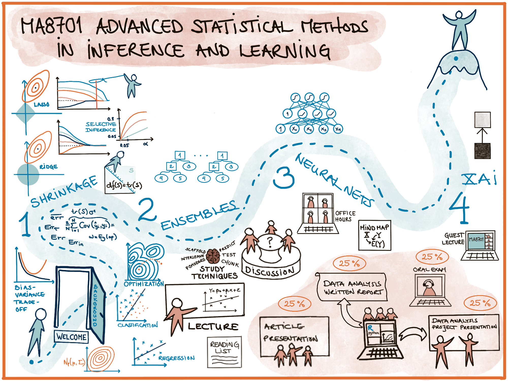
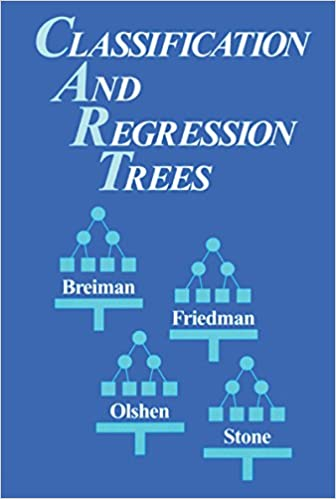

```{r setup, include=TRUE,echo=FALSE}
suppressPackageStartupMessages(library(knitr))
knitr::opts_chunk$set(echo = FALSE, message=FALSE,warning = FALSE, error = FALSE)
suppressPackageStartupMessages(library(ggplot2))
suppressPackageStartupMessages(library(rpart))
suppressPackageStartupMessages(library(rpart.plot))
suppressPackageStartupMessages(library(randomForest))
suppressPackageStartupMessages(library(DAAG))
suppressPackageStartupMessages(library(tree))
suppressPackageStartupMessages(library(MASS))
suppressPackageStartupMessages(library(GGally))
suppressPackageStartupMessages(library(corrplot))
suppressPackageStartupMessages(library(caret)) #for confusion matrices
suppressPackageStartupMessages(library(pROC)) #for ROC curves
suppressPackageStartupMessages(library(dplyr))
```

# Ensembles - first act

```{r,out.width="100%"}
#http://zevross.com/blog/2017/06/19/tips-and-tricks-for-working-with-images-and-figures-in-r-markdown-documents/
# options in r chunk settings
# out.width="100%"
# dpi=72

# ny figur? office hours + mer om shrinkage + optimism Cov(yhat_i,y_i)

#include_graphics("https://upload.wikimedia.org/wikipedia/en/4/4d/Leo_Breiman.jpg")
```

---

## Outline

* Trees
* Many trees with bootstrap aggregation
* Many trees into a random forest
* Conclusions

## Literature L5

* [ELS] The Elements of Statistical Learning: Data Mining, Inference, and Prediction, Second Edition (Springer Series in Statistics, 2009) by Trevor Hastie, Robert Tibshirani, and Jerome Friedman. [Ebook](https://web.stanford.edu/~hastie/Papers/ESLII.pdf). Chapter 8.7 (bagging), 9.2 (trees), 9.6 (missing data), 15 (random forest, not 15.3.3 and 15.4.3).


<!-- Some figures are taken from An Introduction to Statistical Learning, with applications in R (Springer, 2013) with permission from the authors: G. James, D. Witten, T. Hastie and R. Tibshirani.  -->

# Trees
(ELS 9.2)

```{r,out.width="25%"}
#http://zevross.com/blog/2017/06/19/tips-and-tricks-for-working-with-images-and-figures-in-r-markdown-documents/
# options in r chunk settings
# out.width="100%"
# dpi=72

# ny figur? office hours + mer om shrinkage + optimism Cov(yhat_i,y_i)

#include_graphics("https://upload.wikimedia.org/wikipedia/en/4/4d/Leo_Breiman.jpg")
```

---

## Leo Breiman 
the inventor of CART, bagging and random forests

Quotation from [Wikipedia](https://en.wikipedia.org/wiki/Leo_Breiman)

Leo Breiman (January 27, 1928 – July 5, 2005) was a distinguished statistician at the University of California, Berkeley. He was the recipient of numerous honors and awards, and was a member of the United States National Academy of Science.

Breiman's work helped to bridge the gap between statistics and computer science, particularly in the field of machine learning. His most important contributions were his work on classification and regression trees and ensembles of trees fit to bootstrap samples. Bootstrap aggregation was given the name bagging by Breiman. Another of Breiman's ensemble approaches is the random forest.

From [Breimans obituary](https://www.berkeley.edu/news/media/releases/2005/07/07_breiman.shtml)

BERKELEY – Leo Breiman, professor emeritus of statistics at the University of California, Berkeley.

"It is trite to say so, but Leo Breiman was indeed a Renaissance man, and we shall miss him greatly," said Peter Bickel, professor of statistics and chairman this summer of UC Berkeley's statistics department.

Breiman retired in 1993, but as a Professor in the Graduate School, he continued to get substantial National Science Foundation grants and supervised three Ph.D. students. Bickel said that some of Breiman's best work was done after retirement.

"In particular," said Bickel, "he developed one of the most successful state-of-the-art classification programs, 'Random Forest.' This method was based on a series of new ideas that he developed in papers during the last seven years, and it is extensively used in government and industry."

Breiman's best known work is considered to be "Classification and Regression Trees," a work in collaboration with three other scholars that facilitates practical applications, such as the diagnosis of diseases, from a multitude of symptoms.

---

## Main idea
(for regression or classification)

* Derive a set of decision rules for segmenting the predictor space into a number of regions. 
* We classify a new observation into one of these regions by applying the derived decision rules. 
* Then we typically use the mean (regression problems) or a majority vote (classification problems) of the training observations in this region as the prediction in the region.
* Key advantage: interpretability.

We will only allow _recursive binary partitions_ of the predictor space, using some stopping criterion. 

---

### From regions in predictor space to decision tree


---

(ELS Figure 9.2)

---

## Glossary

* Classification and regression trees are usually drawn upside down, where the top node is called the *root*.
* The *terminal nodes* or *leaf nodes* are the nodes at the bottom, with no splitting criteria. These represent the final predicted class (for classification trees) or predicted response value (for regression trees) and are written symbolically as $R_m$ for $m = 1, 2, ..., M$ - and will be referred to as _non-overlapping regions_.
* *Internal nodes* are all nodes between the root and the terminal nodes. These nodes correspond to the partitions of the predictor space.
* *Branches*: segment of the tree connecting the nodes.

---

### Problem: preditor space partition vs tree
(from IRSL)

```{r,out.width="100%"}
#http://zevross.com/blog/2017/06/19/tips-and-tricks-for-working-with-images-and-figures-in-r-markdown-documents/
# options in r chunk settings
# out.width="100%"
# dpi=72

# ny figur? office hours + mer om shrinkage + optimism Cov(yhat_i,y_i)
include_graphics("../../ILSR812.png")
```

1) Draw the tree corresponding to the partition of the predictor space (left).

2) Draw a partitioning of the predictor space corresponding to the tree (right).

[Solutions (Q4)](https://rstudio-pubs-static.s3.amazonaws.com/65564_925dfde884e14ef9b5735eddd16c263e.html)

---

# Regression tree

## Fitting a regression tree

Assume that we have a dataset consisting of $N$ pairs $({\bf x}_i,Y_i)$, $i=1,\ldots,N$, and each predictor is ${\bf x}_i=(x_{i1},x_{i2},...,x_{ip})$.

We want:

$$\hat{f}(X_i)=\sum_{m=1}^M \hat{c}_m I(X_i \in R_m)$$
where $\hat{c}_m$ is the estimate for region $R_m$.

---

Two steps:

1. Divide the predictor space into non-overlapping regions $R_1,R_2,\ldots,R_m$.
2. For every observation that falls into region $R_j$ we make the same prediction - which is the mean of the responses for the training observations that fall into $R_j$. 
$$\hat{c}_m=\text{ave}(y_i \mid x_i \in R_m)$$


How to divide the predictor space into non-overlapping regions $R_1,R_2,\ldots,R_m$?

---

We could try to minimize the MSE (mean squared error, residual sums of squares) on the training set given by
$$
\text{MSE}=\sum_{m=1}^M \sum_{i \in R_m}(y_i-\hat{c}_m)^2,
$$
where $\hat{c}_m$ is the mean response for the training observations in region $m$, and is also used as the predicted value for a new observations that falls into region $m$.

To do this we need to consider every partition of the predictor space, and compute the MSE for each partition. 

---

Ripley (1996, p 216): Two types of optimality. a) Optimality of the partitioning of the predictor space : only feasible for small dimensions. b) Given partitioning of predictor space, how to represent this by a tree in the best possible way (=minimal expected number of tests) is a NP-complete problem.
(NP=nondeterministic polynomial, a NP problem can be solved in polynomial time.)

A _greedy_ approach is taken (aka top-down) - called _recursive binary splitting._

---

## Recursive binary splitting 

---

We start at the top of the tree and divide the predictor space into two regions, $R_1$ and $R_2$ by making a decision rule for one of the predictors $x_1, x_2,...,x_p$. If we define the two regions by 

$$R_1(j,s)=\{x|x_j\le s\} \text{ and }  R_2(j,s)=\{x|x_j > s\}$$

We need to find the (predictor) $j$ and (splitting point) $s$ that minimize

$$\min_{j,s} [ \min_{c_1}\sum_{i: x_i \in R_1(j,s)}(y_i-c_1)^2+\min_{c_2} \sum_{i: x_i \in R_2(j,s)}(y_i -c_2)^2]$$

For any choice of $j$ and $s$ the inner minimization:
$$ \hat{c}_1=\text{ave}(y_i \mid x_i \in R_1(j,s)) \text{ and }
\hat{c}_2=\text{ave}(y_i \mid x_i \in R_2(j,s))$$

This way we get the two first branches in our decision tree.

How costly is this?

---

* We repeat the process to make branches further down in the tree. 
* For every iteration we let each single split depend on _only one of the predictors_, giving us two new branches. 
* This is done _successively_ and in each step we choose the split that gives the best split at that particular step, i.e the split that gives the smallest MSE. 
* We don't consider splits that further down the tree might give a tree with a lower overall MSE.

We continue splitting the predictor space until we reach some _stopping criterion_. For example we stop when a region contains less than 5 or 10 observations.

What about using as stopping criterion that the reduction in the MSE is smaller than a specified limit? There is always a possibility that after a split with little reduction in MSE we might have a split with high reduction in MSE - leading to suggesting to fit a large tree and then _prune_ down the tree afterwards.

---

### Problem: hands-on splitting

Based on the data below find the optimal splitting variable and split point for the first binary splitting for these data according to the recursive binary splitting algorithm. 
_Hint_: Draw a figure and look at possible divisions.

| $i$ 	| $(x_{i1},x_{i2})$ 	| $y$ 	|
|:----:	|:------------:	|:----:	|
| 1 	| (1,3) 	| 2 	|
| 2 	| (2,2) 	| 5 	|
| 3 	| (3,2) 	| 3 	|
| 4 	| (3,4) 	| 7 	|

---

```{r}
ds=as.data.frame(matrix(c(1,3,2,2,2,5,3,2,3,3,4,7),ncol=3,byrow=TRUE))
colnames(ds)=c("x1","x2","y")

fit=rpart(y~x1+x2,data=ds,method="anova",control=rpart.control(minsplit=2,minbucket=1))
fit
rpart.plot(fit,extra=101)
print(rpart.rules(fit))
```

---

## Pruning

---

Imagine that we have a data set with many predictors, and that we fit a large tree. Then, the number of observations from the training set that falls into some of the regions $R_j$ may be small, and we may be concerned that we have overfitted the training data.

_Pruning_ is a technique for solving this problem. 

By _pruning_ the tree we reduce the size or depth of the decision tree. When we reduce the number of terminal nodes and regions $R_1,...,R_M$, each region will probably contain more observations. 

If we have a large dataset with many explanatory variables and terminal nodes, we can also prune the tree if we want to create a simpler tree and increase the interpretability of the model, or just avoid "unneccesary" splits (for classification that could mean that both branches give the same classification rule).

---

### Cost complexity pruning

We first build a large tree $T_0$ by recursive binary splitting. Then we try to find a sub-tree $T\subset T_0$ that (for a given value of $\alpha$) minimizes

$$
C_{\alpha}(T)=Q(T)+\alpha |T|,
$$

where $Q(T)$ is our cost function, $|T|$ is the number of terminal nodes in tree $T$. The parameter $\alpha$ is then a parameter penalizing the number of terminal nodes, ensuring that the tree does not get too many branches. 

We proceed by repeating the the process for a larger value of $\alpha$, and this way we get a sequence of smaller of smaller sub-trees where each tree is the best sub-tree of the previous tree.

For regression trees we choose $Q(T)=\sum_{m=1}^{|T|}\sum_{x_i\in R_m}(y_i - \hat{c}_m)^2$, and or classification trees (to come next) the entropy, Gini or misclassification rate (the last most popular).

---

Given a value of $\alpha$ we get a pruned tree (but the same pruned tree for "ranges" of $\alpha$).
For $\alpha=0$ we get $T_0$ and as $\alpha$ increases we get smaller and smaller trees.

Technically an algorithm called  _weakest link pruning_ is used, where internal nodes in the tree is collapsed to get the smallest increase pr node for $Q(T)$. This is done successively until the tree is a single node tree.

Please study this [note from Bo Lindqvist in MA8701 in 2017](https://www.math.ntnu.no/emner/TMA4268/2018v/notes/CART1MA87012017BoLindqvist.pdf) for an example of how we perform cost complexity pruning in detail. Alternatively, this method, with proofs, are given in Ripley (1996), Section 7.2.

The consept of pruning is not central in our course, since we will mostly use trees as building blocks in bagging, random forest and boosting (where pruning is not "needed").

---

### Pruning in practice

The penalty parameter $\alpha$ is a _model hyperparameter_ and is chosen by cross-validation.

---

## R: function `tree` in package `tree`
by [Brian D. Ripley: Fit a Classification or Regression Tree](https://cran.r-project.org/web/packages/tree/index.html)

Description: A tree is grown by binary recursive partitioning using the response in the specified formula and choosing splits from the terms of the right-hand-side.

tree(formula, data, weights, subset,
     na.action = na.pass, control = tree.control(nobs, ...),
     method = "recursive.partition",
     split = c("deviance", "gini"),
     model = FALSE, x = FALSE, y = TRUE, wts = TRUE, ...)
    
---

* Details: A tree is grown by binary recursive partitioning using the response in the specified formula and choosing splits from the terms of the right-hand-side. Numeric variables are divided into X < a and X > a; the levels of an unordered factor are divided into two non-empty groups. The split which maximizes the reduction in impurity is chosen, the data set split and the process repeated. Splitting continues until the terminal nodes are too small or too few to be split.
* A numerical response gives regression while a factor response gives classification.
* The default choice for a function to minimize is the deviance, and for normal data (as we may assume for regression), the deviance is proportional to the MSE. For the interested reader, this is the connection between the deviance and the MSE for regression <https://www.math.ntnu.no/emner/TMA4315/2018h/2MLR.html#deviance>

---

* Tree growth is limited to a depth of 31 by the use of integers to label nodes.
* Factor predictor variables can have up to 32 levels. This limit is imposed for ease of labelling, but since their use in a classification tree with three or more levels in a response involves a search over 2^(k-1) - 1 groupings for k levels, the practical limit is much less.

## R: `rpart` package

A competing R function is `rpart`, explained in package [vignette](https://cran.r-project.org/web/packages/rpart/vignettes/longintro.pdf).
Short on using [`rpart` R package for CART](https://www.statmethods.net/advstats/cart.html).

---

## Regression example
(ISLR book, Section 8.3.4.)

Information from <https://www.cs.toronto.edu/~delve/data/boston/bostonDetail.html>.

* Collected by the U.S Census Service concerning housing in the area of Boston Massachusetts, US.
* Two tasks often performed: predict nitrous oxide level (nox), or predict the median value of a house with in a "town" (medv).

---

### Variables

* CRIM - per capita crime rate by town
* ZN - proportion of residential land zoned for lots over 25,000 sq.ft.
* INDUS - proportion of non-retail business acres per town.
* CHAS - Charles River dummy variable (1 if tract bounds river; 0 otherwise)
* NOX - nitric oxides concentration (parts per 10 million)
* RM - average number of rooms per dwelling
* AGE - proportion of owner-occupied units built prior to 1940
* DIS - weighted distances to five Boston employment centres
* RAD - index of accessibility to radial highways
* TAX - full-value property-tax rate per $10,000
* PTRATIO - pupil-teacher ratio by town
* B - #1000(Bk - 0.63)^2# where Bk is the proportion of African Americans by town (black below)
* LSTAT - % lower status of the population
* MEDV - Median value of owner-occupied homes in $1000's (seems to be a truncation)

---

### Data

Boston data used from the `MASS` R package.
Data are divided into a training and a test set with 70/30 split.

```{r}
set.seed(1)
train = sample(1:nrow(Boston), 0.7*nrow(Boston))
colnames(Boston)
head(Boston)
```

---

### Regression tree

First with `tree` and default parameters.

```{r,echo=TRUE}
tree.boston=tree(medv~.,Boston,subset=train)
summary(tree.boston); plot(tree.boston)
text(tree.boston,pretty=0)
tree.boston
```

---

Then with the `rpart` R package, and default parameters. This gives the same tree as `tree`. (What do you think of the tree from `rpart.plot`?)

```{r,echo=TRUE}
boston.rpart <- rpart(formula = medv~. , data = Boston,subset=train)
plot(boston.rpart)
text(boston.rpart,pretty=0)
rpart.plot(boston.rpart,type = 3, box.palette = c("red", "grey"), fallen.leaves = TRUE)
```

---

### Need to prune?

The default criterion to monitor is the deviance. For normal regression the deviance is proportional to the MSE.

```{r,echo=TRUE}
cv.boston=cv.tree(tree.boston)
plot(cv.boston$size,cv.boston$dev,type='b')
```

Most complex tree selected.

---

### Pruning

Just to show pruning (even if most complex tree was selected).

```{r, echo=TRUE}
prune.boston=prune.tree(tree.boston,best=5)
plot(prune.boston)
text(prune.boston,pretty=0)
```

---

### Test error for full tree

```{r,echo=TRUE}
yhat=predict(tree.boston,newdata=Boston[-train,])
boston.test=Boston[-train,"medv"]
plot(yhat,boston.test, pch=20)
abline(0,1)
print("MSE on test set for tree")
mean((yhat-boston.test)^2)
```

---

### Effect of changing training set

```{r,echo=TRUE}
set.seed(4)
train2 = sample(1:nrow(Boston), 0.7*nrow(Boston))
tree.boston2=tree(medv~.,Boston,subset=train2)
summary(tree.boston2); plot(tree.boston2)
text(tree.boston2,pretty=0)
tree.boston2

xnew=Boston[1,]
predict(tree.boston,newdata=xnew)
predict(tree.boston2,newdata=xnew)
```

---

# Classification tree

There are only minor differences between working with regression and classification trees.

## Fitting a classification tree

Let $K$ be the number of classes for the response.

Building a decision tree in this setting is similar to building a regression tree for a quantitative response, but there are two main differences: _the prediction and the splitting criterion_

---

**1) The prediction:**   

* In the regression case we use the mean value of the responses in $R_j$ as a prediction for an observation that falls into region $R_m$. 
* For the classification case however, we have two possibilities: 
    * Majority vote: Predict that the observation belongs to the most commonly occurring class of the training observations in $R_m$.  
    * Estimate the probability that an observation $x_i$ belongs to a class $k$, $\hat{p}_{mk}(x_i)$, and then classify according to a threshold value. This estimated probability is the proportion of class $k$ training observations in region $R_j$, with $n_{mk}$ observations. Region $m$ has $N_m$ observations. 
    $$\hat{p}_{mk} = \frac{1}{N_m} \sum_{i:x_i \in R_m} I(y_i = k)=\frac{n_{mk}}{N_m}.$$ 

---

**2) The splitting criterion:**  We do not use MSE as a splitting criterion for a qualitative variable. Instead we can use some _measure of impurity_ of the node. For leaf node (region) $m$ and class $k=1,\ldots, K$:

Gini index:
$$
G=\sum_{k=1}^K \hat{p}_{mk}(1-\hat{p}_{mk}),
$$

Cross entropy:
$$
D=-\sum_{k=1}^K \hat{p}_{mk}\log\hat{p}_{mk}
$$
Here $\hat{p}_{mk}$ is the proportion of training observation in region $m$ that are from class $k$. 

Remark: the deviance is a scaled version of the cross entropy. $-2\sum_{k=1}^K n_{mk} \log\hat{p}_{mk}$ where $\hat{p}_{mk}=\frac{n_{mk}}{N_m}$. Ripley (1996, page 219).

When making a split in our classification tree, we want to minimize the Gini index or the cross-entropy.

The Gini index can be interpreted as the expected error rate if the label is chosen randomly from the class distribution of the node. According to Ripley (1996, page 217) Breiman et al (CART) preferred the Gini index.

---

```{r,echo=FALSE}
p=seq(0.001,0.999,length=1000)
gini=2*p*(1-p)
ent=-p*log(p)-(1-p)*log(1-p)
misc= pmin(1-p,p)
plot(p,misc,xlab="p",ylab="",ylim=c(0,0.5),type="l",main="K=2")
lines(p,ent*(0.5/max(ent)),col="red")
lines(p,gini,col="blue")
legend(0.3,0.2,legend=c("misclassification","cross-entropy","Gini"),fill=c("black","red","blue"))
```

---

For the splitting criterion using $G_1$ or $D_1$ for the left region , and subscript $2$ for the right region.

$$\min_{j,s} [ \sum_{i: x_i \in R_1(j,s)} N_1G_1 + \sum_{i: x_i \in R_2(j,s)} N_2 G_2]$$

<!-- Here $\hat{c}_j=\text{argmax}_k \hat{p}_{jk}$ . -->

---

### Why not misclassification rate as the split criterion?
(ELS page 309)

Data set with 400 controls and 400 cases.

Two possible split points are considered.

1) Split A give 400 observations to the left and right, where
left node has 300 cases 100 controls
and right node has 100 cases and 300 controls. Use majority vote.
Misclassification rate=200/800=0.25.

2) Split B has 600 observations to the left and 200 to the right. Now 
the left node has 200 cases and 400 controls, while the right node has 200 cases and 0 controls. Use majority vote to get 200/800=0.25 misclassification rate.

Which of the splits A or B is the preferable split?

Answer: B- because we then have a _pure_ node (only one class).

Gini and cross-entropy would have lower cost for B split than the A split.

(However, misclassification is the preferred choice for the cost-complexity pruning of classification trees.)

---

## Classification example

We will use the classical data set of _diabetes_ from a population of women of Pima Indian heritage in the US, available in the R `MASS` package. The following information is available for each woman:

* diabetes: `0`= not present, `1`= present
* npreg: number of pregnancies
* glu: plasma glucose concentration in an oral glucose tolerance test
* bp: diastolic blood pressure (mmHg)
* skin: triceps skin fold thickness (mm)
* bmi: body mass index (weight in kg/(height in m)$^2$)
* ped: diabetes pedigree function.
* age: age in years

We will use a training set (called `ctrain`) with 300 observations (200 non-diabetes and 100 diabetes cases) and a test set (called `ctest`) with 232 observations (155 non-diabetes and 77 diabetes cases). Our aim is to make a classification rule for diabetes (or not) based on the available data. 

(There is a version of the training data with missing values, `Pima.tr2` in the `MASS` library. Here a slightly different shuffling for training and test data than in `MASS` is used, because these data were used in a project in TMA4268.)

---

```{r}
flying=dget("https://www.math.ntnu.no/emner/TMA4268/2019v/data/flying.dd")
ctrain=flying$ctrain
ctest=flying$ctest
ctrain.tmp=ctrain
ctrain.tmp$diabetes=as.factor(ctrain.tmp$diabetes)
ctrain.tmp$npreg=as.factor(ctrain.tmp$npreg)
ggpairs(ctrain.tmp,cardinality_threshold = 16)
summary(ctrain)
table(ctrain$npreg)
corrplot(cor(ctrain))
```

---

### Full tree performance

```{r}
fit=tree(factor(diabetes)~npreg+glu+bp+skin+bmi+ped+age,data=ctrain)
summary(fit)
plot(fit)
text(fit,pretty=0)
fit
#print("Full tree performance")
train.res=predict(fit)[,2]
test.res=predict(fit,newdata=ctest)[,2]
train.class=ifelse(train.res>=0.5,1,0)
test.class=ifelse(test.res>=0.5,1,0)
print("Performance on training set")
confusionMatrix(factor(train.class),factor(ctrain$diabetes))
print("Performance on test set")
confusionMatrix(factor(test.class),factor(ctest$diabetes))
roc.tree = roc(factor(ctest$diabetes),test.res,legacy.axes=TRUE)
auc(roc.tree)
ggroc(roc.tree)+ggtitle("ROC curve")
```

---

### Pruned tree performance

```{r}
cv.fit=cv.tree(fit) 
plot(cv.fit$size,cv.fit$dev,type='b')
best=cv.fit$size[which.min(cv.fit$dev)]
prune.fit=prune.tree(fit,best=best)
plot(prune.fit)
text(prune.fit,pretty=0)
prune.fit

train.res=predict(prune.fit)[,2]
test.res=predict(prune.fit,newdata=ctest)[,2]
#print("Pruned tree performance")
train.class=ifelse(train.res>=0.5,1,0)
test.class=ifelse(test.res>=0.5,1,0)
print("Performance on training set")
confusionMatrix(factor(train.class),factor(ctrain$diabetes))
print("Performance on test set")
confusionMatrix(factor(test.class),factor(ctest$diabetes))
roc.tree = roc(factor(ctest$diabetes),test.res,legacy.axes=TRUE)
auc(roc.tree)
ggroc(roc.tree)+ggtitle("ROC curve")
```

---

# Tree issues

## Building a regression (classification) tree

1. Use recursive binary splitting to grow a large tree on the training
data, stopping only when each terminal node has fewer than some
minimum number of observations.
2. Apply cost complexity pruning to the large tree in order to obtain a
sequence of best sub-trees, as a function of $\alpha$.
3. Use K-fold cross-validation to choose $\alpha$. That is, divide the training
observations into K folds. For each k = $1,\ldots, K$:
   + Repeat Steps 1 and 2 on all but the kth fold of the training data.
   + Evaluate the mean squared prediction (misclassification, gini, cross-entropy) error on the data in the
left-out $k$th fold, as a function of $\alpha$.
   + Average the results for each value of $\alpha$, and pick $\alpha$ to minimize the average error.
4. Return the sub-tree from Step 2 that corresponds to the chosen value of $\alpha$.

---

## Missing covariates
(ELS 9.6, and [van Buuren: "Flexible imputation of missing data"](https://stefvanbuuren.name/fimd/))

When performing data analysis we often encounter data sets where some observations have missing values. It is important to understand the underlying mechanism for the observations to be missing, so that we may treat the missing data appropriately.

We first look at the general definitions of missing variants, and then move to how missing data can be handled for trees.

---

### Notation

* ${\bf y}$: response vector (no missing values)
* ${\bf X}$: the full covariate matrix
* ${\bf Z}=({\bf X},{\bf y})$: full responses and covariates
* ${\bf X}_{\text{obs}}$: the observed part of the covariate matrix 
* ${\bf Z}_{\text{obs}}=({\bf X}_{\text{obs}},{\bf y})$
* ${\bf R}$: indicator matrix (0/1) for missingness in ${\bf X}$, the observability of ${\bf X}$.
* $\theta$: some parameter in the distribution of ${\bf R}$.

The missing data mechanism is characterized by the conditional distribution of ${\bf R}$
$$P({\bf R} \mid {\bf Z},\theta)$$

---


### Missing completely at random (MCAR)

$$P({\bf R} \mid {\bf Z},\theta)=P({\bf R} \mid \theta)$$

* All observations have the same probability of being missing, and 
* the missing mechanism is not related to the data.

If observations with MCAR data are removed that should not bias the analyses (but the sample size will of cause be smaller).

Examples:

* measure weight, and the scales run out of battery
* similar mechanism to taking a random sample

---

### Missing at random (MAR)

$$P({\bf R} \mid {\bf Z},\theta)=P({\bf R} \mid {\bf Z}_{\text obs},\theta)$$

* All observations in a group defined by the observed data have the same probability of being missing.
* Remark: not dependent on what could have been observed.

Example:

* measure weight, and the scales have different missing proportions when being on a hard or soft surface

Most methods for handling missing data require the data to be MAR.

---

### Missing not at random (MNAR)

We have MNAR if we dont have MAR or MCAR.

Then the missing mechanicm could depend on what we could have meaured.

Examples:

* the scales give more often missing values for heavier objects than for lighter objects
* a patient is too sick to perform some procedure that would show a high value of a measurement

---

## General solutions to missing covariates

These solutions require that the missingness is MCAR.

**Complete case analysis:** discard all observations containing missing values. Wasteful.

Let each variable have a probability for missing values of 0.05, then for 20 variables the probability of an observation to be complete is
$(1 − 0.05)^20 = 0.36$, for 50 variables $0.08$. Not many observations left with complete case analysis.

**Pairwise deletion:** for example when calculating a correlation matrix only complete pairs may enter in the calculation. Not so relevant for regression and classification.

**LOCF:** Last observation carried forward. Time series etc. Not recommended, unless there is a reason to believe that nothing has changed.

---

**Mean imputation:** Replace the missing value with the mean of the covariate over all samples. Will decrease the variability in the data. "Common solution" within machine learning, but not so common in statistics(?).

**Multiple imputation:** Devise a method to construct the distribution of each covariate (that can be missing) based on other covariates (often a regression method). Sample multiple observation for each missing value, and get $m$ complete dataset. Analyse all $m$ dataset and weigh the results together. R: package `mice`.

**Use a method that handles missing data**: such as trees!

---

## Handling missing covariates in trees

Instead of removing observation with missing values, or performing single or multiple imputation, there are two popular solutions to the problem for trees:

**Make a "missing category"**

* If you believe that missing covariates behave in a particular way (differently from the non-missing values), we may construct a new category for that variable. 

---

**Use surrogate splits** 

The best split at a node is called the _primary split_. 

An observation with missing value for variable $x_1$ is dropped down the tree, and arrive at a split made on $x_1$.

A "fake" tree is built to predict the split, and the observation follows the predicted direction in the tree. This means that the correlation between covariates are exploited - and the higher the correlation between the primary and predicted primary split - the better.

This is called a _surrogate split_.

If the observation is missing the surrogate variable, there is also a back-up surrogate variable that can be used (found in a similar fashion.)

If the surrogate variable is not giving more information than following the majority of the observations at the primary split, it will not be regarded as a surrogate variable.

---

The R package `rpart` [vignette page  18](https://cran.r-project.org/web/packages/rpart/vignettes/longintro.pdf) gives the following example:

* Assume that the split (age <40, age ≥40) has been chosen. 
* Surrogate variables are found by _re-applying the partitioning algorithm_ (without recursion=only one split?) to predict the two categories age <40 vs. age ≥40 using the other covariates.
* Using "number of misclassified"/"number of observations" as the criterion: the optimal split point is found for each covariate. 
* A competitor is the majority rule - that is, go in the direction of the split where the majority of the training data goes. This is given misclassification error 
 min(p, 1 − p) where
p = (# in A with age < 40) / nA.
* A ranking of the surrogate variables is done based on the misclassification error for each surrogate variable, and variables performing better than the majority rule is kept.

---

### Example

Look at the Boston default tree with `tree` and `rpart` to see how the two handles missing values.

```{r}
print("tree package")
testobs=Boston[1,]
testobs[1,13]=NA
print(testobs)
predict(tree.boston,newdata=testobs)
print("rpart package")
predict(boston.rpart,newdata=testobs)
tree.boston
```

---

## Other issues
(ELS 9.2.4)

* Categorical predictors: For a predictor with $q$ levels (may be unordered) the number of possible partitions into two groups is large. A trick is used in the processing, where first dummy variable coding is performed then sorted by increasingly popular categories into a ordered categorical variable. Proofs exists that this gives optimal splits for cross-entropy, Gini, squared loss (see ELS page 310 for references).
* Categorical predictors with many levels may have a advantage for the splits, because there are so many possible splits that often one is very good. This may lead to overfitting if $q$ is large.
* For multiclass problems loss matrices may be included easily in the Gini loss.

---

* Binary splits: multiway splits into more than two groups is possible, but may fragment the data very quickly (too quickly). Multiway splits is achived by a series of binary splits. Thus, we stay with binary splits.
* Due to the binary splits it may be hard to model an additive structure.
* Linear combination splits: is possible by including also finding linear weight parameters for the splits. This may improve predictive power, but hurt interpretability.
* There exists other tree-building procedures than CART. One such is C5.0 by Quinlan, see ELS page 312 for reference.
* For regression trees the regression surface will be non-smooth, which may degrade performance. For classification trees where there response is a classification (and thus not smooth) this is not a large problem.

---

## Questions

Choose your favourites below and discuss in group.
(maybe use the Boston and Pima indian analysis to look for examples)

1) Check out the partitioning of the predictor space to recursive binary tree - or opposite (given as a problem earlier in this note).
2) Why do we say that trees can automatically handle (and find?) non-linearities? Give example.
3) Same, but now interactions in data. Give example.
4) What rule do you think is used for the prediction with missing value for the `tree` and `rpart` example above?
5) Make list of pros and cons for trees for regression and classification.
6) For Project 1 - do you have missing data in the data you have chosen? If yes, do you think the missing data are missing at random? How did you handle the missing data?
7) Discuss the bias-variance tradeoff of a regression tree when increasing/decreasing the number of terminal nodes, i.e What happens to the bias? What happens to the variance of a prediction if we reduce the tree size? 

---

### Some answers

5) 

**Advantages (+)** of using trees

* Trees automatically select variables
* Tree-growing algorithms scale well to large $n$, growing a tree greedily
* Trees can handle mixed features (continuouos, categorical) seamlessly, and can deal with missing data
* Small trees are easy to interpret and explain to people
* Some believe that decision trees mirror human decision making
* Trees can be displayed graphically
* Trees model non-linear effects 
* Trees model interactions between covariates
* Trees handle missing data in a smart way!
* Outliers and irrelevant inputs will not affect the tree.

There is no need to specify the functional form of the regression curve or classification border - this is found by the tree automatically.

---

**Disadvantages (-)** of using trees

* Large trees are not easy to interpret
* Trees do not generally have good prediction performance (high variance)
* Trees are not very robust, a small change in the data may cause a large change in the final estimated tree
* Trees do not produce a smooth regression surface.

7) 

As the tree size increase the bias will decrease, and the variance will increase. This is the same as any other method when we increase the model complexity.

---

## What is next?

* **Bagging**: grow many trees (from bootstrapped data) and average - to get rid of the non-robustness and high variance by averaging
* **Random forest**: inject more randomness by just allowing a random selection of predictors to be used for the splits at each node.
* The Out-of-Bag available validation set and 
* importance plot

---

# Bagging

Bagging can be used with different regression and classification methods, but we will focus on trees.

## High variance of trees

Decision trees often suffer from high variance. 

* By this we mean that the trees are sensitive to small changes in the predictors: 
* If we change the observation set, we may get a very different tree. 
* This is due to the fact that small changes in the data can result in a large effect on which splits is done. 
* A small effect on the top level is propagated down in the tree.

For the Boston data, we saw that changing the train/test split gave very different trees

To reduce the variance of decision trees we can apply _bootstrap aggregating_ (_bagging_), invented by Leo Breiman in 1996 (after he retired in 1993).

---

## Independent data sets

Assume we have $B$ i.i.d. observations of a random variable $X$ each with the same mean and with variance $\sigma^2$. We calculate the mean $\bar{X} = \frac{1}{B} \sum_{b=1}^B X_b$. The variance of the mean is
$$\text{Var}(\bar{X}) = \text{Var}\Big(\frac{1}{B}\sum_{b=1}^B X_b \Big) = \frac{1}{B^2} \sum_{b=1}^B \text{Var}(X_b) = \frac{\sigma^2}{B}.$$
By averaging we get reduced variance. This is the basic idea!

---

But, we will not draw random variables - we want to fit decision trees: $\hat{f}_1({\bf x}),\hat{f}_2({\bf x}),\ldots, \hat{f}_B({\bf x})$ and average those.
$$ \hat{f}_{avg}({\bf x})=\frac{1}{B}\sum_{b=1}^B \hat{f}_b({\bf x})$$

However, we do not have many independent data set - so we use _bootstrapping_ to construct $B$ data sets.

---

## Bootstrapping 

Problem: we want to draw samples from a population with distribution $F$.

But: we do not know $F$ and do not have a population to draw from, we only have our one sample.

Solution: we may use our sample as an empirical estimate for the distribution $F$ - by assuming that each sample point has probability $1/N$ for being drawn. 

Therefore: we draw with replacement $N$ observations from our sample - and that is our first _bootstrap sample_.

We repeat this $B$ times and get $B$ bootstrap samples - that we use as our $B$ data sets.

---

## Bootstrap samples and trees

For each bootstrap sample we construct a decision tree, $\hat{f}^{*b}(x)$ with $b=1,...,B$, and we then use information from all of the trees to draw inference. 

Study Figure 8.9 to see variability of trees - observe that different covariates are present in each tree. All features are equally correlated $0.95$. Observe

* trees variable (high variance)
* bagging will smooth out this variance to reduce the test error

---

## Bagging regression trees

For regression trees, we take the average of all of the predictions and use this as the final result:

$$
\hat{f}_{bag}(x)=\frac{1}{B}\sum_{b=1}^B \hat{f}^{*b}(x).
$$

* Bagging works well under squared loss.
* It can be shown that true population aggregation never increases the MSE (ELS Eq 8.52).
* Thus, we expect a decrease in MSE with bagging.
* However, a "similar result" is not true for classification trees.

---

## Bagging classification trees

For classification trees there are two possible ways to use the tree ensemble of $B$ trees:

**consensus**

* we record the predicted class (for a given observation $x$) for each of the $B$ trees and 
* use the most occurring classification (majority vote) as the final prediction.
* (It is not wise to use the voting proportions to get posterior probabilites. For example is P(class 1)=0.75 but all B trees votes for 1.)

Let $\hat{G}(x)$ be the estimated class, and 
$$\hat{G}(x)=\text{argmax}_k q_k(x)$$
where $q_k(x)$ is the proportion of the trees voting $k$, $k=1,\ldots,K$.

---

**probability**

* alternatively average posterior probabilities for each class $\hat{p_m^b}$,
* and then choose the class with the largest probability.

$$\hat{G}(x)=\text{argmax}_k \frac{1}{B} \sum_{b=1}^B p^b_k(x)$$
where $p^b_k(x)$ is estimated probability for class $k$ for tree $b$ at $x$.

---

### Prediction by consensus vs probability

Consider the case when you have grown $B$ classification tree with a binary response with classes 0 and 1. You might wonder which approach to choose to make a final prediction: consensus or probability? Or would the prediction be the same in each case? 

The difference between these two procedures can be compared to the difference between the mean value and median of a set of numbers. If we average the probabilities and make a classification thereafter, we have the mean value. If we sort all of our classifications, so that the classifications corresponding to one class would be lined up after each other, followed by the classifications corresponding to the other class we obtain the median value. 

---

We examine this by an example: 

Suppose we have $B=5$ (no, $B$ should be higher - this is only for illustration) classification tree and have obtained the following 5 estimated probabilities: \{0.4, 0.4, 0.4, 0.4, 0.9 \}. If we average the probabilities, we get 0.5, and if we use a cut-off value of 0.5, our predicted class is 1. However, if we take a majority vote, using the same cut off value, the predicted classes will be \{0, 0, 0, 0, 1 \}. The predicted class, based on a majority vote, would accordingly be 0.

The two procedures thus have their pros and cons: 
* By averaging the predictions no information is lost. We do not only get the  final classification, but the probability for belonging to the class 0 or 1. 
* However, this method is not robust to outliers. By taking a majority vote, outliers have a smaller influence on the result. 

---

* According to ELS (page 283) the probability method will give bagged classifiers with lower variance that with the consensus method.

* Bagging a good classifier can make it better, but bagging a bad classifier can make it worse. (Not as for MSE for regression tree.)

## Choosing $B$

* The number $B$ is chosen to be as large as "necessary". 
* An increase in $B$ will not lead to overfitting, and $B$ is not regarded as a tuning parameter. 
* If a goodness of fit measure is plotted as a function of $B$ (soon) we see that (given that $B$ is large enough) increasing $B$ will not change the goodness of fit measure.

(Study Figure 8.10 to see effect of $B$ and the two strategies.)

---

## Pruning trees?

Originally, Breiman (1996) suggested to prune each tree, but later research has found that it is better to leave the trees at maximal size (a bushy tree), to make the trees as different from each other as possible.

---

## Bagging algorithm

(We write out in class.)

---

## Wisdom of the crowd
(ELS page 286)

_the collective knowledge of a diverse and independent body of people typically exceeds the knowledge of any single individual, and can be harnessed by voting_

Study Figure 8.11 in ELS - and what about <https://tv.nrk.no/serie/alle-mot-1>

Bagging: sadly not independent bodies.

---

## Out-of-bag error estimation

* We use a subset of the observations in each bootstrap sample. We know that the probability that an observation is in the bootstrap sample is approximately $1-e^{-1}$=`r 1-exp(-1)` (0.63212).
* when an observation is left out of the bootstrap sample it is not used to build the tree, and we can use this observation as a part of a "test set" to measure the predictive performance and error of the fitted model, $f^{*b}(x)$. 

In other words: Since each observation $i$ has a probability of approximately 2/3 to be in a bootstrap sample, and we make $B$ bootstrap samples, then observation $i$ will be outside the bootstrap sample in approximately $B/3$ of the fitted trees. 

The observations left out are referred to as the _out-of-bag_ observations, and the measured error of the $B/3$ predictions is called the _out-of-bag error_. 

---

### Boston housing

I R we can do bagging by using the function _randomForest()_ in the _randomForest_ library, but specify that all predictors will be used at all splits, here `mtry=13`.

The regression tree does noe automatically output OOB MSE.

```{r}
set.seed(1)
bag.boston=randomForest(medv~.,data=Boston,subset=train,mtry=13)
print(bag.boston)
```

Plotting predicted test values vs true values.

```{r}
yhat.bag = predict(bag.boston,newdata=Boston[-train,])
plot(yhat.bag, boston.test,pch=20)
abline(0,1)
mean((yhat.bag-boston.test)^2)
```

Error rate on test set for bagging

```{r,eval=FALSE,echo=FALSE}
bag.boston=randomForest(medv~.,data=Boston,subset=train,mtry=13,ntree=25)
yhat.bag = predict(bag.boston,newdata=Boston[-train,])
mean((yhat.bag-boston.test)^2)
```

Remember that the error rate on the test set for a single tree was:
`r mean((yhat-boston.test)^2)`. 

---

### Pima indians

Here the misclassification rate for the OOB is reported.

```{r, eval=TRUE}
set.seed(1)
rf=randomForest(as.factor(diabetes)~npreg+glu+bp+skin+bmi+ped+age,data=ctrain,mtry=7) #default is 500 trees
rf
test.x=ctest[,-1]
test.y=ctest[,1]
train.y=ctrain[,1]
train.x=ctrain[,-1]

train.res=predict(rf,type="prob")[,2]
test.res=predict(rf,newdata=test.x,type="prob")[,2]
train.class=ifelse(train.res>=0.5,1,0)
test.class=ifelse(test.res>=0.5,1,0)

print("Evaluation on training data")
confusionMatrix(factor(train.class),factor(train.y))$overall[1]

print("Evaluation on test data")
confusionMatrix(factor(test.class),factor(test.y))$overall[1]
roc.rf = roc(test.y,test.res,legacy.axes=TRUE)
print(auc(roc.rf))
ggroc(roc.rf)+ggtitle("ROC curve")
```

Remember that the misclassification error rate on the test set for a single tree (after pruning) was: $1-0.75=0.25$.

---

## When should we use bagging?

Bagging can be used for predictors (regression and classification) that are not trees, and according to Breiman (1996):

* the vital element is the instability of the prediction method
* if perturbing the learning set can cause significant changes in the predictor constructed, then bagging can improve accuracy.

Breiman (1996) suggests that these methods should be suitable for bagging:

* neural nets, classification and regression trees, subset selection in linear regression

however not nearest neighbours - since 

* the stability of nearest neighbour classification methods with respect to perturbations of the data distinguishes them from competitors such as trees and neural nets.

Would you think that much is gained by bootstrapping MLR, logistic regression, or a lasso version of the two?

BUT: making many trees destroys the interpretability of the estimator.

---


# Random forest

If there is a strong predictor in the dataset, the decision trees produced by each of the bootstrap samples in the bagging algorithm becomes very similar: Most of the trees will use the same strong predictor in the top split. 

_Random forests_ is a solution to this problem and a method for decorrelating the trees. The hope is to improve the variance reduction. 

---

## The effect of correlation on the variance of the mean

The variance of the average of $B$ observations of i.i.d random variables $X$, each with variance $\sigma^2$ is $\frac{\sigma^2}{B}$. Now, suppose we have $B$ observations of a random variable $X$ which are identically distributed, each with mean $\mu$ and variance $\sigma^2$, but not independent. 

That is, suppose the variables have a positive correlation $\rho$
$$\text{Cov}(X_i, X_j) = \rho \sigma^2, \quad i \neq j.$$ This is called compound symmetry.

Then the variance of the average is 
$$\rho \sigma^2+\frac{1-\rho}{B} \sigma^2$$
(Exercise to prove this.)

---

Check: $\rho=0$ and $\rho=1$?
Observe the linearity in $\rho$.

(Most negative values of $\rho$ will not give a positive definite covariance matrix. The covariance matrix is positive definite if $\rho>-1/(B-1)$.)

```{r,eval=FALSE,echo=FALSE}
varmean=function(B=100,rho,sigma2=1) return(sigma2*(1-(1-B)*rho)/B)
rhovec=seq(-1,1,length=100)
plot(rhovec,varmean(rho=rhovec),type="b")
```

---

## Core modifications to bagging

The idea behind random forest is to _improve the variance reduction of bagging_ by reducing the correlation between the trees - while hoping the possible increase in variance in each tree doesn´t cancel the improvement.

The procedure is thus as in bagging, but with the important difference, that 

* at each split we are only allowed to consider $m<p$ of the predictors. 

A new sample of $m$ predictors is taken at each split and 

* typically $m= \text{floor}(\sqrt p)$ (classificaton) and $m=\text{floor}(p/3)$ (regression)

The general idea is at for very correlated predictors $m$ is chosen to be small.

---

## Random forest algorithm

(We write out in class.)

* Regression: average of trees
* Classification: majority vote based on vote from each tree.

---

Study ELS Figure 15.3 to see that the rule of thumb for $m$ may not always be the best choice.

Study ELS Figure 15.9 to se that the correlation between trees is dependent on $m$.

---

In addition the recommendations from the Random forest authors were also on _node size_ (the minimum number of observations in a leaf node):

* classification: 1
* regression: 5

(ELS page 592)

This is an indication that node size is an hyperparameter, but ESL argue that is is maybe not worth the extra effort to optimize on this parameter.

Study ELS Figure 15.8 for effect of node size.


---

The number of trees, $B$, is not a tuning parameter (according to the ISLR-authors), and the best is to choose it large enough. 

But - in lecture L7 we will hear that we may also look at many of the choices for how to fit a tree as model hyperparameters - in addition to both $B$ and $m$.

---

Study Figure 15.1 in ELS.

We will look at comparing error rates (using statistical tests) for different methods later in Part 2.

---


## OOB again

When the OOB error stabilizes the $B$ is large enough and we may stop training. 

Study Figure 15.4 in ELS.

If $B$ is sufficiently large (three times the number needed for the random forest to stabilize), the OOB error estimate is equivalent to LOOCV (CASI: Efron and Hastie, 2016, p 330).

---

## Variable importance plots

Bagging is an example of an _ensemble method_, so is boosting and random forests. For all of these methods many trees are grown and combined, and the predictive power can be highly improved. However, this comes at a cost of interpretability. Instead of having one tree, the resulting model consists of $B$ trees, where $B$ often is 300 or 500 (or maybe even 5000 when boosting). 

Variable importance plots show _the relative importance of the predictors:_ the predictors are sorted according to their importance, such that the top variables have a higher importance than the bottom variables. 
There are in general two types of variable importance plots: 

* variable importance based on decrease in node impurity and 
* variable importance based on randomization.

---

### Variable importance for a single tree
(10.13.1)

A single tree can be studied to interpret the model fitted. For large trees - and in the coming chapters - for many trees, the concept of _variable importance_ is useful.

Consider a covariate. How important is this covariate for the tree prediction?

We have a tree $T$ with $J-1$ _internal nodes_ (remark: no leaf nodes - because there is no split at a leaf node).

Let $I_l^2(T)$ be a measure of squared relevance for predictor $X_l$:

$$ I_l^2(T)=\sum_{t=1}^{J-1} \hat{i}^2_t I(v(t)=l)$$

At each internal node $t$ there is a split, where the covariate to split on is denoted $X_{v(t)}$, and this variable was the one that gave the maximal improvement $\hat{i}^2_t$.

The importance measure is the square root, so  $I_l(T)= \sqrt{I_l^2(T)}$.

The term *important* relates to _total decrease in the node impurity, over splits for a predictor_, and is defined differently for regression trees and classification trees.

---

### From single to many trees 

$$I_l^2=\frac{1}{B} \sum_{b=1}^B I_l^2(T_b)$$
The measure is relative:

* the highest value is set to 100
* the others are scaled according to this


---

**Regression trees:** 

* The importance of each predictor is calculated using the MSE. 
* The algorithm records the total amount that the MSE is decreased due to splits for each predictor (there may be many spits for one predictor for each tree). 
* This decrease in MSE is then averaged over the $B$ trees. The higher the decrease, the more important the predictor.

---

**Classification trees:** 

* The importance of each predictor is calculated using the Gini index. 
* The importance is the mean decrease (over all $B$ trees) in the Gini index by splits of a predictor.

---

R: `varImpPlot` (or `importance`) in `randomForest` with `type=2`.

---

### Variable importance based on randomization

Variable importance based on randomization is calculated using the OOB sample. 

* Computations are carried out for one bootstrap sample at a time. 
* Each time a tree is grown the OOB sample is used to test the predictive power of the tree. 
* Then for one predictor at a time, repeat the following: 
     + permute the OOB observations for the $j$th variable $x_j$ and calculate the new OOB error. 
     + If $x_j$ is important, permuting its observations will decrease the predictive performance. 
* The difference between the two is averaged over all trees 
* and again highest set to 100, others rescaled.

R: `varImpPlot` (or `importance`) in `randomForest` with `type=1`.

---

Study Figure 15.5 in ELS.

---

### Boston

%IncMSE is a OOB estimate. IncNodePurity is not OOB. Not normalized to 100.

```{r,echo=TRUE}
set.seed(1)
rf.boston=randomForest(medv~.,data=Boston,subset=train,mtry=6,importance=TRUE)
yhat.rf = predict(rf.boston,newdata=Boston[-train,])
mean((yhat.rf-boston.test)^2)
importance(rf.boston)
varImpPlot(rf.boston)
summary(rf.boston$oob.times) #for 500 trees in total
varImpPlot(rf.boston,pch=20,type=1)
#varImpPlot(rf.boston,pch=20,type=2)

```

---

### Pima indians

We decorrelate the trees by using the _randomForest()_ function again, but this time we set _mtry=3_. This means that the algorithm only considers three of the predictors in each split. We choose $3$ because we have $10$ predictors in total and $\sqrt{10}\approx 3$. 

Deviance (not Gini) used for node impurity.

```{r, eval=TRUE,echo=TRUE}
set.seed(1)
rf=randomForest(factor(diabetes)~npreg+glu+bp+skin+bmi+ped+age,data=ctrain,mtry=3,importance=TRUE) #default is 500 trees
rf
test.x=ctest[,-1]
test.y=ctest[,1]
train.y=ctrain[,1]
train.x=ctrain[,-1]

train.res=predict(rf,type="prob")[,2]
test.res=predict(rf,newdata=test.x,type="prob")[,2]
train.class=ifelse(train.res>=0.5,1,0)
#train.class2=predict(rf,type="response") #same as train.class
test.class=ifelse(test.res>=0.5,1,0)
print("Evaluation on training data")

confusionMatrix(factor(train.class),factor(train.y))$overall[1]
print("Evaluation on test data")
confusionMatrix(factor(test.class),factor(test.y))$overall[1]
roc.rf = roc(test.y,test.res,legacy.axes=TRUE)
print(auc(roc.rf))
ggroc(roc.rf)+ggtitle("ROC curve")
varImpPlot(rf,pch=20)
#varImpPlot(rf,pch=20,type=1)
#varImpPlot(rf,pch=20,type=2)
```

## Forward - boosting next

Study ELS Figure 15.7 for comparing random forest with boosting as a function of relevant variables.

When the number of relevant predictors 
* is high, random forest performs well. 
* is small, random forest performance deteriorate with many noisy variables

# Conclusions

# Exercises

## Small tasks

Look through the many problems sets presented in this document. 
(Solutions provided for some of the problems.)

## Prove the formula
for the variance of the mean with compound symmetry correlation
$$\rho \sigma^2+\frac{1-\rho}{B} \sigma^2$$
This is also Exercise 15.1 in ELS.
[Link to solutions](https://github.com/mettelang/MA8701V2021/blob/main/Part2/L5solex.pdf)

# References

* ISLR: An introduction to statistical learning (2013). James, Gareth and Witten, Daniela and Hastie, Trevor and Tibshirani, Robert. Springer.
* Ripley (1996): Pattern Recognicion and Neural Networks, Cambridge University Press.
* Breiman (1996): Bagging Predictors, Machine Learning, 24, 123-140.
* Breiman (2001): Random Forest, Machine Learning, 45, 5-32.
* Stef van Buuren. "Flexible imputation of missing data", Section 1.2 <https://stefvanbuuren.name/fimd/sec-MCAR.html>
* CASI: Computer age statistical inference - algorithms, evidence, and data science (2016). Bradley Efron and Trevor Hastie. Cambridge University Press.
