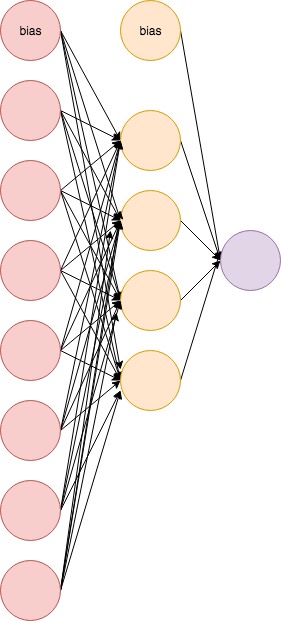

```{r setup, include=FALSE,echo=FALSE}
suppressPackageStartupMessages(library(knitr))
knitr::opts_chunk$set(echo = FALSE, message=FALSE,warning = FALSE, error = FALSE)
suppressPackageStartupMessages(library(ggplot2))
suppressPackageStartupMessages(library(glmnet))
suppressPackageStartupMessages(library(rpart.plot))
suppressPackageStartupMessages(library(randomForest))
suppressPackageStartupMessages(library(MASS))
suppressPackageStartupMessages(library(ggpubr))
suppressPackageStartupMessages(library(caret)) #for confusion matrices
suppressPackageStartupMessages(library(pROC)) #for ROC curves
suppressPackageStartupMessages(library(corrplot)) #for ROC curves
suppressPackageStartupMessages(library(correlation)) #for ROC curves
```

# Part 3 Neural networks

## Plan L9-L12

$~$

* **L9: Feedforward neural networks**: what is it and how does it relate to what we have done in parts 1 (shrinkage) and 2 (ensembles). Literature: Goodfellow et al (2016) Ch 6.0, 6.2-6.4, 7.0-7.1, 7.8, 7.11, 7.12 (more in L11).

* Presentation on Ethical AI by groups 1 and 5.

$~$

* **L10: Analysing text with neural networks**. Digital guest lecture by Samia Touileb and Jeremy Barnes (UiO). Literature: Ch 14+15 of Yoav Golberg (2017). [Book webpage](https://doi.org/10.2200/S00762ED1V01Y201703HLT037). Paper copies provided under the Kopinor lisence. Python with [sklearn](https://scikit-learn.org/stable/) and [PyTorch](https://pytorch.org/).

* Presentation on Reinforcement learning by group 8, and Data science vs. statistics by group 4.

---


$~$

* **L12: Uncertainty in neural networks**. Digital guest lecture by Kristian Gundersen (UiB). Literature: Ch 2.1-2.3, 3, 4 of [the phd-thesis of Gundersen](https://bora.uib.no/bora-xmlui/handle/11250/2725235).

* Presentation of Weight Uncertainty in Neural Networks by group 3, and 
Statistical modelling: The two cultures by group 9.

$~$

---

## Why a part on neural networks?

* Should be in the vocabulary (and tool kit) of every statistician, data scientist, and phd-student (in science and technology) at NTNU?

$~$

* Images and computer vision is handled in [TDT4265 - Computer Vision and Deep Learning](https://www.ntnu.edu/studies/courses/TDT4265#tab=omEmnet) 
(and also [IMT4392](https://www.ntnu.no/studier/emner/IMT4392#tab=omEmnet) which I don´t know). So not in this course.

$~$

* Today we just get into the game!

---

## L9: What will we discuss?

$~$

* Deep feedforward networks 
    + problem type "decides" the input/output units and cost function
    + implications from "gradient learning"
    + hidden units and universal approximation theorem
    + group discussion

$~$    
    
* Regularization 
    + old friends from Part 1
    + early stopping and drop-out
    + group discussion
    

---

# Feedforward artificial neural networks (FNN)

* We will focus on regression and classification (with K classes).

$~$ 

* The goal is to _approximate_ some function $f^*$ by a model class $f(x;\theta)$ - where both _non-linearity_ in and _interactions between_ covariates are modelled.

$~$

* Instead of relying on humans to specify this function we build a network as an _acyclic graph_ where the function $f$ is a chained structure of _affine transformations_ combined with _simple squashing function_. 

---

## Vocabulary and elements

$~$ 

* Our covariates are now presented as _input units_ (or _nodes_) in an _input layer_.
* The intercept is called a _bias_. (Not to be confused with bias for estimators.)
* The response is presented as  _output unit(s)_ in an _output layer_.
* The model parameters (coefficients) are called _weights_.

$~$ 

* The network has one or many layers with _hidden_ units (we don't know the "true" values). _Depth_ of network defined by number of layers and _width_ by number of hidden units in layers.

$~$ 

* For each unit in a layer, it receives a weighted sum from the previous layer (added bias), and is transformed by a _activation_, giving a _chain_ structure. 


$~$ 

(Study Figure 6.2 of @goodfellow)

---

## Gradient-based training
@goodfellow Ch 6.2.

$~$ 

* The non-linearities of the FNN-model leads to a non-convex optimization problem for "most interesting loss functions".

$~$ 

* Often more parameters than observations (or just many of both).

$~$ 

* Parameter estimation for FNN is performed by iterative gradient-based optimization driving the loss function to some small value (not aiming for some global optimum.)

$~$ 

* Model architecture choices made to ensure nice performance of gradient-based training - so not have "saturation" of the loss function where we get a gradient close to 0 (also referred to as the _vanishing gradient problem_).

---

## Output activation and loss function

$~$ 

Remark: We have used _loss function_ for a calculation over the whole training set, but others use loss function for one training example and _cost function_ for the whole training set. 

$~$ 

* The problem-type we study guide the choice of the loss function and the activation function of the output layer.
* The _negative log-likelihood_ for a response distribution is now standard to use as loss function.

$~$ 

| Type | Distribution | Activation | \# | Loss| 
|:-------|:----------|:-------|:---|:-----------|
|Binary | Bernoulli  | Sigmoid | 1 | Binary cross-entropy|
|Discrete | Multinoulli  | Softmax | $K$ | Discrete cross-entropy|
|Continuous | Normal  | Linear| $\ge 1$ | MSE (Gauss. cross-entropy)|


---

**Written out:**

* $n$ is the number of (independent) observation in the training data $({\bf x}_i, y_i)$, $i=1,\ldots,n$.
* ${\bf h}_i$ be the output from the last hidden layer for training sample ${\bf x}_i$.
* ${\theta}$: all model parameters (weights ${\bf W}$ and biases ${\bf b}$, where ${\bf w}$ and $b$ from last hidden layer to output).

**Continuous-normal-linear-MSE**
\begin{eqnarray*}
\hat{y}({\bf x}_i)={\bf w}^T {\bf h}_i+ b \\
J({\theta})=\frac{1}{n}\sum_{i=1}^n (y_i-{\hat{y}({\bf x}_i)})^2
\end{eqnarray*}

---

**Binary-Bernoulli-sigmoid-binary cross-entropy**
\begin{eqnarray*}
\hat{y}({\bf x}_i)=\frac{1}{1+\exp(-{\bf w}^T {\bf h}_i+b)}\\
J({\theta})=-\frac{1}{n}\sum_{i=1}^n (y_i\ln({\hat{y}({\bf x}_i)})+(1-y_i)\ln(1-{\hat{y}({\bf x}_i)})
\end{eqnarray*}

**Discrete-Multinoulli-softmax-discrete cross-entropy**
\begin{eqnarray*}
\hat{y}_c({\bf x}_i)=\frac{\exp({\bf w}_c^T {\bf h}_i+b_c)}{\sum_{s=1}^{C}\exp({\bf w}_s^T {\bf h}_i+b_s)}\\
J(\theta)=-\frac{1}{n}\sum_{i=1}^n\frac{1}{C} \sum_{c=1}^C (y_{ic}\ln({\hat{y}_c({\bf x}_i)})
\end{eqnarray*}

More on [multinomial regression in GLM](https://www.math.ntnu.no/emner/TMA4315/2018h/6Categorical.html)

---

**Sigmoid** 
Showing $\frac{\exp{\beta_0+\beta_1x}}{1+\exp{\beta_0+\beta_1x}}$. Solid lines: $\beta_0=0$ and $\beta_1$ is $0.8$ (blue), $1$ (red) and $2$ (orange), and dashed lines with $\beta_0=1$. This is the probability for class 1, and class 0 will then be one minus this probability (they sum to 1).

```{r,echo=FALSE,fig.width = 4,fig.height=2.5}
ggplot(data.frame(x = c(-6, 5)), aes(x)) + xlab(expression(x)) + ylab("Sigmoid") + 
    stat_function(fun = function(x) exp(x)/(1 + exp(x)), geom = "line", colour = "red") + 
    stat_function(fun = function(x) exp(2 * x)/(1 + exp(2 * x)), geom = "line", 
        colour = "orange") + stat_function(fun = function(x) exp(0.8 * x)/(1 + 
    exp(0.8 * x)), geom = "line", colour = "blue") + stat_function(fun = function(x) exp(1 + 
    x)/(1 + exp(1 + x)), geom = "line", colour = "red", linetype = "dashed") + 
    stat_function(fun = function(x) exp(1 + 2 * x)/(1 + exp(1 + 2 * x)), geom = "line", 
        colour = "orange", linetype = "dashed") + stat_function(fun = function(x) exp(1 + 
    0.8 * x)/(1 + exp(1 + 0.8 * x)), geom = "line", colour = "blue", linetype = "dashed") + 
    scale_colour_manual("0+k x", values = c("red", "orange", "blue"), labels = c("1", 
        "2", "0.8"))
```

---

**Softmax $K=2$**
Showing $K=2$ with $\frac{\exp{\beta_k x}}{\sum_{k=1}^2 \exp{\beta_{k} x }}$ where $\beta_1=1$ (red), $\beta_2=1.1$ (orange). Observe that this is that same as using a sigmoid for one of the classes.

```{r,echo=FALSE,fig.width = 4,fig.height=2.5}
p=ggplot(data.frame(x=c(-40,40)), aes(x))+
  xlab(expression(x))+ 
  ylab("Softmax with two classes")
p=p+stat_function(fun=function(x) exp(1*x)/(exp(1*x)+exp(1.1*x)), geom="line", colour="red")
p=p+stat_function(fun=function(x) exp(1.1*x)/(exp(1*x)+exp(1.1*x)), geom="line", colour="orange")
p
```

---


**Softmax $K=3$ v1**
Showing $K=3$ with $\frac{\exp{\beta_k x}}{\sum_{k=1}^3 \exp{\beta_{k} x }}$ where $\beta_1=1$ (red), $\beta_2=1.1$ (orange) and $\beta_3=0.9$ (green). 


```{r,echo=FALSE,fig.width = 4,fig.height=2.5}
p=ggplot(data.frame(x=c(-40,40)), aes(x))+
  xlab(expression(x))+ 
  ylab("Softmax")
p=p+stat_function(fun=function(x) exp(1*x)/(exp(1*x)+exp(1.1*x)+exp(0.9*x)), geom="line", colour="red")
p=p+stat_function(fun=function(x) exp(1.1*x)/(exp(1*x)+exp(1.1*x)+exp(0.9*x)), geom="line", colour="orange")
p=p+stat_function(fun=function(x) exp(0.9*x)/(exp(1*x)+exp(1.1*x)+exp(0.9*x)), geom="line", colour="green")
p
```

---

**Softmax $K=3$ v2**
Showing $K=3$ with $\frac{\exp{\beta_k x}}{\sum_{k=1}^3 \exp{\beta_{k} x }}$ where $\beta_1=1$ (red), $\beta_2=5$ (orange) and $\beta_3=0.5$ (green). 


```{r,echo=FALSE,fig.width = 4,fig.height=2.5}
p=ggplot(data.frame(x=c(-7,7)), aes(x))+
  xlab(expression(x))+ 
  ylab("Softmax")
p=p+stat_function(fun=function(x) exp(5*x)/(exp(1*x)+exp(5*x)+exp(0.5*x)), geom="line", colour="orange")
p=p+stat_function(fun=function(x) exp(0.5*x)/(exp(1*x)+exp(5*x)+exp(0.5*x)), geom="line", colour="green")
p=p+stat_function(fun=function(x) exp(1*x)/(exp(1*x)+exp(5*x)+exp(0.5*x)), geom="line", colour="red")
p
```

---

Observe that adding a constant what is in the exponent does not change the function. 
Softmax has to be handled smart so that not overflow (value in exponent too large) will be a problem, and that log(softmax) is calculated in a numerically stable way. Many smart tricks starting at page 21- in Slide deck from Ch 4 of @goodfellow [Numerical precision: a deep learning super skill](https://www.deeplearningbook.org/slides/04_numerical.pdf)

---
  
## Universal approximation property and hidden units

$~$ 

* Remember: The goal is to _approximate_ some function $f^*$ by $f(x;\theta)$ - where both _non-linearity_ and _interactions between covariates_ are included.

$~$ 

* What type of mathematical function can a FFN with one hidden layer and linear output activation represent? 

$~$ 

---


The _universal approximation theorem_ says that a FFN with

* a _linear output layer_ 
* at least one hidden layer with a "squashing" activation function and "enough" hidden units

can approximate any (Borel measurable) function from one finite-dimensional space (our input layer) to another (our output layer) with any desired non-zero amount of error.

The theorem has been shown both for the sigmoid (logistic) and ReLU activation functions in the hidden layer.

---

@goodfellow, page 198. See also @Ripley Ch 5.7 for a "readable display". ELS Ch 11: universal approximation is also true for a projection pursuit regression - which in the 1990s was the statisticians "competing solution" for universal approximation (not FNNs).

---

**The rectified linear unit ReLU** $\max(0,a)$ (90% of all FNN)

```{r,echo=FALSE,fig.width = 4,fig.height=2.5}
x=seq(-3,3,length=3)
y=pmax(0,x)
qplot(x,y,geom="line",main="ReLU")
```

The ReLU function is piecewise linear, but in total non-linear. Left gradient 0 and right -1, with discontinuity of derivative at 0.  


---

Even though a large feedforward network with one hidden layer may be able to represent a desired function, we may not be able to _estimate_ the parameters of the function from training data, 

* we may choose a too many or too few nodes in the hidden layer
* our optimization routine may fail
* we may overfit/underfit the training data

Therefore, sometimes networks with more than one hidden layer is used — with fewer total number of nodes but more layers. A network with many hidden layers is called a _deep network_.

$~$ 

_Empirically, greater depth does seem to result in better generalization for a wide variety of tasks._

@goodfellow page 201.

---

## Group discussion

1. Why do we need to use non-linear activation functions when defining a neural network model?

2. One of the most popular activation function is called Rectified Linear Unit (ReLU), defined as $g(x) = \max(x,0)$. What makes this activation function so attractive?

3. 
**a)** Which network architecture and activation functions does this formula give? Include a drawing of the network architecture.

$$ \hat{y}({\bf x})=[1+\exp(-\beta_{01}-\sum_{m=1}^2 \beta_{m1}\max(\gamma_{0m}+$$
$$\sum_{l=1}^{3} \gamma_{lm}\max(\alpha_{0l}+\sum_{j=1}^{4}\alpha_{jl}x_j,0),0))]^{-1}$$
**b)** How many parameters are estimated in this network?

**c)** Which type of problem can this network be used to solve, and what would you use as loss function? 

**d)** Discuss briefly how parameters are estimated in a feedforward neural network.

---

### Additional exam questions from TMA4268V2019

**a)** Write down the mathematical formula for a feedforward network with one input layer, one hidden layer and one output layer, with the following architecture

* input layer: seven input nodes and one bias node for the hidden layer, 
* hidden layer: four nodes, and a bias node for the output layer, 
* output layer: one node.

Let the nodes in the hidden layer have sigmoid activation function and the node in the output layer have linear activation function.

A drawing of the network is provided.

```{r, out.width="300pt",echo=FALSE}

```

**b)**  Which type of problem can this network solve? 

**c)** What would be an appropriate loss function (give mathematical formula)?

Solutions to both exam problems are found here: <https://www.math.ntnu.no/emner/TMA4268/Exam/e2019sol.html>

---

# Regularization
@goodfellow, Chapter 7

$~$ 

**What:** any modification we make to a learning algorithm that is intended to reduce its generalization (test) error but not its training error.

$~$ 

**Or:** we need not focus entirely on finding the model of "correct size" (is that unique?), but instead find (too) a large model that has been regularized properly.

$~$ 

In Part 1 (and 2) we wanted to construct a _biased estimator_ with _less variance_ (than the unbiased estimator) so that the _bias-variance trade-off_ gave a smaller expected loss on future data, $\text{Err}$, than for the unbiased estimator.   

---

## Penalization

Regularized loss (objective) function
$$\tilde{J}(\theta; {\bf X}, {\bf y})=J(\theta; {\bf X}, {\bf y})+\alpha \Omega(\theta)$$

$~$ 

* ${\bf X}, {\bf y}$ covariates and responses in training data.
* Penalty parameter is now $\alpha$ - previously $\lambda$.

$~$ 

* As in Part 1 the bias term is not regularized - if done it may lead to underfitting. Notation: $\theta$ for all parameters, but ${\bf w}$ for weights - and the bias $b$ is then not a part of the weights.

$~$ 

* Different from Part 1: now the weights are not only for each input, but also for non-linearities in each input and interactions between the inputs. Why is that? 

$~$ 

---

### Weight decay
aka $L_2$, ridge regression or Tikhonov regularization.

$$\Omega(\theta)=\frac{1}{2} {\bf w}^T {\bf w}$$

**Q:** Why are we penalizing towards 0, and not towards the true value of the parameter?

$~$ 

In @WNvW we studied (briefly) the interpretation of the ridge penalty for multiple linear regression, and will elaborate a bit more here - and then relate to FNN.

$$ {\bf w}=({\bf X}^T{\bf X}+\alpha {\bf I})^{-1}{\bf X}^T{\bf y}$$

---

Assume covariates and response are centered (no intercept needed). To look at figures we let the number of covariates be $p=2$, and assume that both covariates contribute equally to the response (weigths without penalization would be the same).

$~$ 

1) Assume covariates are uncorrelated with the same variance, so that the estimated covariance matrix $\frac{1}{n}{\bf X}^T{\bf X}$ is diagonal. Ridge: The weights for each covariate is then shrunken with the same factor.

$~$ 

2) Assume covariates are uncorrelated with different variances. Then the weights for the covariate with the largest variance is shrunken less than the covariate with the smallest variance (the weight for the covariate with the larger variance is larger than for the other). 

$~$ 

---

Remark: if covariates are standardized the variances are the same. Then ridge estimates before and after scaling will not simply differ by a factor.

---

```{r, out.width="100%",echo=FALSE,fig.cap="Figure 1.5 of W. N. van Wieringen (2020)"}
knitr::include_graphics("WNvWfig15bottom.jpg")
```

---

3) Assume covariates are correlated but have the same variance. The ridge shrinks less the weights of the strongly positively correlated covariates. 


```{r, out.width="60%",echo=FALSE,fig.cap="Figure 1.6 of W. N. van Wieringen (2020)"}
knitr::include_graphics("WNvWfig16left.jpg")
```


---

In ELS (Ch 3.4.1) we looked at the singular value decomposition of the covariate matrix ${\bf X}$, and the result was that:

$$\hat{y}_{\text{ridge}}={\bf X}\hat{\beta}_{\text ridge}= \cdots =
{\bf U}{\bf D}^2({\bf D}^2+\alpha {\bf I}_p)^{-1}{\bf U}^T {\bf y}=
\sum_{j=1}^p {\bf u}_j \frac{d_j^2}{d_j^2+\alpha}{\bf u}_j^T {\bf y}$$

* The estimated covariance matrix for centred covariates is $\frac{1}{N}{\bf X}^T{\bf X}$. The eigenvalues of ${\bf X}^T{\bf X}$ are the squared singular values, $d^2_j$. 
* The small singular values $d_j$ correspond to directions in the column space of ${\bf X}$ with small variance, which will be the direction for the last principal components. 

$~$ 

* The ridge penalties shrinks the direction with the small singular values the most.
(Which is the same as we saw with the highly correlated directions being shrunken less.)

$~$ 

---

In @goodfellow, the transition over to FNN is done by first looking at the effect of the penalty term in gradient descent.

#### Gradient descent

Let $\nabla J({\boldsymbol \theta}^{(t)})$ be the gradient of the loss function evaluated at the current estimate ${\boldsymbol \theta}^{(t)}$, then a step $t+1$ of the algorithm the new values (estimates) of of the parameters are given as:

$~$ 

$${\boldsymbol \theta}^{(t+1)}={\boldsymbol \theta}^{(t)} - \epsilon \nabla_{\boldsymbol \theta} J({\boldsymbol \theta}^{(t)})$$

The _learning rate_ $\epsilon$ is often set to some small value ($0.01$).

$~$ 

The gradient is the vector of partial derivative of the loss function with respect to each of the parameter in the network.

$~$ 

---

#### Effect of penalty on gradient

Assume not bias parameter (maybe centering of covariates and response)

$$\tilde{J}({\bf w}; {\bf X}, {\bf y})=J({\bf w}; {\bf X}, {\bf y})+\frac{\alpha}{2}{\bf w}^T {\bf w}$$
$$\nabla_{\bf w} \tilde{J}({\bf w}; {\bf X}, {\bf y})=\nabla_{\bf w} J({\bf w}; {\bf X}, {\bf y})+\alpha{\bf w}$$
Gradient step with learning rate $\epsilon$

$${\bf w}^{(t+1)}={\bf w}^{(t)}-\epsilon \cdot (\nabla_{\bf w} J({\bf w}^{(t)}; {\bf X}, {\bf y})+\alpha{\bf w}^{(t)})$$
$${\bf w}^{(t+1)}=(1-\alpha \epsilon){\bf w}^{(t)}-\epsilon \cdot (\nabla_{\bf w} J({\bf w}^{(t)}; {\bf X}, {\bf y})$$


The effect is to shrink the weight be a constant factor at each step.

This is a local effect - on one gradient step.

---

### Effect of penalty in quadratic approximation

$~$ 


For the multiple linear regression with quadratic loss the loss function is also a quadratic function in the weights. 

$~$ 

For a FNN with a general loss function we may use a quadratic approximation close to the optimal weights ${\bf w}^*=\text{argmin}_{\bf w} J({\bf w})$ from the unregularized problem:

\begin{align*}\hat{J}({\bf w}; {\bf X}, {\bf y})&= J({\bf w}^*; {\bf X}, {\bf y})+\nabla_{\bf w} J({\bf w}^*; {\bf X}, {\bf y})({\bf w}-{\bf w}^*)\\
&+\frac{1}{2} ({\bf w}-{\bf w}^*){\bf H}_J({\bf w}-{\bf w}^*)
\end{align*}

where $H_J$ is the Hessian matrix (matrix of partial second derivatives) of the loss function $J$ with respect to ${\bf w}$ and evaluated at ${\bf w}^*$.

---

$~$ 


Since ${\bf w}^*$ is a minimum of $J$ then the gradient is (close to) 0, and the Hessian should be positive semidefinite. 

$~$ 


The gradient of the approximation is then
$$\nabla_{\bf w} \hat{J}({\bf w}; {\bf X}, {\bf y})={\bf H}_J({\bf w}-{\bf w}^*)$$
And setting the gradient equal ${\bf 0}$ shows that ${\bf w}^*$ is the solution.

$~$ 


Adding the penalty term to the gradient approximation changes this:

$$\nabla_{\bf w} \tilde{\hat{J}}({\bf w}; {\bf X}, {\bf y})={\bf H}_J({\bf w}-{\bf w}^*)+\alpha {\bf w}$$

---

Setting this equal to ${\bf 0}$ we call the new minimum $\tilde{\bf w}$

\begin{eqnarray*}
{\bf 0}={\bf H}_J(\tilde{\bf w}-{\bf w}^*)+\alpha \tilde{\bf w}\\
({\bf H}_J(\tilde{\bf w}-\alpha {\bf I})\tilde{\bf w}={\bf H}{\bf w}^*\\
\tilde{\bf w}=({\bf H}+\alpha {\bf I})^{-1}{\bf H}{\bf w}^*
\end{eqnarray*}

Comparing this to the ridge regression solution
$$ {\bf w}=({\bf X}^T{\bf X}+\alpha {\bf I})^{-1}{\bf X}^T{\bf y}$$
and from Part 1 L2 (exercise) we saw that this can be written as

$$ {\bf w}^{\text ridge}=({\bf X}^T{\bf X}+\alpha {\bf I})^{-1}{\bf X}^T{\bf X}{\bf w}^{\text LS}$$

The difference is just that ${\bf X}^T {\bf X}$ for the ridge regression is replaced by ${\bf H}$ for the quadratic approximation.


---

For the GLM with canonical link the Hessian of the (negative) log-likelihood is in general equal to the Fisher information matrix, which is ${\bf H}={\bf X}^{T}{\bf W}{\bf X}$. Here ${\bf W}$ is a diagonal matrix involving the derivative of the response function and the variance of the response. For the normal case ${\bf W}$ is equal $\frac{1}{\sigma^2}$.

$~$ 


With the Hessian taking the place of the ${\bf X}^T{\bf X}$ in our results from the ridge regression we may also now conclude that

* the ridge penalty shrinks the directions of the small eigenvalue of the Hessian matrix the most.

$~$ 


(Study Figure 7.1 in @goodfellow.)


---

### $L_1$ penalty

$~$ 

* We know that it is hard to write solutions on closed form except for very special cases as for linear regression with orthogonal covariates.

$~$ 

* We saw from Part 1 that gradient methods were difficult for the lasso.

$~$ 

* Combinations of $L_1$ and $L_2$, elastic net, is also implemented for FNNs. 

$~$ 

---

<!-- ## Penalties as constrained optimization -->
<!-- @goofellow Ch 7.2 -->

<!-- We know from Part 1 about the  -->
<!-- * duality of writing our penalty problems as a constained problem instead of a  -->
<!-- * budget version problem. -->

<!-- For FNN the budget version might be used -->


## Early stopping
@goodfellow, Ch 7.8.
 
The most commonly used for of regularization for FNN is _early stopping_. 

$~$ 

* If we have chosen a sufficiently large model with the capacity to overfit the training data, we would observe that the training error decreases steadily during training, but the error on the validation set at some point begins to increase.

$~$ 

* If we stop the learning early and return the parameters giving the best performance on the validation set, this model would hopefully be a better model than if we trained the model until convergence — and this model will then also give a better test set error.

$~$ 

---

* It is possible to think of the number of _training steps_ as a hyperparameter. This hyperparameter can easily be set, and the cost is just that we need to monitor the performance on the validation set during training. 

$~$ 

(Study figure 7.3 of @goodfellow for U-shaped behaviour on validation set.)

---

$~$ 

* Algo 7.1: For early stopping we need to save the weights as we train, then find the optimal point to stop the training - and then use the weights from that point in the training. 

$~$ 

* Algo 7.2:  First find the optimal stopping time for the training based on the validation set, and then retrain the full training set (including the validation part) and stop at the selected stopping time. (Algo 7.2)

$~$ 

* Algo 7.3: Start from the weight of Algo 7.3, and continue training but now with the full training set. Even though the validation set is now a part of the training scheme, monitor the average performance on the validation set and stop when the performance goes below the value of the training set objective when the early stopping stopped. This strategy may not be optimal or even terminate. 

---

$~$ 

* Why is early stopping a regularization technique? By early stopping the optimization procedure has only seen a relatively small part of the parameter space in the neighbourhood of the initial parameter value. 

$~$ 

* There is a formal equivalence between early stopping and $L_2$ regularization for a linear regression and squared loss, elaborating on the trajectory of the gradient descent during training. See @goodfellow page 251-252.

$~$ 

(Study figure 7.4 of @goodfellow for a comparison with $L_2$ regularization.)

---

## Bagging and ensembles
@goodfellow Ch 7.7

$~$ 

* FNN are also suitable for making ensembles - for example by just averaging predictions from many runs of optimization - so no bootstrapping.

$~$ 

* Here the FFNs then are trained 
   + from different random initializations
   + random selections of minibatches
   + different hyperparameters
 
 $~$ 

But, this may be costly for large networks.

---

## Dropout
(@goodfellow, Section 7.12) and **will discuss more in L11**. 

$~$ 

_Dropout_ can be sees as a method for _makes bagging practical_ for ensembles of many large neural networks, and can mimic an ensemble of "exponentially" many networks.

$~$ 

* Positive: low cost of computations, robust and can be applied to many types of network models, 
* Negative: not good for very large datasets, not good with low sample size.

$~$ 

With small changes to the implementation dropout can also be seen to perform boosting, 

---

### Training

* Dropout trains the ensemble of all sub-networks that can be formed by removing _non-output_ units from _an underlying base network_
* Removing= multiplying the output value from the unit by zero.

$~$ 

* Minibatch-based algorithm (small steps) used, where each time an example is loaded into a minibatch a _random binary mask_ is sampled to be applied to all input and hidden units in the network.
* Mask (0=not included, 1=include) has probability fixed (hyperparameter). Input unit has default 0.8 to include and hidden 0.5.

$~$ 

(Study Figure 7.6 and 7.7 in @goodfellow.)

---

* $\mu$: mask vector (which units to include)
* $\theta$: model parameters
* $J(\theta,\mu)$: loss (cost) of the model defined by $\mu$ and $\theta$

Dropout training aims to minimize $\text{E}_{\mu}(J(\theta,\mu))$.

$~$ 

Compare to bagging: 

* not independent models
* models share parameters
* the different models are not explicitly trained
    + tiny fraction of possible sub-networks each trained at a single step
    + parameter sharing helps remaining sub-networks to get good parameters
* but: training set at each sub-network is a subset of the original training data (resampled with replacement=minibatch SDG)

---

### Use for prediction

To make a prediction in bagging we needed to include the prediction from all the members. How can that be done with dropout-trained networks?

For bagging with $k$ models:
$$\frac{1}{k} \sum_{i=1}^k  p^{(i)}(y\mid {\bf x})$$
* Each model $i$ gives a probability distributions $p^{(i)}(y\mid {\bf x})$
    + for softmax and sigmoid output units it is the probability of each class, 
    + for regression  output units just one value.

$~$ 

---

**Method 1**

For dropout each sub-model is defined by the mask $\mu$, and the prediction may be

$$\sum_{\mu} p^{(i)}(y\mid {\bf x},\mu)p(\mu)$$
where $p(\mu)$ is the probability distribution describing how the masking was done.

But, this is not possible (many terms in the sum), so instead outputs from many masks are averaged together. These maskes are then sampled, and even 10-20 may be enough.

---

**Method 2**

* Let $d$ be the number of units that may be dropped (input and hidden).
* The there are $2^d$ possible sub-networks (minus some that have no connection between input and output?)
* Models that assign probability 0 to any event is not included

This method uses the geometric instead of the arithmetic mean.

$$\hat{p}_{\text{ensemble}}(y\mid {\bf x})=(\prod_{\mu}p(y\mid {\bf x},\mu)))^ {\frac{1}{2d}}$$
Here $p(\mu)=1$ - so a uniform model (but should have been $p(\mu)=\frac{1}{2d}$), and the ensemble is renormalized across all possible outputs.

$$p_{\text{ensemble}}(y\mid {\bf x})=\frac{\hat{p}_{\text{ensemble}}(y\mid {\bf x})}{\sum_{y'} \hat{p}_{\text {ensemble}}(y' \mid {\bf x})}$$


---

**Method 3: the weight scaling inference rule**

* Approximate the ensemble by just using one model = the model with all units present.
* but - modified by multiplying the weigth out of unit $j$ by the probability of including this unit in the training.

$~$ 

* No mathematical argument for deep non-linear, but "empirically works well".
* For methods without non-linear unit it can be shown that the weight scaling rule is exact (see pages 263-264 of @goodfellow)

$~$ 

Alternatively: during training the probability of inclusion is $0.5$, then multiply all weights by $2$ by the end of traning and use as "usual" for prediction.

$~$ 

---

## Group discussion
(q1 was asked at the oral exam in 2019)

1) Can you mention three different techniques to prevent overfitting? What are key aspects of one of the techniques? Have you used any of theses yourself? Elaborate.

2) Which courses (or self study?) have you done to learn about neural networks? What is the most interesting aspect of neural network (your opinion)?

3) What is your experience with using Python or R to fit (deep) FNN? "Packages" used?

---

4) What are connections between an artificial neural network and the neural network of our brains (that is studied in the field of neuroscience)?

```{r, out.width="500pt",echo=FALSE}
knitr::include_graphics("./Neuron3.png")
```

Image title: Neuron and myelinated axon, with signal flow from inputs at dendrites to outputs at axon terminals. Image credits: By Egm4313.s12 (Prof. Loc Vu-Quoc) - Own work, CC BY-SA 4.0, <https://commons.wikimedia.org/w/index.php?curid=72816083>

# Optimization

## Gradient descent

Explained above.

## Mini-batch stochastic gradient descent (SGD)
@goodfellow Ch 8.3.1

The loss function is computed as a mean over all training examples. 

$$J({\boldsymbol \theta})=\frac{1}{n}\sum_{i=1}^n J({\bf x}_i, y_i)$$

This means that the gradient will also be a mean over the gradient contribution from each training example. 

$$\nabla_{\boldsymbol \theta} J({\boldsymbol \theta})=\frac{1}{n}\sum_{i=1}^n \nabla_{\boldsymbol \theta} J({\bf x}_i, y_i)$$

---

To build a network that generalizes well, it is important to have many training examples, but that would make us spend a lot of time and computer resources at calculating each gradient descent step. 


We observe that we may see the gradient as an average over many individual gradients, and think of this as an estimator for an expectation. This expectation can we (also) approximate by the average gradient over just a _mini-batch_ (random sample) of the observations. 

The idea here is that the optimizer will converge much faster if they can rapidly compute approximate estimates of the gradient, instead of slowly computing the exact gradient (using all training data).

---

In addition with multicore systems, mini-batches may be processed in parallell and the batch size is often a power of 2 (32 or 256).

It also turns out that small batches also serves as a regularization effect maybe due to the variability they bring to the optimization process.

In the 4th video (on backpropagation) from 3Blue1Brown there is nice example of one trajectory from gradient decent and one from SGD (13:50 minutes into the video):
<https://www.youtube.com/watch?v=tIeHLnjs5U8>

---

This means that for (mini-batch) stochastic gradient descent we do as follows:

1. Divide all the training samples randomly into mini-batches.
2. For each mini-batch: Make predictions of the responses in the mini-batch in a _forward pass_.
3. Compute the loss for the training data in this batch.
4. Compute the gradient of the loss with regard to the model's parameters (_backward pass_) based on the training data in the batch. $\nabla_{\boldsymbol \theta}^* J({\boldsymbol \theta}^{(t)})$
5. Update all weighs, but just using the average gradient from the mini-batch ${\boldsymbol \theta}^{(t+1)}={\boldsymbol \theta}^{(t)} - \lambda \nabla_{\boldsymbol \theta} ^* J({\boldsymbol \theta}^{(t)})$
6. Repeat 2-5 until convergence. (Could have gone back to 1, but often not done.)

---

* The algorithm defined above is called mini-batch SGD. The Stochastic part comes from the fact that we are randomly sampling batches from the training data.
* Stochastic gradient descent (SGD) for size equals to 1.
* Mini-batch SGD is a compromise between SGD (one sample per iteration) and full gradient descent (full dataset per iteration)

---

## Backpropagation algorithm

Computing the analytical expression for the gradient $\nabla J$ is not difficult, but the numerical evaluation may be expensive. The Backpropagation algorithm is an simple and inexpensive way to calculate the gradient. 

The chain rue is used to compute derivatives of functions of other functions where the derivatives are known, this is done efficiently with backpropagation.

Backpropagation starts with the value of the loss function and works backward from the top layers to the bottom layers, applying the chain rule to compute the contribution that each parameter have in the loss value.

---

More information:

* Mathematical details in @goodfellow Section 6.5 (pages 204-238), 
* 3Blue1Brown: video overview: <https://www.youtube.com/watch?v=Ilg3gGewQ5U> and chain rule maths <https://www.youtube.com/watch?v=tIeHLnjs5U8>

---

## Variations of SDG — with adaptive learning rates
@goodfellow 8.5

General concept:

* momentum term: previous gradients are allowed to contribute.

<!-- * decay the learning rate linearly until iteration $\tau$: $\lambda_k=(1-\delta)\lambda_0+\delta \lambda{\tau}$, where $\delta=k/\tau$. After iteration $\tau$ the learning rate is kept constant. -->


Named variants: In `keras` the "default optimizer" is RMSprop.

* AdaGrad: individually adapt the learning rates of all model parameters by scaling them inversely proportional to the square root of the sum of all their historical squared values. (Nice properties for convex problems, but with non-linear hidden activation function we do not have a convex problem.)
* RMSprop: modification to AdaGrad in non-convex setting. Scales with exponentially weighted moving average instead of all historical squared gradient values.

---

## Further reading on optimizers

* [Keras documentation for Optimizers](https://keras.io/optimizers/)
* [An overview of gradient descent optimization algorithms](http://ruder.io/optimizing-gradient-descent/index.html)
* [Overview	of	mini-batch	gradient	descent](http://www.cs.toronto.edu/~tijmen/csc321/slides/lecture_slides_lec6.pdf)
* Andrew Ng explains about RMSprop in Coursera course: [Improving Deep Neural Networks: Hyperparameter tuning, Regularization and Optimization](https://www.coursera.org/learn/deep-neural-network/lecture/BhJlm/rmsprop)

---

# Keras in R

* <https://keras.rstudio.com/>
* Cheat-sheet for R Keras: <https://github.com/rstudio/cheatsheets/raw/master/keras.pdf>
* [Keras documentation for Optimizers](https://keras.io/optimizers/)

---

## Resources from MA8701 in 2019
(made by Thiago G. Martins)

All files: <https://www.math.ntnu.no/emner/MA8701/2019v/DeepLearning/>

And with focus on running Keras:

* What is and installing: <https://www.math.ntnu.no/emner/MA8701/2019v/DeepLearning/3-keras.html>
* Setting up model: <https://www.math.ntnu.no/emner/MA8701/2019v/DeepLearning/4-deep_learning_models.html>
* Compiling: <https://www.math.ntnu.no/emner/MA8701/2019v/DeepLearning/5-compiling_deep_learning_models.html>
* Overfitting (regularization and dropout) <https://www.math.ntnu.no/emner/MA8701/2019v/DeepLearning/7-prevent_overfitting.html>
* Boston housing: <https://www.math.ntnu.no/emner/MA8701/2019v/DeepLearning/11-neural_networks_boston_housing.html>

Thiago also has resources for analysing text (with IMBD data) and images (with MNIST) at <https://www.math.ntnu.no/emner/MA8701/2019v/DeepLearning/>, but for the text analysis lecture we will use Python with sklearn and pyTorch.

# <a id="further">References and further reading</a>

* [Introduction to artificial neural networks from TMA4268 in 2019](https://www.math.ntnu.no/emner/TMA4268/2019v/11Nnet/11Nnet.html)
* <https://youtu.be/aircAruvnKk> from 3BLUE1BROWN - 4 videos - using the MNIST-data set as the running example
* Explaining backpropagation <http://neuralnetworksanddeeplearning.com/chap2.html>
* Look at how the hidden layer behave: <https://playground.tensorflow.org>
* @ESL,Chapter 11: Neural Networks
* @casi, Chapter 18: Neural Networks and Deep Learning


